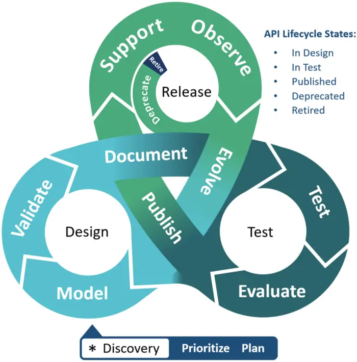
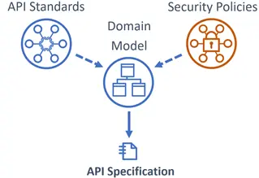
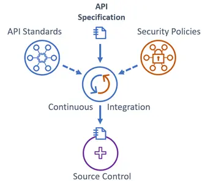
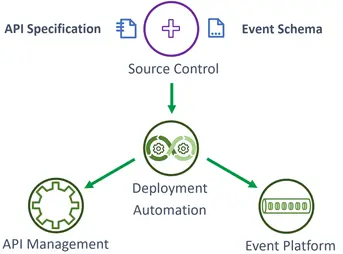
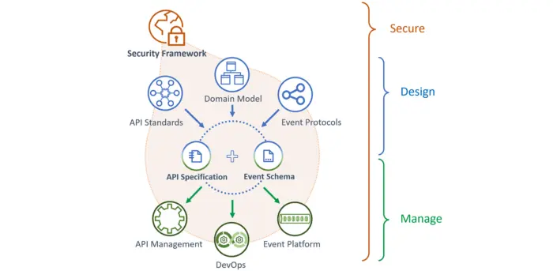

> https://medium.com/@trgoodwill/writing-api-design-standards-84cb7cbb3fd7

> An 8-step guide to tailoring resource API design standards to your organizational context

## **The Role of API Standards**

API Development Standards are a focused collection of imperatives, conventions and guidance, and are intended to improve the **_consistency, stability, generality, predictability and usability of business resource APIs_**. They may be self-contained or reference and augment external standards. They may offer best-practice recommendations and provide a basis for quality assessment.

Governed, opiniated standards and patterns will be required to enable **_seamless interoperability between independent, decoupled domains_**. Balancing the benefits to development teams of an enterprise landscape of rich, composable, self-service business data against the impost on implementation flexibility is a difficult line to tread – **_standards, just like models, must learn from implementation_** and improve through engagement and iteration.

### Fit-for Purpose, Tailored to the Enterprise Context

This discussion will touch of a number of conventions and standards that will be relevant in a large enterprise environment. While sample guidance and exemplars are offered in this cluster of articles, there is often more than one tried-and-tested approach in any one area of API design — specific tactics and conventions should be tailored to the target environment.

### MUST, SHOULD, MAY Keywords

In the context of the following sections and linked documents, the words ‘must’, ‘should’ and ‘may’ serve as a loose indication of the importance of a concept. Were these concepts to be translated into enterprise guidance, occurrences of these words SHOULD be considered against their definition per [RFC 2119](https://www.ietf.org/rfc/rfc2119) and aligned and capitalized as considered appropriate.

## 1. Principles, Concepts and Terms

Introduce the motivation behind and importance of API development standards to your organization. It is important to introduce the maintainers of the standards and **_provide a mailbox or other method of feedback_**.

Briefly outline and/or define important concepts and terms, especially if definitions are loose in common usage. _Here are a few candidates:_

### Domain

In the context of this document, the word “business domain” is concerned with the responsibilities of a business entity such as “cargo and trade”. In contrast, the unqualified word “domain” — as used in the term “domain model” — is used synonymously with “business sub-domain”, the business owner of a capability or product stream, that maps to a bounded context such as “regulatory”.

### REST

The REST architectural style “provides a set of architectural constraints that, when applied as a whole, emphasizes scalability of component interactions, generality of interfaces, independent deployment of components” — [Fielding, R.T. 2000, Representational State Transfer (REST)](https://www.ics.uci.edu/~fielding/pubs/dissertation/rest_arch_style.htm). The tooling and patterns for REST APIs are relatively advanced, and REST API technology literacy is high.

### REST Model

A REST model will describe a business resource, and how client systems interact with it. The model will detail operations, methods and paths. It may include assertions and status codes. It is aligned with the domain data model, though abstracted to enhance composability, generality and stability. From the REST model and the constraints provided by enterprise API standards, it is possible to generate a prototype API specification.

### Types of API

There are a number of ways to slice and dice APIs into categories, however in the enterprise context, there are **_two overarching categories_** that will profoundly affect the standards and patterns that may apply **—** these are **_Business Resource APIs_** and **_Mediating APIs._**

**Business Resource APIs** are ‘canonical’ business capability APIs, and the **_source-of-truth for business data_**. They are the product of a process of Domain Driven Design and REST Modelling. Business resources are the nouns of a system, such as ‘_applications_’ and ‘_applicants_’. Resource APIs provide a context for interaction with a business capability, represent the business facts about a business domain, and when consistently modeled, discoverable and subscribable, they become the backbone of a federated data platform.

Business resource APIs are _always_ secured by an enterprise API gateway, and ideally, secured by OAuth/OIDC and API scope authorization. These APIs must be stable, reusable, discoverable and subscribe-able via an enterprise API developer portal.

**Mediating APIs**, including experience APIs, will tend to be tailored to specific applications (SPA/PWA/Mobile) or use-case requirements. These APIS are **not** the source of truth for business information— data requirements are composed, cached or replicated from enterprise resource APIs. Typically there is little potential for re-use.

The consumer and producer of experience APIs are often managed by the same team. Experience APIs are usually not intended to be discoverable in an enterprise portal, are sensitive to latency and may employ OIDC scopes that are not compatible with upstream API scopes. These APIs will typically manage their OWN cloud-native API gateway, in conformance with _governing patterns created specifically for this purpose._

### Focusing Standards

Standards underpinning interoperability, discovery and reuse will be focused on resource APIs, however most conventions will have a level of applicability to mediating/experience APIs.

Leaving to developer discretion the translation of conventions to a mediating/experience API context is recommended over committing to parallel sets of standards, however robust configuration patterns and templates should be created to support the special case of experience APIs managing their own API gateways.

### DDD, the Domain Model and Stakeholder Engagement

Robust, consistent and truly interoperable resource APIs need to be anchored in a validated model of the domain and the bounded context.

DDD can sound like a huge commitment, however contemporary agile-aligned processes and domain modelling tooling give a lean focus and form to the discipline, and facilitate sharing and collaboration on the model.

_For more:_ [**_Modeling Coherent and Composable Business Resource APIs_**](https://medium.com/@trgoodwill/where-do-business-resource-apis-come-from-472cc8422dec)

### API Maturity

Agreement on an intentional, interoperability-focused API maturity model can underpin coherent and evolvable API and interoperability standards, identify interim and target states, and minimize technical debt.

_This is discussed further here:_ [**_API Interoperability Maturity Model_**](https://medium.com/@trgoodwill/api-interoperability-maturity-model-85d0e74c066b)**_._**

### APIs and Business Events

Synchronous business resource APIs and asynchronous business events are fundamentally related. If your organization has adopted an API harmonized business event model, an introduction to and overview of the framework should be provided, together with links to event-specific guidance.

_This topic is discussed further here:_ [A Harmonized API-led Interoperability Framework (accenture.com)](https://kxdocuments.accenture.com/Contribution/f31f8bf1-f21d-4e6d-bb1d-193c0b5407d3).

## 2. API Lifecycle Management

### API Lifecycle Phases

The API lifecycle is sometimes characterised in terms of production readiness, sometimes in terms of development stages. In an enterprise managed API context, an API lifecycle must encompass both of these perspectives, as well as the reality of multiple environments and pre-production consumer feedback and iteration.



A diagrammatic description of the phases of an API lifecycle

### Starting point

- **Discovery:** Discovery is outside of the API lifecycle, however it is the setup and the initial entrypoint. It is the process of demand generation, prioritization and planning that results in a prioritized backlog and kickoff of the design phase.
- **Evolution:** Observation, evaluation and client feedback on APIs deployed to either test or production environments may trigger design changes. Changes may be breaking, or non-breaking.

### Design

1. **Model:** Through a process of broad stakeholder consultation, distillation and frequent iteration, a model of the domain is built. A collaborative, version controlled and readily accessible domain data modelling tool is recommended.
2. **Validate:** The domain model “_acts as a_ [_Ubiquitous Language_](https://martinfowler.com/bliki/UbiquitousLanguage.html) _to help communication between software developers and domain experts_”, maximizing collaboration, tightening the feedback loop, and ensuring that the domain model remains the definitive source-of-truth.

### Test

1. **Document:** API specifications may be tool-generated or ‘hand-crafted’ from the model, in conformance with API standards and security policies. The specification is deployed to a development environment and may be initially backended by a mock service.
2. **Test**: ‘Code-first’ API continuous integration and publishing automation can apply Policy-as-Code controls, enforce mandatory standards with specification linting, and validate security schemes. Deployment and regression testing validates security, function and performance.
3. **Evaluate:** Testing, client engagement and analytics inform an evaluation of the API resulting in either promotion or rework. The API may loop through several test environments and evaluation checkpoints.

### Release

1. **Publish:** APIs that survive the final test and acceptance stage-gate are published to production. APIs might be published to an internal, partner or public facing catalog as appropriate.
2. **Support & Observe:** The API is actively monitored and supported, and client engagement encouraged via the client portal. Feedback and analysis may provide insights that shape the **evolution** of APIs and business processes.
3. **Deprecate:** As APIs evolve and are republished as a new major version, the previous version must be deprecated — which means maintaining support for a period in order to allow existing clients adequate time to cut-over to the new version. No new clients are able to subscribe to a deprecated API. A retirement schedule should be communicated to subscribed clients.
4. **Retire:** Once existing clients have cut-over to the new version, and/or the scheduled retirement date arrives, the API is retired, and will no longer be available. Calls to this API will result in a gateway error.

### Security

It is important to note that **security is not a step** — but rather is embedded in each phase.

- Data is classified and regulatory controls identified during the **modelling phase**
- **API development** guidelines outline practises and patterns to be employed by developers to secure APIs
- API specification linting is applied during **integration into source control**
- API management and API gateway security policies are **enforced on test and production gateways**
- **API testing** incorporates OWASP testing as well as targeted testing against applicable security controls

### API Lifecycle States

API Lifecycle states are of particular interest to consumers, as they will have ramifications in terms of stability and support. The lifecycle states of an API are as follows:

- **In Design** — in design and development, subject to change at any time.
- **In Test** — feedback encouraged; breaking changes may be made.
- **Published** — released to production, stable and actively supported.
- **Deprecated** — soon to be retired. New clients are unable to subscribe.
- **Retired** — the API has been shut down. The gateway will return errors.

### Managing API Versions

A key aim of business resource APIs is stability. However, in the pursuit of continuous improvement, breaking changes are almost inevitable, and in order to avoid a ‘big-bang’ coordinated cut-over there will occasionally be a need to support more than one version of an API.

**Versioning APIs**

An enterprise-wide API versioning strategy will be required. Versioned URLs are widely employed for the management of API versions. The scheme is somewhat limiting but uncomplicated, making it easy for clients to comprehend and control which API versions they interact with.

_Versioning options and considerations are covered in the article_ [**_Versioning Managed APIs_**](https://medium.com/@trgoodwill/api-bites-1af949efdd1b)**_._**

Versioned URLs must _only_ include the MAJOR version as part of the URI, in the format ‘v{MAJOR}’, e.g.

/membership/v1/applicants

Minor and patch versions (assuming SemVer versioning) must NOT be included in the URI as such changes are by definition backwards-compatible.

**Semantic Versioning**

Unless there is a compelling reason not to, API Models and specifications should be managed with [semantic versioning](https://semver.org/).

{MAJOR}.{MINOR}.{PATCH}

Versioning should align across the domain and REST models, and the API specification. Ideally, [domain modelling tooling would manage semantic versioning](https://medium.com/@trgoodwill/api-interoperability-maturity-bb1e5a25dea1) across all derivative artifacts.

As a guide the following rules should apply when incrementing the API version number:

- **MAJOR** version when **_incompatible_** or **_breaking_** API changes are made,
- **MINOR** version when functionality is added in a backwards-compatible manner, and
- **PATCH** version when backwards-compatible bug fixes are made.

**Replacing a Major API Version**

_Also covered in_ [**_Versioning Managed APIs_**](https://medium.com/@trgoodwill/api-bites-1af949efdd1b)**_._**

In short:

- Avoid major (breaking) version changes.
- Justify, document and socialize unavoidable breaking changes.
- Decouple cut-over — maintain a deprecated version.
- Communicate a retirement schedule.

## Design Tooling and Documentation

### API Documentation

The OpenAPI Specification (OAS) defines a standard, programming language agnostic interface description for REST APIs. Importantly, the specification is widely supported by API Management platforms, and by a number or domain modelling platforms.

Adoption of the most current, generally supported specification version is recommended. Take the time to research the level of support offered by commercial API management platforms — including both gateway and developer portal support for key features. Be prepared to support more than one version of the spec as new versions are released.

Include the full semantic version number in the OpenAPI 3.x info object or Swagger 2 API description — {MAJOR}.{MINOR}.{PATCH}

API request and response examples should be included in the specification document to assist client developers.

### **API Design Tooling**

If your organization has adopted enterprise API design and development tools or platforms (recommended), an introduction would be warranted, together with links to ‘getting started’ resources.

Domain/REST modelling tooling must provide the ability for a diverse group of stakeholders to collaborate on the model. Ideally the platform will support source control and manage semantic versioning across the model and its derivative artefacts — features that are helpful in maintaining the currency and traceability of published APIs.

API specifications are generated from the model, in conformance with API standards and security policies. These may be tool generated based on standards and policy-conformant rules or templates, or they may be ‘hand-crafted’ from templates. In either case, peer review is essential.



API specifications are generated from the model, in conformance with API standards and security policies.

_Links out_ to configuration guidance should be provided.

## Integrated DevOps

API enabled, interoperable business services often endure considerable friction and blocking engagements coordinating the delivery of new and updated interfaces. A well-defined process of model driven development, complimentary tooling and vertically integrated DevOps can **_substantially reduce friction between domain model development and delivery_**.

_Managing API lifecycles with model driven development, API generation and automation is discussed in_ [**_Managing API Lifecycles with Model Driven, Integrated DevOps_**](https://medium.com/@trgoodwill/managing-api-lifecycles-with-model-driven-integrated-devops-3cfcb9eca32e)

**Source Control:** Guidance on enterprise source/version control and continuous integration enablement should be provided. API specification documents (and potentially config files) should be co-located in a common repository with the service implementation. Include high level guidance as part of the lifecycle management model and _links out_ to more detailed tool and platform-specific documentation and ‘getting started’ resources.

**Compliance with Security Controls and API Design Standards:** API design standards and security policy compliance is automated wherever possible. Continuous integration and delivery pipelines will apply Policy-as-Code controls, enforce mandatory standards with specification document linting, and will validate API security schemes and gateway security configuration as appropriate for a given context.



**CI-CD Pipeline Enrolment:** Enterprise endorsed DevOps tools and platforms should be identified in API Lifecycle Management guidance, together with _links out_ to more detailed tool and platform-specific documentation and ‘getting started’ resources for CI-CD enrolment. Typically, onboarding into lower (dev) environments will present a low barrier, however an autonomous CI-CD pipeline will require tighter governance and accountability.

**Coordinated, Automated Deployment:** As managed APIs are the interface to deployed microservices, DevOps tooling must ensure that new and updated interfaces and schemas generated by domain modeling tooling and implemented by a business service are published to relevant API management platforms simultaneously with the deployment of the business service. Deployment and testing of APIs must be automated, domain-autonomous and as frictionless as possible.



**Testing Platforms:** Similarly, enterprise testing requirements, tools and platform guidance should be provided, together with _links out_ to more detailed tool and platform-specific documentation and ‘getting started’ resources.

### Registering API Resources with IAM

It is essential to provide clear and efficient guidance for the registration of new business resources, data profiles and resource access policies to API Management, Security Token Service (STS) and Identity Access Management (IAM) platforms.

_Registration of API resources is further discussed here:_ [Securing APIs with an Integrated Security Framework](https://medium.com/@trgoodwill/securing-apis-with-an-integrated-security-framework-bf70569c8919)

## 3. Path and Naming Conventions

Consistent naming conventions enhance the coherence, predictability and usability of APIs. There are a number of factors that may influence naming conventions. This might include prevalent development languages and frameworks, and conventions already employed in legacy messaging protocols, data dictionaries etc. A Java or JS shop will _probably_ prefer lowerCamelCase, a Python shop will _probably_ prefer snake*case. An organization with a SOA heritage will \_probably* prefer camelCase. It is a good idea to seek buy-in from stakeholders, and particularly developers.

### Field Names

For request and response body field names (and query parameter names), case MUST be consistent. Either lowerCamelCase or snake_case schemes will ordinarily be mandated within an organization. At this point, lowerCamelCase is more prevalent, and should probably be the default choice unless there are compelling reasons to go a different way. e.g. `"familyName" : "Jones"`

Fields that represent arrays should be named using plural nouns (e.g. ‘colours’).

### Resource Names

Resource names must be plural nouns when referring to a resource collection (there are potentially a number of instances) e.g. ‘/**users’**. A singleton, such as ‘/users/1234/**cart’** must be singular.

[https://api.myorg.com/membership/v1/**applications**](https://api.myorg.com/membership/v1/applications/12345)

Resource names should be lower-case and use only alphabetic characters, with hyphens employed to separate words in the URI. URIs are the only place where hyphens are used as a word separator. In all other situations, the word separation scheme should align with enterprise field naming conventions (e.g. camelCase or snake_case).

### Resource Identifiers

A resource identifier can be a string or numeric value, and must be URL safe. A protected or confidential resource identifier must be un-guessable and non-sequential, providing maximum abstraction from Personally Identifiable Information, primary keys, and time or order of creation. This requirement may be met with a Universally Unique Identifier (UUID), e.g.

/v1/applicants/**538d9bb1–95c9–4ceb-864c-808877765733**

The resource identifier must be immutable.

### Resource References

Resource identifiers returned with the core data should be referenced consistently — a standard should be mandated.

The most popular schemes are:

- Return an “id” field. e.g. `"id" : "12B34C"`. The name of the resource is implied, having been addressed in the URL.
- Return an unambiguous concatenation of the resource name followed by the “Id” designation, e.g. `"customerId" : "12B34C"`.

All **_external resource id references_** should in any case be concatenation of the resource name followed by the “Id” designation, e.g. `"orderId" : "34C56D"`. Standardizing resource Ids in this format can simplify and improve the clarity of references.

### Path conventions

The structure of the URLs by which Business Resource APIs are addressed should be consistent, predictable, and meaningful to clients. Enterprise guidance on URI and path composition can ensure clarity of API context and intent, and therefore usability.

_Further reading:_ [**_Predictable API Path Conventions_**](https://medium.com/@trgoodwill/api-bites-7373b2127ed1)

### Query Parameters

Predictably implemented parameter driven field selection and filtering can reduce over-fetching and enhance composability — without risking a proliferation of client-coupled response document models.

Query parameters commonly employed for this purpose include ‘fields’, ‘include’ and ‘sort’ parameters and field-based filtering. The exact name and syntax of the parameters matters less than the imperative that they are transparent in intent, and applied to a business resource context.

Query parameter names must be consistent with field naming conventions (e.g. camelCase or snake_case).

_Filtering is discussed further here:_ [**_Filtering Conventions_**](https://medium.com/@trgoodwill/api-bites-filtering-conventions-8a1a19c03975)

## 4. Payload Conventions

### Encoding

Unicode Transformation Format-8 (UTF-8) is the standard encoding type for all text and textual representations of data through APIs, and is the default encoding for JSON (RFC 7159). UTF-8 encoding must ordinarily be adhered to for APIs published across the enterprise and externally. Other encodings may be used for ‘private’ partner APIs if and only if there are technical limitations to using UTF-8.

### Interoperable Data Formats

Enterprise guidance on media type, data-time format and shared enterprise vocabulary (e.g. archetypes such as ‘address’) should be provided to improve the interoperability of APIs.

_Interoperable data formats are discussed further here:_ [**_Payload Conventions_**](https://medium.com/p/76ffde7f5eb2/edit)

### Request and Response Document Structure

Similarly, a consistent and coherent document structure will enhance the predictability and usability of business resource APIs. There may be applicable regulatory or industry frameworks/formalisms that provide structural constraints, however in general data structures should be as flat and lean as possible — expressing composability and cohesion in alignment with [core domain and conceptual contours principles.](https://medium.com/@trgoodwill/where-do-business-resource-apis-come-from-472cc8422dec)

_Request and response document structure is discussed further in_ [**_Payload Conventions_**](https://medium.com/p/76ffde7f5eb2/edit)

### Binary and Multi-part Content

Some resources have one or more binary documents associated with them. For example identity verification might require multiple supporting documents. REST interfaces are, however, primarily concerned with data that can be serialized and parsed (and/or validated) by services and platforms that processes HTTP requests.

Implementation details for large binary uploads are often necessarily different from small JSON payloads (for example virus scanning, different tuning for HTTP variables for efficient compression, different DDOS protection strategies, etc). For these reasons, care needs to be taken with the modeling of binary data to avoid unnecessary imposts on performance and availability.

_More on this topic in the article:_ [**_Binary and Multi-Part Content_**](https://medium.com/@trgoodwill/api-bites-binary-and-multi-part-content-283ef69fc5e9)

### HATEOAS, Link Relations and Pagination

Existentially related sub-resources may **_optionally_** be represented as links, however in a managed API environment, linking versioned APIs external to the current namespace creates dependencies, and such links may in fact be invalid for some clients when these services undergo major version changes. It is best to reserve links for operations and resources within the same versioned namespace.

When links are employed as [HATEOAS — the engine of application state](https://medium.com/@trgoodwill/the-engine-of-application-state-92bfdce0d41c), applicable, adjacent state-lifecycle affordances are presented as links in the payload. The name of every HATEOAS link will correspond to a documented operation with an explicitly defined request and response document, referring to an **_operationId_** or to an OAS 3 **_link name_**.

_More on this topic in the article:_ [**_The Engine of Application State. Aligning HATEOAS, Affordances and Business Events_**](https://medium.com/@trgoodwill/the-engine-of-application-state-92bfdce0d41c)

## 5. Request and Response Protocols

Guidance on consistent request and response HTTP protocols should be provided, and should cover (at least):

- **HTTPS** : Expose only HTTPS TLS-encrypted endpoints
- **HTTP Methods** : Descriptions and guidance for standard HTTP methods as applied to business resources. Include why (or why not) business services might avoid DELETE, support PATCH for partial updates and support HEAD for enterprise health checks.
- **HTTP Request and Response Headers** : Describe headers that API resource servers should understand and those that should be applied to API responses.
- **HTTP Response Status Codes** : Guidance on the HTTP Response codes that may be appropriate for a resource server to return against each of the commonly supported HTTP methods.
- **Response Caching** : Guidance on cache control, and how HTTP caching can impact APIs.

_Request and response protocols are discussed here:_ [**_Request and Response Protocols_**](https://medium.com/@trgoodwill/1f3a4f34cecf?source=friends_link&sk=7c5c4de05dd7a1da933760c56251d097)

## 6. Error Handling

Returning a [standard HTTP status code](https://medium.com/@trgoodwill/1f3a4f34cecf) for unsuccessful API requests will ordinarily convey adequate, high-level information about the error to the client with little risk of exposing information that may compromise security. Not infrequently however, the intentionally terse HTTP status response (consider ‘400 — Bad request’) impedes timely resolution of an issue.

Reliable and comprehensive enterprise logging, tracing and analytics should be considered the ideal target platform for analysis and resolution of API errors within the enterprise. However, in the absence of consistent, detailed and navigable logs, or in support of data exchange over trusted networks, enterprise error responses might be considered.

When enterprise error responses are introduced into the API framework, business resource APIs may provide additional error information in the response body. Enterprise guidance on error response structure and semantics will be required, as well as caveats around its use.

For example, an “errors” top-level array might be defined, with one or more error objects returned in a collection. Each error object might contain fields that _broadly_ characterize the issue, assist client maintainers in locating or communicating log identifiers and error codes, and potentially provide a reference to problematic data in the request message.

```json
{
  "errors": [
    {
      "id": "85024bfe-a602-7b3c-82be-301e7d0bd0a6",
      "code": "12345",
      "detail": "Future date not allowed",
      "source": {
        "body": "birthDate"
      }
    }
  ]
}
```

When returning error responses, technical details, technical errors, thread dumps, and process identifiers **_must be masked_**. Care should be taken to ensure PII or other classified information is not returned.

## 7. API Security

### Security-by-Design

Data must be classified and regulatory controls identified during the modelling phase in order to ensure robust API security.



Fine-grained data handling and security controls are implemented accordingly by the business service responsible for the data. Corresponding API specification security schemes are derived from matching security controls captured by the domain model against templated enterprise security patterns.

_Security-by-design, registration of resources and integrated API security are considered in_ [**_more detail here_**](https://medium.com/@trgoodwill/securing-apis-with-an-integrated-security-framework-bf70569c8919)

### Protecting Resource APIs with API Scopes

API scopes are an extension of the OAuth scope mechanism and are utilized by OAS 3 and many API management platforms to control access to API operations.

API gateways will make a low-granularity access decision that asks only “is this a registered user and/or system with a valid API use-case?”. The access token (and the OIDC identity token behind it) is intended to provide the business service with the means to ask the high-granularity access question “Does this particular user have a right to see the requested data?”.

API scopes represent the authorized user/system scope of access to a business resource. It is essential to define and guide a clear and efficient process for the registration of business resources and data profiles to Identity Access Management (IAM) and Security Token Service (STS) platforms.

_More here on_ [**_Protecting Resource APIs with API Scopes_**](https://medium.com/@trgoodwill/protecting-resource-apis-with-api-scopes-4f0e819763d7)

### Tactics to Secure Sensitive APIs

Guidance on securing sensitive APIs will include:

- **API Abstraction** : An API must not expose implementation details. Resource identifiers should be non-sequential and un-guessable, providing maximum abstraction from Personally Identifiable Information, primary keys, and time or order of creation.
- **Transport Security :** Expose only HTTPS TLS-encrypted endpoints. restrict to TLS versions ’n’ or ‘n-1’ (e.g. ‘TLS 1.3 or 1.2’). Locked down resource server APIs with MA from the API Gateway.
- **Data Confidentiality, Integrity and Non-Repudiation, :** Occasionally, regulatory controls or controls-by-agreement will dictate special handling of data. Careful validation of such requirements and a coherent and consistent enterprise approach can mitigate a potentially considerable maintenance burden
- **API Testing :** ‘Code-first’ API publishing automation incorporating Policy-as-Code controls and security testing can improve API security.
- **Gateway Security Features :** Make use of the Security policy features provided by API Gateway platforms to augment back-end API security and provide defense-in-depth.

_API security tactics are discussed here:_ [**_Tactics to Secure Sensitive APIs_**](https://medium.com/@trgoodwill/api-bites-securing-sensitive-api-s-bac6d51fe233)

## 8. Logging, Traceability and Availability

### Enterprise Logging and Tracing

Content (payload) classified as sensitive or otherwise restricted should not be logged by gateways or business services, unless over secure channels and to platforms approved for the retention of data to the appropriate classification. _Guidance might include the following directives:_

- Ensure logged data is masked and sanitized to prevent exposure of credentials, tokens, Personally Identifiable Information or other sensitive business information.
- Implement an allowed list of characters to mitigate against log injection attacks. [Test potential vulnerabilities](https://owasp.org/www-community/attacks/Log_Injection).
- Understand and follow [enterprise trace participation](https://medium.com/@trgoodwill/api-bites-w3c-trace-context-8a4f4dcb2456) requirements

_More on distributed tracing here:_ [**_Distributed Tracing and W3C Trace Context_**](https://medium.com/@trgoodwill/api-bites-w3c-trace-context-8a4f4dcb2456)

### Audit Logs, Security Incident and Event Management

When a security event occurs, or an authorization decision is made, it must be logged to an enterprise security incident and event management platform (SIEM) where incidents, patterns and trends can be analyzed and acted upon. It is imperative to define the right granularity of logging and to ensure alerts and notifications are appropriately escalated.

### Health Check

Provide guidance on the API contexts that would require business services to support API health checks, and consider a standardized approach.

Enterprise-wide support for the **HEAD** method provides an avenue for a standardized, safe and consistently implemented service health check mechanism.

## Wrap-up

Governed, opiniated standards and patterns will be required to enable **_seamless interoperability between independent, decoupled domains_**. While sample guidance and exemplars are offered in this article, there is often more than one tried-and-tested approach in any one area of API design — specific tactics and conventions should be tailored to the target environment.

Involve a broad cross-section of developers, validate assumptions, and aim for practical and unambiguous guidance that will be easily understood by the bulk of your technical staff. Consider development standards a living document— **_standards must learn from implementation_** and improve through engagement and iteration.
