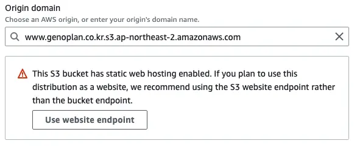

## S3 버킷 생성

### 권한 탭

- 객체 소유권→ ACL 활성화됨. 객체 라이터
- 퍼블릭 액세스 차단(버킷 설정) - 모두 비활성

<details>
  <summary>버킷 정책</summary>

```json
{
  "Version": "2012-10-17",
  "Statement": [
    {
      "Action": ["s3:ListBucket"],
      "Resource": ["arn:aws:s3:::YOUR_BUCKET"],
      "Principal": {
        "AWS": "arn:aws:iam::YOUR_ACCOUNT_NUMBER:user/YOUR_USERNAME"
      },
      "Effect": "Allow"
    },
    {
      "Action": [
        "s3:PutObject",
        "s3:PutObjectAcl",
        "s3:DeleteObject", // sync --delete에 필요. https://stackoverflow.com/a/30638955/5163033
        "s3:GetObject",
        "s3:GetObjectAcl",
        "s3:AbortMultipartUpload"
      ],
      "Resource": ["arn:aws:s3:::YOUR_BUCKET/*"],
      "Principal": {
        "AWS": "arn:aws:iam::YOUR_ACCOUNT_NUMBER:user/YOUR_USERNAME"
      },
      "Effect": "Allow"
    },
    {
      //Public read가 필요하다면
      "Sid": "public-read",
      "Effect": "Allow",
      "Principal": "*",
      "Action": "s3:GetObject",
      "Resource": "arn:aws:s3:::YOUR_BUCKET/*"
    }
  ]
}
```

</details>

### 속성 탭

정적 웹 호스팅 편집

- 정적 웹 사이트 호스팅: 활성화
- 호스팅 유형: 정적 웹 사이트 호스팅
- 인덱스 문서: index.html

## CloudFront 배포 생성

- origin domain: S3> 속성 탭> 정적 웹 사이트 호스팅> 버킷 웹 사이트 엔드포인트
- SSL Certicicate → Custom SSL → ACM에 만들어져 있는 SSL
- CNAME: domain name
- default root object: index.html

## Route53

### CNAME 생성

- 레코드 이름: site name
- 값: CloudFront의 URL

## Cache

> https://medium.com/wantedjobs/cloudfront-cloudfront-functions-%EC%9D%B4%EC%9A%A9%ED%95%98%EC%97%AC-next-js-%EB%B2%88%EB%93%A4%ED%8C%8C%EC%9D%BC-%ED%9A%A8%EC%9C%A8%EC%A0%81%EC%9C%BC%EB%A1%9C-%EC%84%9C%EB%B9%99%ED%95%98%EA%B8%B0-9ccc0541e406

### CloudFront Functions

```js
// cache
// path pattern - Default (*)
function handler(event) {
  var response = event.response
  var headers = response.headers

  // CORS header
  if (!headers["access-control-allow-origin"]) {
    headers["access-control-allow-origin"] = { value: "*" }
    console.log("Access-Control-Allow-Origin was missing, adding it now.")
  }
  // cache-control
  headers["cache-control"] = { value: "public,max-age=31536000,immutable;" }
  return response
}
```

```js
// non-cache index.html cache가 남아 있으면 front 배포 때마다 새로 build 된 assets의 uri을 못 가져온다.
// path pattern - *.html
function handler(event) {
  var response = event.response
  var headers = response.headers

  // CORS header
  if (!headers["access-control-allow-origin"]) {
    headers["access-control-allow-origin"] = { value: "*" }
  }
  // cache-control
  headers["cache-control"] = { value: "no-store, must-revalidate" }
  return response
}
```

함수연결 - 뷰어 응답

## SPA framework - S3 - CloudFront 배포 시 404 error 처리

없는 URI로 접근 시 403 error가 뜬다. [아마도 해당 url path를 cloudFront에서 인식하지 못해서 S3로 요청이 가고 public이 아니니 permission denied 에러](https://dexlee.tistory.com/189#:~:text=%ED%95%B4%EB%8B%B9%20url%20path%EB%A5%BC%20cloudFront%EC%97%90%EC%84%9C%20%EC%9D%B8%EC%8B%9D%ED%95%98%EC%A7%80%20%EB%AA%BB%ED%95%B4%EC%84%9C%20S3%EB%A1%9C%20%EC%9A%94%EC%B2%AD%EC%9D%B4%20%EA%B0%84%EB%8B%A4.%20public%EC%9D%B4%20%EC%95%84%EB%8B%88%EB%8B%88%20%EB%8B%B9%EC%97%B0%ED%9E%88%20permission%20denied%20%EC%97%90%EB%9F%AC%20%EB%B0%9C%EC%83%9D.)


cloudfront에서 403 error를 SPA framework index.html로 처리하도록 해주면 framework에서 404 처리해 줌


## [How do I serve index.html in subfolders with S3/Cloudfront?](https://stackoverflow.com/a/59649703/5163033)

In brief: when setting up your CloudFront distribution, don’t set the origin to the name of the S3 bucket; instead, set the origin to the static website endpoint that corresponds to that S3 bucket. Amazon [are clear](https://aws.amazon.com/premiumsupport/knowledge-center/s3-rest-api-cloudfront-error-403/) there is a difference here, between REST API endpoints and static website endpoints, but they’re only looking at 403 errors coming from the root in that document. [#](https://www.mark-gilbert.co.uk/serving-index-pages-from-non-root-locations-with-aws-cloudfront/#:~:text=to%20the%20solution.-,In%20brief%3A,-when%20setting%20up)



## Github Actions with IAM Roles

[Configuring OpenID Connect in Amazon Web Services](https://docs.github.com/en/actions/security-for-github-actions/security-hardening-your-deployments/configuring-openid-connect-in-amazon-web-services)

```yml
- name: Configure AWS credentials
  uses: aws-actions/configure-aws-credentials@v4
  with:
    role-to-assume: arn:aws:iam::<arn-number>:role/<role-name>
    role-duration-seconds: 900
    aws-region: <region>
```

```json
{
  "Version": "2012-10-17",
  "Statement": [
    {
      "Effect": "Allow",
      "Principal": {
        "Service": "s3.amazonaws.com"
      },
      "Action": "sts:AssumeRole"
    },
    {
      "Effect": "Allow",
      "Principal": {
        "Federated": "arn:aws:iam::<arn-number>:oidc-provider/token.actions.githubusercontent.com"
      },
      "Action": "sts:AssumeRoleWithWebIdentity",
      "Condition": {
        "StringEquals": {
          "token.actions.githubusercontent.com:aud": "sts.amazonaws.com"
        },
        "StringLike": {
          "token.actions.githubusercontent.com:sub": "repo:<org-name>/<repo-name>:*"
        }
      }
    }
  ]
}
```
