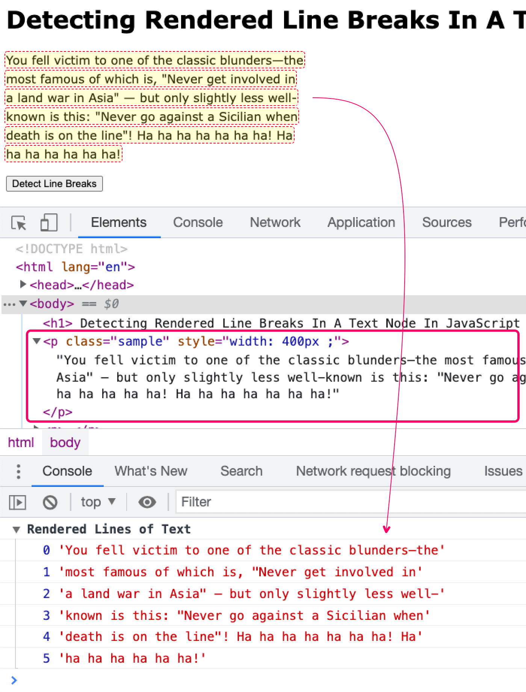

> https://www.bennadel.com/blog/4310-detecting-rendered-line-breaks-in-a-text-node-in-javascript.htm

```html
<!DOCTYPE html>
<html lang="en">
  <head>
    <meta charset="utf-8" />
    <title>Detecting Rendered Line Breaks In A Text Node In JavaScript</title>
    <link rel="stylesheet" type="text/css" href="./main.css" />
  </head>
  <body>
    <h1>Detecting Rendered Line Breaks In A Text Node In JavaScript</h1>

    <p class="sample" style="width: 400px ;">
      You fell victim to one of the classic blunders-the most famous of which
      is, "Never get involved in a land war in Asia" - but only slightly less
      well-known is this: "Never go against a Sicilian when death is on the
      line"! Ha ha ha ha ha ha ha! Ha ha ha ha ha ha ha!
    </p>

    <p>
      <button class="button">Detect Line Breaks</button>
    </p>

    <script type="text/javascript">
      var source = document.querySelector(".sample").firstChild;
      var button = document.querySelector(".button");

      // When the user clicks the button, process the text node.
      button.addEventListener("click", function handleClick(event) {
        logLines(extractLinesFromTextNode(source));
      });

      // --------------------------------------------------------------------------- //
      // --------------------------------------------------------------------------- //

      /**
       * I extract the visually rendered lines of text from the given textNode as it
       * exists in the document at this very moment. Meaning, it returns the lines of
       * text as seen by the user.
       */
      function extractLinesFromTextNode(textNode) {
        if (textNode.nodeType !== 3) {
          throw new Error("Lines can only be extracted from text nodes.");
        }

        // BECAUSE SAFARI: None of the "modern" browsers seem to care about the actual
        // layout of the underlying markup. However, Safari seems to create range
        // rectangles based on the physical structure of the markup (even when it
        // makes no difference in the rendering of the text). As such, let's rewrite
        // the text content of the node to REMOVE SUPERFLUOS WHITE-SPACE. This will
        // allow Safari's .getClientRects() to work like the other modern browsers.
        textNode.textContent = collapseWhiteSpace(textNode.textContent);

        // A Range represents a fragment of the document which contains nodes and
        // parts of text nodes. One thing that's really cool about a Range is that we
        // can access the bounding boxes that contain the contents of the Range. By
        // incrementally adding characters - from our text node - into the range, and
        // then looking at the Range's client rectangles, we can determine which
        // characters belong in which rendered line.
        var textContent = textNode.textContent;
        var range = document.createRange();
        var lines = [];
        var lineCharacters = [];

        // Iterate over every character in the text node.
        for (var i = 0; i < textContent.length; i++) {
          // Set the range to span from the beginning of the text node up to and
          // including the current character (offset).
          range.setStart(textNode, 0);
          range.setEnd(textNode, i + 1);

          // At this point, the Range's client rectangles will include a rectangle
          // for each visually-rendered line of text. Which means, the last
          // character in our Range (the current character in our for-loop) will be
          // the last character in the last line of text (in our Range). As such, we
          // can use the current rectangle count to determine the line of text.
          var lineIndex = range.getClientRects().length - 1;

          // If this is the first character in this line, create a new buffer for
          // this line.
          if (!lines[lineIndex]) {
            lines.push((lineCharacters = []));
          }

          // Add this character to the currently pending line of text.
          lineCharacters.push(textContent.charAt(i));
        }

        // At this point, we have an array (lines) of arrays (characters). Let's
        // collapse the character buffers down into a single text value.
        lines = lines.map(function operator(characters) {
          return collapseWhiteSpace(characters.join(""));
        });

        // DEBUGGING: Draw boxes around our client rectangles.
        drawRectBoxes(range.getClientRects());

        return lines;
      }

      /**
       * I normalize the white-space in the given value such that the amount of white-
       * space matches the rendered white-space (browsers collapse strings of white-space
       * down to single space character, visually, and this is just updating the text to
       * match that behavior).
       */
      function collapseWhiteSpace(value) {
        return value.trim().replace(/\s+/g, " ");
      }

      /**
       * I draw red boxes on the screen for the given client rects.
       */
      function drawRectBoxes(clientRects) {
        arrayFrom(document.querySelectorAll(".box")).forEach(function iterator(
          node
        ) {
          node.remove();
        });

        arrayFrom(clientRects).forEach(function iterator(rect) {
          var box = document.createElement("div");
          box.classList.add("box");
          box.style.top = rect.y + "px";
          box.style.left = rect.x + "px";
          box.style.width = rect.width + "px";
          box.style.height = rect.height + "px";
          document.body.appendChild(box);
        });
      }

      /**
       * I log the given lines of text using a grouped output.
       */
      function logLines(lines) {
        console.group("Rendered Lines of Text");

        lines.forEach(function iterator(line, i) {
          console.log(i, line);
        });

        console.groupEnd();
      }

      /**
       * I create a true array from the given array-like data. Array.from() if you are on
       * modern browsers.
       */
      function arrayFrom(arrayLike) {
        return Array.prototype.slice.call(arrayLike);
      }
    </script>
  </body>
</html>
```


