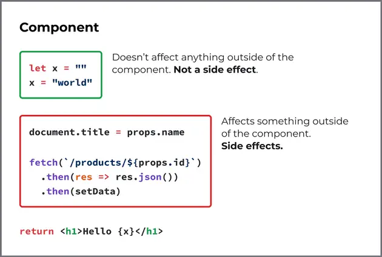

## Collections

- [A Visual Guide to useEffect](https://alexsidorenko.com/blog/useeffect/)
  > Side effects shouldn’t happen during component render. Therefore they do not belong to the body of a functional component. React has a special place for them.
  > 
- 🌠 [Some reasons for disliking react hooks](https://blog.bitsrc.io/some-reasons-for-disliking-react-hooks-80f1e18eb9b3)
- [React - The Missing Parts](https://acko.net/blog/react-the-missing-parts/)
- [Microsoft Office rewrite in React.js nears completion](https://react-etc.net/entry/microsoft-office-rewrite-to-react-js-nears-completion)
- [The Perils of Rehydration: Understanding how Gatsby/Next manage server-side rendering and rehydration](https://www.joshwcomeau.com/react/the-perils-of-rehydration/)
- [A Visual Guide to React Rendering - Cheat Sheet](https://alexsidorenko.com/blog/react-render-cheat-sheet/)
- [React with TypeScript Cheatsheet. An answer to all your React typing…](https://blog.bitsrc.io/react-with-typescript-cheatsheet-9dd891dc5bfe)
- [Avoid React Re-Renders with Automatic Batching](https://blog.bitsrc.io/avoid-react-re-renders-with-automatic-batching-dc8a76ce6de4): batching is not applied to cases like promises, setTimeout, native event handlers, and so on by default. Starting from React 18, there is a new root API called createRoot which allows you to use all the concurrent features of React 18.
- [REACT: USESTATE VS USEREDUCER](https://tasoskakour.com/blog/react-use-state-vs-use-reducer): see section of `Comparing the two implementations`
- [The React Cheatsheet for 2022](https://www.freecodecamp.org/news/the-react-cheatsheet)
- [Hooks Considered Harmful (factorialhr.com)](https://news.ycombinator.com/item?id=30753127)
- [Why React Re-Renders](https://www.joshwcomeau.com/react/why-react-re-renders/)
  - https://news.ycombinator.com/item?id=32485460
- [Blogged Answers: A (Mostly) Complete Guide to React Rendering Behavior](https://blog.isquaredsoftware.com/2020/05/blogged-answers-a-mostly-complete-guide-to-react-rendering-behavior/)
- [Can We All Just Admit React Hooks Were a Bad Idea?](https://medium.com/codex/can-we-all-just-admit-react-hooks-were-a-bad-idea-c48120c5188d)
- [Patterns.dev](https://www.patterns.dev/) is a free book on design patterns and component patterns for building powerful web apps with vanilla JavaScript and React.
- [Is React going anywhere?](https://www.infoxicator.com/is-react-going-anywhere)
  - [Aghiles Ait lounis](https://app.daily.dev/posts/kk7qnX1Wi)
    > The real question is not about React going somewhere, some of the alternatives are not “slightly better” rather immensely better, you know that a big company in Brazil is using Svlete for embedded UI for arduino devices not so powerful, performance is a big thing, as devs we want to build the best application possible, we are not business mens looking for turnover, I’m a React developer myself and work as a freelance on a big React project, and let me tell you, if the project was written in Solid it will be 10x easier to maintain, just because of the app re-rendering all the time due to useEffects() thrown everywhere and non memoized functions, objets…it’s a complete mess, anyone that think it’s not big for me it’s because they didn’t work on a big project.
    >
    > Thus said i might be completely wrong, but for me i found that Svlete, Solid and Qwik are a superior alternatives, especially Solid, they offer you free optimized code without you thinking about anything, your app will be fully optimized out the box ! it’s huge
- [A HISTORICAL REFERENCE OF REACT CRITICISM](https://www.zachleat.com/web/react-criticism/)
- [Why Create React App exists](https://github.com/reactjs/reactjs.org/pull/5487#issuecomment-1409720741)
- [New React docs pretend SPAs don't exist anymore](https://wasp-lang.dev/blog/2023/03/17/new-react-docs-pretend-spas-dont-exist)
  > The strongly recommended way to start a new React project is to use a framework such as Next.js, while the traditional route of using bundlers like Vite or CRA is fairly strongly discouraged.

## Performance

- [Before You memo()](https://overreacted.io/before-you-memo/)
  - Solution 1: Move State Down
  - Solution 2: Lift Content Up
