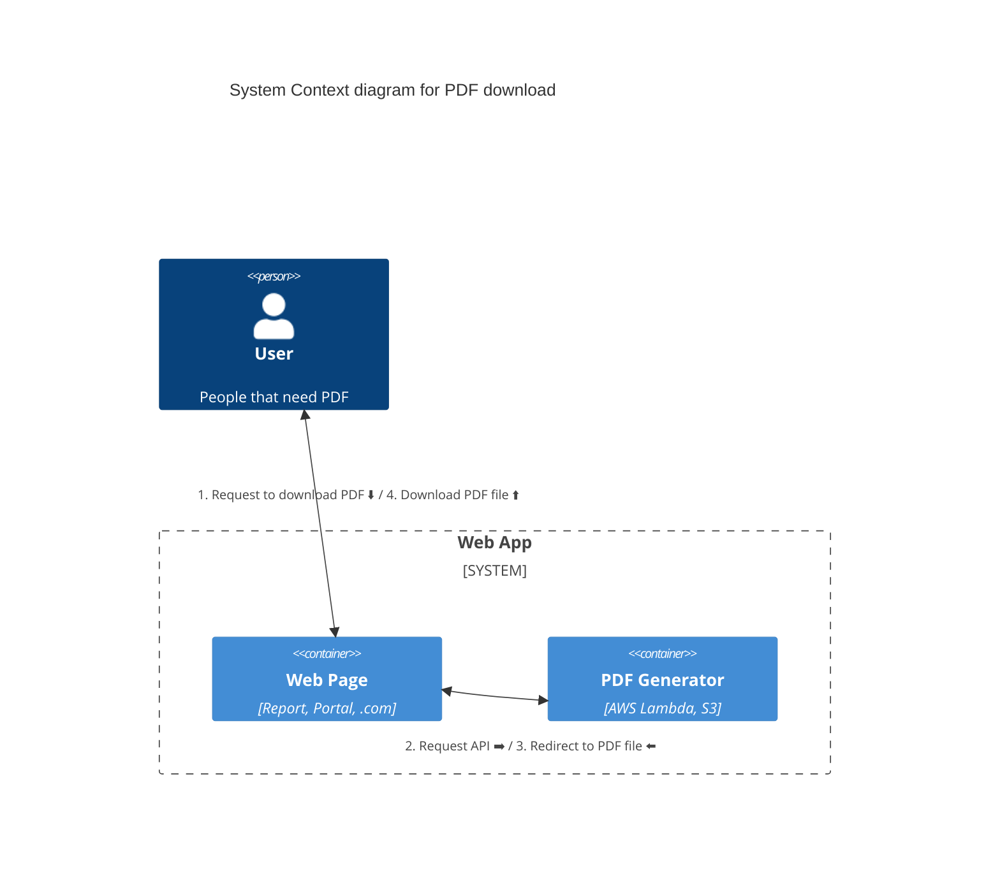

[Arc42](https://arc42.org/overview)와 [C4 model](https://c4model.com/)을 참고하여
프로젝트 문서를 작성

## Goal

제공되는 웹페이지를 A4 크기의 PDF로 만들어 client에게 제공

### Requirements Overview

기존에 PDF 생성에 사용하던 [PDFCrowd](https://pdfcrowd.com/)를 대체할 도구 제작

### Quality Goals

1. PDFCrowd보다 저럼하게 → $276/month 보다 저렴히
2. PDFCrowd보다 빠르게 PDF 생성 → 20~30초보다 빠르게
3. PDFCrowd보다 Scalability 좋게 → 동시 생성 가능 개수를 전체 8개보다 많게
4. 생성된 PDF를 S3 저장하여 서비스하고 그대로 파일을 방치하는 프로세스를 개선하여 인프라·관리 비용을 줄일 것

### Stakeholders

| Name | Expectations            |
| ---- | ----------------------- |
| Luke | Project, AWS Infra 관리 |

## Constraints

### Technical Constraints

| Constraint             | Background and / or motivation                                 |
| ---------------------- | -------------------------------------------------------------- |
| Web browser로 다운가능 | 파트너사나 Report 고객에게 PDF를 제공할 때 가장 접근성이 좋다. |

## Context

### User

| 사용자      | 용도              |
| ----------- | ----------------- |
| Report 고객 | Mybook 다운로드   |
| 파트너사    | Mybook 인쇄       |
| [.com] 고객 | 동의서(미리 생성) |

### Build, Deployment

github action을 통해 nuxt build.

client code는 S3, cloudfront로 배포, server code는 aws lambda로 배포.
(cloudfront는 없어도 될 듯?)

현재 AWS GPJ dev 계정에만 연결되어 있음. 추후 AWS GPK 계정에도 세팅해야 함.

### HTML page to PDF render

이 프로젝트에서 생성할 PDF target. 2023년 Q3 현재 back-end에서 제작 중.

추후 front-end에서 담당할 예정

예제 URL

- ~~Sample URL A~~
- ~~Sample URL B~~

### PDF file

S3에 저장되는 결과물. github action을 통해 하루 단위로 삭제. [Quality Goals#4](#quality-goals)

github 공식문서에서 언급하듯이 [cron 신뢰도가 좀 떨어지므로](#하루-한-번-s3-directory-삭제) 2번 trigger 걸어놓음.  
결과는 slack channel로 message 보내게 해뒀으니 체크하여 대응할 수 있도록 함.

## Solution Strategy

| Quality goal                            | Solution Approach       | Details                                                                |
| --------------------------------------- | ----------------------- | ---------------------------------------------------------------------- |
| $276/month 보다 저렴히                  | AWS Lambda 사용         | [Lambda resource setting](#lambda-resource-setting)                    |
| 20~30초보다 빠르게 PDF 생성             | AWS Lambda 사용         | [Lambda resource setting](#lambda-resource-setting)                    |
| 동시 생성 가능 개수를 전체 8개보다 많게 | AWS Lambda 사용         | [AWS Lambda를 쓰는 이유](#aws-lambda를-쓰는-이유)                      |
| 인프라·관리 비용 줄이기                 | Github action cron 사용 | [하루 한 번 S3 dir 삭제](#하루-한-번-s3-directory-삭제-quality-goals4) |

## Building Block View

### /server/routes/\*

Puppeteer로 지정된 Render URL을 PDF로 생성하여 S3에 저장 후 redirect하는 API

### /pages/\*

[FileSaver.js](https://github.com/eligrey/FileSaver.js), [JSZip](https://github.com/Stuk/jszip)를 사용하여 client 단에서 Download를 실행시키는 페이지

## Runtime View

- AWS Lambda에서 Puppeteer + [headless chromium](https://github.com/Sparticuz/chromium#-min-package)으로 PDF 생성
  - 이미 생성된 PDF가 있다면 생성과정 없이 바로 redirect
- PDF는 [S3에 저장](#s3를-써야-하는-이유) 후, 해당 URL을 redirect
  - 내일을 expire day로 잡아 directory로 생성
  - [하루 한 번 Github action cron으로 directory 삭제](#하루-한-번-s3-directory-삭제)
- redirect 후 단일 PDF [저장](https://github.com/eligrey/FileSaver.js) or [복수 개의 PDF라면 zip으로 저장](#download-multiple-pdf-into-one-zip-file)

## Deployment View

### GPJ dev 계정

| Infrastructure       | Description             |
| -------------------- | ----------------------- |
| AWS Lambda           | ~~Lambda Function URL~~ |
| AWS S3 client 배포용 | ~~S3 URL~~              |
| AWS S3 PDF resources | ~~S3 URL~~              |

## Decision Log

### Client가 아닌 server generator을 쓰는 이유

client에서 생성할 수 있지만, server에서 생성해서 내려주는게 사용자별 browser 호환성 문제 없다.

Client PDF generator tools

- https://github.com/parallax/jsPDF
- https://github.com/eKoopmans/html2pdf.js

### AWS Lambda를 쓰는 이유

Scalability 확보를 위해. [Quality Goals#3](#quality-goals)

복수(30개) pdf 생성 & 다운로드 테스트해보니 [browser에서 동시 접속 제한](https://stackoverflow.com/a/985704)만큼 병렬로 생성 됨 (보통 6개)

- 이전 PDFCrowd는 여러 명이 사용해도 전체 8개 제한이 있지만 Lambda는 그런 제한이 없음

### Lambda resource setting

#### 생성에 걸리는 시간 [Quality Goals#2 관련](#quality-goals)

PDFCrowd의 경우 20~30초

메모리에 따라 CPU 할당도 변경.  
Sample PDF(6.5초 rendering) 기준, run Puppeteer + Load HTML + save PDF to S3에 걸리는 시간:

| 할당된 메모리 | 생성에 걸리는 시간 |
| ------------- | ------------------ |
| 4096MB        | 18초               |
| 2048MB        | 21초               |
| 1024MB        | 48초               |

CPU를 더 할당해도, lambda cold start와 API response time은 못 줄임.

#### 가격 [Quality Goals#1 충족](#quality-goals)

2기가 기준으로 sample pdf 하나당 $0.0006993가 소모된다. ([memory cpu 가격](https://aws.amazon.com/ko/lambda/pricing/#AWS_Lambda_Pricing)만 따졌을 때) 1만 건당 7달러.  
2022.08~2023.08의 1년에 약 2만 건. $14 vs $3312(PDFCrowd plan $276/month x 12개월)

### S3를 써야 하는 이유

lambda에서 직접 다운로드 불가 - [용량 초과(Invocation payload)](https://docs.aws.amazon.com/lambda/latest/dg/gettingstarted-limits.html#function-configuration-deployment-and-execution)

### 하루 한 번 S3 directory 삭제 [Quality Goals#4](#quality-goals)

Github cron issue - [공식 문서](https://docs.github.com/en/actions/using-workflows/events-that-trigger-workflows#schedule)에서 schedule time이 부정확하고 누락 가능성도 있다고 언급  
-> 새벽에 2번 실행. slack message 확인 후 안됐으면 github에서 직접 실행 가능

github actions나 AWS lambda 시간은 UTC+0 기준.

### Download multiple PDF into one zip file

파트너사? 사용자가 하나하나 받기 불편하다고 요청

[FileSaver.js](https://github.com/eligrey/FileSaver.js), [JSZip](https://github.com/Stuk/jszip), [JSZipUtils](https://github.com/Stuk/jszip-utils)으로 browser 단에서 받도록

- [browser에서 동시 접속 제한](https://stackoverflow.com/a/985704)만큼 병렬로 생성 됨 (보통 6개)
- 30개 생성 + pdf download + zip 생성 후 저장에 2분 안 걸림 (227.4MB)
- [chrome에서 2GB 제한](https://github.com/eligrey/FileSaver.js#supported-browsers). 더 큰 파일은 stream 이용하는 code로 변경해야 함

## References

### Generation pdf with headless chrome

찾는 문서마다 chromium binary가 몇 년 지난 구 버전뿐이라 다른 문서에서 설명하는 docker image로 올려야 하나 고민했는데 계속 찾아보니 최신 binary를 발견

참고 URLs

- [Running Puppeteer on AWS Lambda](https://github.com/puppeteer/puppeteer/blob/main/docs/troubleshooting.md#running-puppeteer-on-aws-lambda)
  - https://github.com/Sparticuz/chromium
  - https://github.com/Sparticuz/chromium#-min-package
    - https://github.com/Sparticuz/chromium/blob/master/examples/remote-min-binary/index.js
  - https://github.com/Sparticuz/chromium#running-locally--headlessheadful-mode
- https://dev.to/aws-builders/building-a-pdf-generator-using-aws-lambda-4220#the-best-way-out-serverside-generation
- [Also make sure that you use --no-sandbox, --disable-dev-shm-usage, --disable-gpu, and --single-process.](https://blog.carlosnunez.me/post/scraping-chromium-lambda-nodeless-zerostress/#lessons-learned)
- https://wkhtmltopdf.org/downloads.html#stable - lambda용 binary가 있어 이것도 괜찮을거 같은데 `Qt WebKit rendering engine`을 써서 개발 시 귀찮을 듯
- [Chromium only supports x86_64 architecture inside lambda docker container, not arm64](https://awstip.com/pdf-generator-by-puppeteer-on-aws-lambda-with-nestjs-and-serverless-framework-669ba22d9fa)
- [Local Development](https://github.com/alixaxel/chrome-aws-lambda/wiki/HOWTO:-Local-Development)
- [header/footer template](https://github.com/Wavelop/download-pdf-aws/blob/main/lambdas/download-pdf.ts)
- [puppeteer launch option](https://apitemplate.io/blog/tips-for-generating-pdfs-with-puppeteer/)
- [`browser.newPage()` returns null](https://github.com/puppeteer/puppeteer/issues/1523)
- [save base64 string as pdf at client](https://stackoverflow.com/questions/11415665/save-base64-string-as-pdf-at-client-side-with-javascript)

### Etc

그 외 참고했던 URLs

- https://chromedevtools.github.io/devtools-protocol/tot/Page/#method-printToPDF
- https://blog.grio.com/2020/08/understanding-pdf-generation-with-headless-chrome.html
- https://developer.chrome.com/blog/headless-chrome/
- https://github.com/GoogleChrome/chrome-launcher
- https://medium.com/compass-true-north/go-service-to-convert-web-pages-to-pdf-using-headless-chrome-5fd9ffbae1af
- https://dev.to/aromanarguello/using-aws-lambdas-headless-chrome-to-generate-pdf-files-from-html-b4l
- https://github.com/alixaxel/chrome-aws-lambda
- https://github.com/adieuadieu/serverless-chrome
- [Amazon Linux 2](https://docs.aws.amazon.com/lambda/latest/dg/lambda-runtimes.html)
  - https://commondatastorage.googleapis.com/chromium-browser-snapshots/index.html?prefix=Linux_ARM_Cross-Compile/
- https://dev.to/akirautio/generate-a-pdf-in-aws-lambda-with-nodejs-and-puppeteer-2b93
  > And here we have everything to generate PDF in AWS lambda. To my opinion generating the pdf with 1024 MB took something like 4000ms which would mean that total price would be close to 1 euro per 20000 PDF generations after free tier.
  - https://github.com/ARautio/aws-lambda-pdf-generator-puppeteer
  - https://github.com/RelaxedJS/ReLaXed
- https://stackoverflow.com/questions/58629198/base64-to-pdf-export-issue-aws-lambda - API gateway permission
- https://aws.amazon.com/ko/blogs/architecture/field-notes-scaling-browser-automation-with-puppeteer-on-aws-lambda-with-container-image-support/
- https://github.com/serverless/examples/tree/v3/aws-node-puppeteer
- https://stackoverflow.com/a/74549527/5163033 - generate pdf using Blob

