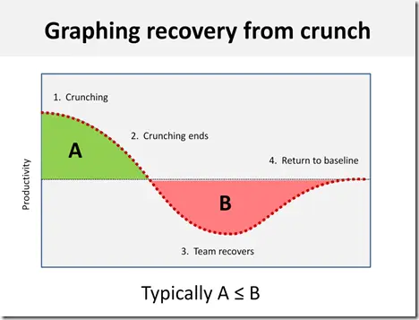
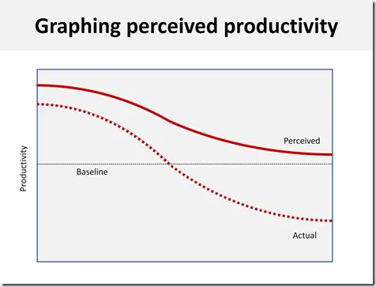

> http://blog.approache.com/2010/11/rules-of-productivity.html

How do we get more work done? It is a question that every manager and every passionate worker faces. Yet, for the most part, teams operate on gut instinct and habit. The results are less than optimal. \[[source](http://www.lostgarden.com/2008/09/rules-of-productivity-presentation.html)\]

## What is productivity?

- \+ Work accomplished
- \- Work required to fix defects
- \- Work required to fix bad design decisions

Productivity can be **_negative_** when there is more harm than good.

## Experiment 1: Overtime

Working more than  40 hours a week leads to decreased productivity.

- < 40 hours/week – working not “enough”.
- \> 60 hours/week – small productivity boost.

The boost only lasts for 3 to 4 weeks and then turns _**negative**_. Though can be used for a short-time productivity increase.

So, work 40 hours a week with time for rest and family. Never work 2 months of 60 hrs/week. Overall productivity will be lower, despite the initial boost.

## Experiment 2: Work harder in bursts.

- Take advantage of the burst during overtime.
- Crunch for a week and work only 40 hrs on another week.
- Any more efficient work patterns?

Anything over 40 hrs/week results in a recovery period, no matter how you split it up. 40 hrs/week can be 10 hrs/day for 4 days and one day off. This pattern of work can increase productivity by 10-70%.

So:

- Raise productivity immediately with short spurts < 3 weeks.
- Overtime temporarily to meet deadlines.
- Plan for the reduction in productivity immediately afterwards.
- Consider 4-day work week as a flexitime option.

## Experiment 3:  Performance for knowledge workers declines after 35 hrs, not 40.

- Creativity and problem solving decreases faster with fatigue than manual labour.
- Grinding  out problems by working longer  on average result in inferior solutions.
- Lack of sleep is particularly damaging.

So:

- Overtime kills creativity.
- If you are stuck on a problem, go home or take a break.
- Get 8 hrs of sleep to improve your problem solving abilities.

## Experiment 4: Teams on overtime feel like they are doing more, but actually accomplish less.

- Team with overtime feels like they are doing much more than the team without overtime.
- Team without overtime produces the better product and accomplishes more.

Humans ignore the systematic costs and physiological biases:

- Failure to measure (cost of defects, bad design decisions, missed opportunities).
- Linear extrapolation (initial productivity boost is seen as same in the future).
- Habit (a bad one!).
- Self reported excellence (behaviour rewarded independent of the results).

So:

- The feeling of increased long-term productivity is FALSE.
- Use customer metrics to determine the productivity.

## Experiment 5: Productivity is maximised in small teams of 4-8 people.

- Productivity of a small group is 30-50% higher than groups over 10 people.
- Too high cost of communication for groups with > 10 people.
- Smaller teams don’t have enough breadth to solve a wide array of problems.

So:

- Split your teams into cross-functional teams.
- Link small teams using '”scrum-of-scrums”.
- Create processes for:
  - growing new teams;
  - splitting large teams;
  - transitioning to new projects;

## Experiment 6: Seat people on the same team together in a closed team room.

- _**100% increase**_ in productivity.
- Faster communication and problem-solving.
- Fewer external interruptions to the team increase overall productivity.

So:

- Seat the team in their own room. With walls.
- Give at least 5 sqr/meters per person.
- Create side rooms for private conversations, phone calls, meetings.
- Minimise non-team distractions.

## Experiment 6: Cross-functional teams outperform siloed teams

- Produced more effective solutions in the same time.
- Much more likely to generate breakthrough solutions.
- Short-term loss of negotiation of norms.

This is why:

- Fewer external dependencies mean fewer lengthy blockages.
- Team has the breadth to see the forest, not just the trees.
- Different perspectives mean lower chance of groupthink.

So:

- Create the team where every skill needed to solve the problem at hand is in the same room.
- Limit the charter: “Do everything = big team”.
- Fulltime: focused team member efforts. _**Multitasking = 15% drop in productivity**_.

## Experiment 8: Scheduling at 80% of team capacity produces better products.

- Scheduling at 100% doesn’t give space to creativity.
- No lost time: passionate workers keep thinking.
- The 20% goes into new idea generation and process improvements.
- _**Producing 20 great features is usually far more profitable than 100 competent features**_.

Why?

- Allows employees to explore many options cheaply.
- Gives time to prototype breakthrough solutions that sound crazy on paper.
- _**Allows people to pursue passions**_.

So:

- Schedule 20% below possible velocity.
- Hold periodic reviews of side projects and award interesting ideas.
- Publicise and reward side projects that make their way into production.
- Keep a public list of important things if anyone runs out of work (happens rarely).

## Other productivity Techniques

### Experimentation culture:

- Fail faster to find success sooner.
- Short iterations.
- User metrics such as A/B testing.
- State gate portfolio management.

### Safety nets:

- Test-Driven-Development.
- Daily/weekly access to real customers.

### Empower the team

- Constraints-based requirements, not mandates from above.
- Training.

See the original [PDF](http://www.lostgarden.com/2008/09/rules-of-productivity-presentation.html).
