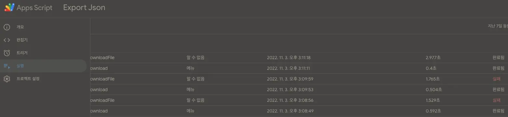

## Add apps script on sheet

> https://thenewstack.io/how-to-convert-google-spreadsheet-to-json-formatted-text/

You’ve added your data into the spreadsheet, the next step is to create an [Apps Script](https://developers.google.com/apps-script), a Google Cloud  JavaScript tool to integrate and automate tasks. To do this, click _Extensions > Apps Script_. In the resulting window, paste the following script found in [this Gist](https://gist.githubusercontent.com/pamelafox/1878143/raw/6c23f71231ce1fa09be2d515f317ffe70e4b19aa/exportjson.js).

After pasting the script, click Untitled Document and then name it something like JSON EXPORT. Next, click the _Save_ button to save your work so far. Once it’s saved, click the Run button (**Figure 1**).

**Figure 1:** The run button is the small right-pointing arrow directly to the left of Debug.

When you click Run, you’ll be prompted that the script needs permissions to continue (**Figure 2**).

**Figure 2:** Permissions are always an issue.

Make sure you walk through handing over the proper permissions for the account in question. Curing this process you’ll get a warning that Google hasn’t verified the app. Go ahead and okay that by clicking Advanced and then Go to JSON (unsafe). Finish up the permissions and you’ll be directed back to the Apps Script window.

If you now go back to the spreadsheet and reload it, you should see a new menu entry, labeled Export JSON (**Figure 3**).

**Figure 3:** Our new menu entry for the conversion to JSON.

## Script of Sheet -> i18n JSON

> https://stackoverflow.com/questions/66308153/download-google-sheet-data-as-json-from-browser-through-custom-menu  
> https://stackoverflow.com/a/66308417/5163033

### Sheet data

| Key                          | ko       | ja     | en      | zh_hant |
| ---------------------------- | -------- | ------ | ------- | ------- |
| company.desc.offices-seoul   | 서울     | ソウル | Seoul   | 首爾    |
| company.desc.offices-fukuoka | 후쿠오카 | 福岡   | Fukuoka | 福岡    |

### Google Apps Script side:

```js
// Code.gs
function onOpen() {
  SpreadsheetApp.getUi()
    .createMenu("JSON")
    .addItem("Export", "download")
    .addToUi();
}

function download() {
  const html = HtmlService.createHtmlOutputFromFile("index");
  SpreadsheetApp.getUi().showModalDialog(
    html,
    "Wait for a while -> 10 seconds +"
  );
}

function downloadFile(language) {
  const jsonString = generateJsonString(language);
  const filename = `${language}.json`;

  const blob = Utilities.newBlob(jsonString, MimeType.PLAIN_TEXT, filename);
  return {
    data: `data:${MimeType.PLAIN_TEXT};base64,${Utilities.base64Encode(
      blob.getBytes()
    )}`,
    filename,
  };
}

function generateJsonString(language) {
  const sheets = SpreadsheetApp.getActiveSpreadsheet().getSheets();
  const sheetsData = {};
  for (const sheet of sheets) {
    const rowsData = getRowsData({ sheet, language });
    Object.assign(sheetsData, rowsData); //! 같은 key가 여러 sheet에 있는 경우, 후자의 내용으로 덮어씀
  }

  return Utilities.jsonStringify(sheetsData).replace(/\",/gi, '",\n'); //! git diff로 관리하기 위해 줄바꿈 추가
}

function getRowsData({ sheet, language }) {
  const [, ...values] = sheet.getDataRange().getValues();

  const INDEX_KEY = 0;
  const INDEX_COLUMN = INDEX_LANGUAGE_COLUMNS[language];
  const obj = {};
  values.forEach((raw) => (obj[raw[INDEX_KEY]] = raw[INDEX_COLUMN]));

  return obj;
}

const INDEX_LANGUAGE_COLUMNS = {
  ko: 1,
  ja: 2,
  en: 3,
  zh_hant: 4,
};
```

### HTML&Javascript side:

```html
<!--index.html-->
<script>
  function downloadJsons(languages, indexProcessing) {
    google.script.run
      .withSuccessHandler(({ data, filename }) => {
        if (data && filename) {
          const a = document.createElement("a");
          document.body.appendChild(a);
          a.download = filename;
          a.href = data;
          a.click();
        }
        if (++indexProcessing < languages.length)
          downloadJsons(languages, indexProcessing);
        else google.script.host.close();
      })
      .downloadFile(languages[indexProcessing]);
  }

  downloadJsons(["ko", "ja", "en", "zh_hant"], 0);
</script>
```

## 주의

- Export 실행 후 다운로드까지 10초 이상 소요.
  - 언어 하나만 export할 때와 4개 export할 때 시간이 x4가 아닌걸로 봐선, script setup이 대부분의 시간을 차지하는 듯
  - script fail 시 modal 창이 그대로 유지되므로 30초 지났을 때까지 반응 없다면 Apps Script의 left nav의 실행에서 log를 확인해볼 것 
- 같은 key가 여러 sheet에 있는 경우, 후자의 내용으로 덮어씀

## Etc

- https://github.com/liddiard/google-sheet-s3
