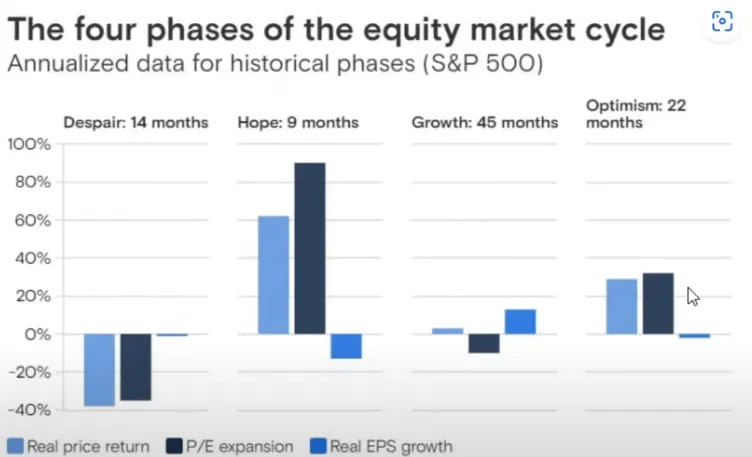

## [경기둔화 순서](https://youtu.be/uMA-FI0SYsQ?t=745)

Fed가 긴축하게되면 HOPE순서로 둔화.

1. House
2. new Order(PMI)
3. Profit (기업, EPS)
4. Employment

## [The four phases of the equity market cycle](https://www.youtube.com/live/PFUwWPA4Mn8?feature=share&t=851)

