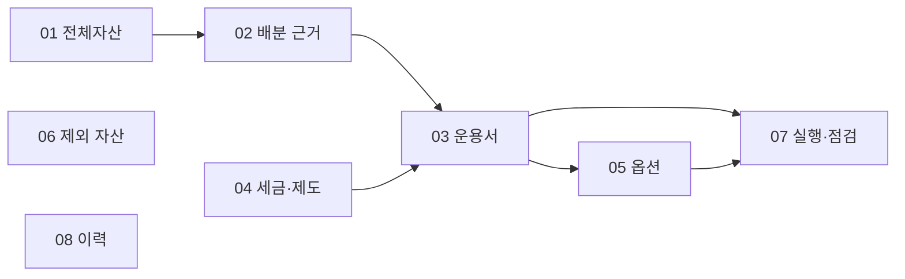

# fin.portfolio — 포트폴리오 설계 인덱스

> 단일 통합본 `fin.portfolio.md`를 대체한다. 이 문서는 입구다. 내용은 아래 8개 문서에 있다.
>
> 전제: 43세, 직장 재직 중(총급여 5,500만원 초과 → 연금 세액공제율 13.2%), **적립기**(인출 없음), 현금흐름 불필요, 투자기간 10년 이상 / 30년 지향, 채권 제외
> 부동산: **수도권 실거주 1주택 (확정)**. 총자산 부동산 8 : 유동자산 5 (약 61.5% / 38.5%)
> 인출 개시는 근로소득이 끝난 뒤로 미룬다
> 계좌: 달러 계좌, 절세 계좌(연금저축·IRP·ISA), 국내 일반 계좌, 금현물계좌
> 절세 계좌 여력: 연금저축·IRP 합산 1,800만원 + ISA 2,000만원 = 연 3,800만원
> 월 납입금: 약 330만원 (연 약 3,960만원)
> 현재 규모·계좌별 금액: [[R-1\|fin.portfolio.03-rebalancing#r-1-계좌-배치]]에서만 관리 (**최신 평가액 재측정 필요 — [[E-1\|fin.portfolio.07-execution#e-1-이행--무엇을-언제-옮기나]] 0단계**)

## 1. 기준안 배분 (요약)

| 성장주 (나스닥100 + VGT, 선택 시 모멘텀) | SCHD 대응 | KRX 금현물 | 현금 (IRP 안전자산 포함) | 주식 노출 |
| ---------------------------------------- | --------- | ---------- | ------------------------ | --------- |
| **50%**                                  | **25%**   | **15%**    | **10%**                  | **75%**   |

- 원본은 [[A-1|fin.portfolio.02-allocation#a-1-기준안]] — 비중을 바꿀 때는 A-1을 고치고 이 표를 맞춘다.
- 밴드: 상대 ±20% 발동, ±10% 복귀 → [[R-4.1|fin.portfolio.03-rebalancing#r-41-밴드--상대-20-tolerance-10]]

## 2. 문서 지도

| 문서                                                           | 접두어 | 담는 내용                                                                                    | 여는 때                                |
| -------------------------------------------------------------- | ------ | -------------------------------------------------------------------------------------------- | -------------------------------------- |
| [[01 전체자산 구조\|fin.portfolio.01-net-worth]]               | **N**  | 부동산·대출·비상금, 순자산 관점의 제약                                                       | 대출·시세 확정, 주거 관련 결정         |
| [[02 배분 근거\|fin.portfolio.02-allocation]]                  | **A**  | 기준안 배분, SCHD·금 비중 근거, 금현물 선택, 환노출, 메가캡 리스크, 지수 선택                | 비중 자체를 재검토할 때                |
| [[03 계좌 배치·리밸런싱 운용서\|fin.portfolio.03-rebalancing]] | **R**  | 계좌별 배치 금액·기준 비율, 계좌 운용 규칙, IRP 70%, 매도 우선순위, 밴드·납입금 규칙         | **매월 납입일, 밴드 이탈 시**          |
| [[04 세금·계좌 제도\|fin.portfolio.04-tax]]                    | **T**  | 세 경로 세율, 해외 배당 원천징수, 연간 세금 관리, 연금 인출 병목, 연금 900만·ISA 비이전 근거 | 세법·소득 구간이 바뀔 때, 11~12월      |
| [[05 선택 옵션\|fin.portfolio.05-options]]                     | **O**  | KIWOOM 모멘텀 ETF, 개별주 모멘텀 슬리브                                                      | 옵션 채택 판단, 3·9월 지수 리밸런싱 후 |
| [[06 검토 후 제외한 자산\|fin.portfolio.06-excluded]]          | **X**  | 검토 후 제외한 자산과 사유                                                                   | 새 자산 편입 아이디어가 생겼을 때      |
| [[07 실행·점검\|fin.portfolio.07-execution]]                   | **E**  | 이행 단계, 재검토 트리거, 미해결 사항, 연 1회 점검                                           | 할 일 확인, 연 1회 점검                |
| [[08 변경 이력·출처\|fin.portfolio.08-history]]                | **H**  | 통합·보완 경위, 변경 이력, 유의사항, 참고 문헌                                               | 결정의 배경을 찾을 때                  |

**읽는 순서.** 처음이면 00 → 01 → 02 → 03. 평소에는 03과 07만.

## 3. 분할 기준

**3.1 여는 빈도와 바뀌는 이유로 나눈다.** 규칙(03)은 매월 열고, 근거(02·04)는 전제가 바뀔 때만 연다. 같은 주제라도 "무엇을 하는가"와 "왜 그런가"를 다른 문서에 둔다.

- 03에는 규칙과 결론 한 줄만 두고, 계산은 04로 링크한다. 예: 연금 900만원 한도의 결론은 R-2.7, 계산은 T-5.
- 매도 우선순위(R-3)는 규칙이므로 03, 그 근거인 세율 표(T-1)는 제도이므로 04. 세율이 바뀌면 04를 고치고 R-3의 순서가 뒤집히는지만 확인한다.

**3.2 서로를 계속 참조하는 규칙은 한 문서에 묶는다.** 계좌별 비중(R-1)·계좌 운용 원칙(R-2)·매도 순서(R-3)·밴드와 납입금 규칙(R-4)은 하나를 바꾸면 나머지를 함께 봐야 하므로 03에 모은다.

**3.3 일회성 내용과 상시 규칙을 섞지 않는다.** 재편 이행 단계(E-1)는 끝나면 사라질 내용이라 07에 둔다. 이행이 끝나면 H(이력)로 옮긴다.

**3.4 채택 미정인 전략은 따로 둔다.** 모멘텀 ETF와 개별주 모멘텀(05)은 채택 여부가 열려 있어 코어 규칙과 분리한다. 두 전략은 한 문서에 있지만 예산을 공유하지 않는다.

**3.5 참고 기록은 링크로 대체한다.** 제외 자산(06)과 변경 이력(08)은 운용 판단에 쓰이지 않으므로 본문에서 빼고 링크로만 참조한다.

**3.6 변하는 숫자는 한 곳에서만 관리한다.**

| 숫자                                          | 원본                                |
| --------------------------------------------- | ----------------------------------- |
| 기준안 배분 비중                              | A-1 (이 문서 §1은 요약)             |
| 평가액, 계좌별 금액·기준 비율, 연 납입금 배분 | R-1                                 |
| 밴드 폭                                       | R-4.1                               |
| 세율·한도                                     | T-1, T-4                            |
| 모멘텀 옵션 상한                              | O-1 (연금 성장주 금액은 R-1을 따름) |

다른 문서에 같은 숫자가 나오면 설명용 인용이며, 불일치 시 원본이 우선한다.

**3.7 수정 파급 방향.** 링크는 탐색용이라 양방향으로 걸려 있지만, **내용을 고쳤을 때 확인할 문서**는 한 방향으로 정해 둔다.

- 04를 고치면 → 03 → 07 순으로 확인
- 02를 고치면 → 03 → 05 → 07
- 03을 고치면 → 05·07
- 06·08은 다른 문서의 판단에 영향을 주지 않는다

**3.8 문서를 추가하거나 합칠 때.** 위 기준으로 어느 문서에 속하는지 먼저 정하고, 새 문서가 필요하면 `fin.portfolio.NN-이름.md`로 만들고 새 접두어를 이 표에 추가한다. 01과 04의 병합 여부는 실제 사용 후 결정한다(미정).

## 4. 번호·링크 규칙

- **번호**: 문서별 접두어 + 번호. `R-4.1` = 03 문서 R-4의 1절. 헤딩은 `## R-4 …`, `### R-4.1 …` 형태로 번호로 시작한다.
- **링크**: dendron 위키링크 `[[번호|파일#슬러그]]`. 같은 문서 안은 `[[번호|#슬러그]]`. 슬러그는 헤딩 텍스트를 소문자화하고, 단어문자·공백·하이픈 외의 문자(구두점 등)는 삭제하고, 남은 공백을 하나씩 하이픈으로 바꾼 것이다 — 여러 문자가 삭제돼 공백이 연달아 남으면 하이픈도 그만큼 연달아 나온다 (예: `A-7 메가캡 고평가 문제 — SCHD의 존재 이유` → `a-7-메가캡-고평가-문제--schd의-존재-이유`, `—` 앞뒤 공백 2개가 하이픈 2개로 남는다).
- **표 안의 링크**는 레이블(번호)과 대상 사이 구분자를 `\|`로 쓴다.
- **헤딩에는** `:` `#` `|` `^` `[` `]`를 쓰지 않고, 링크도 넣지 않는다. 헤딩을 바꾸면 그 헤딩을 가리키는 링크를 함께 고친다(Obsidian의 헤딩 이름 변경 시 링크 자동 갱신 기능을 켜 두면 편하다).
- **외부 문서의 절 번호**(예: "인수인계 문서 §3-2")는 원문 번호이므로 `§` 표기를 그대로 둔다. 이 설계 문서 안에서는 `§`를 쓰지 않는다.

## 5. 최근 변경

- 2026-09-16 IRP 70% 한도·계좌별 목표 비율 반영 → [[H-6|fin.portfolio.08-history#h-6-irp-한도계좌별-목표-비율-반영-2026-09-16]]
- 2026-09-15 KIWOOM 모멘텀 검토 자료 반영 → [[H-5|fin.portfolio.08-history#h-5-모멘텀-검토-자료-반영-2026-09-15]]
