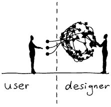
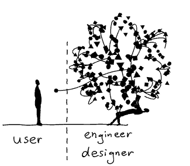

## Week 25, 2023

- [Software effort estimation is mostly fake research](https://shape-of-code.com/2021/01/17/software-effort-estimation-is-mostly-fake-research/)
  > from [HK news](https://news.ycombinator.com/item?id=36350632)
  >
  > - It's not fake research. It's actually quite an established science in the 24 years I've been doing it.
  > - Take your first guess, double it, double it again if the stakeholder is a poser, add 20% per developer less experience than you, subtract 10% for the features you're going to essentially copy paste, add 15% for sick leave (browsing HN) and then double it for every question you have that are unresolved and divide it by the room temperature multiplied by the amount of people with mechanical keyboards.
  > - That gives you roughly the right estimate for any job, until the next sprint.
- [My Custom CSS Reset](https://www.joshwcomeau.com/css/ccustom-css-reset/)
  - In MacOS Mojave, released in 2018, Apple disabled subpixel antialiasing across the operating system.
  - Confusingly, MacOS browsers like Chrome and Safari still use subpixel antialiasing by default. We need to explicitly turn it off, by setting `-webkit-font-smoothing` to `antialiased`.

## Week 24, 2023

- [Edge sends images you view online to Microsoft, here is how to disable that](https://www.neowin.net/news/edge-sends-images-you-view-online-to-microsoft-here-is-how-to-disable-that/)
- [The Surprising Power of Documentation](https://vadimkravcenko.com/shorts/proper-documentation/)
- [CIA 2010 covert communication websites](https://cirosantilli.com/cia-2010-covert-communication-websites)
- [Effortlessly Support Next Gen Image Formats](https://dennisforbes.ca/articles/jpegxl_just_won_the_image_wars.html)
  - use the `picture` element

## Week 23, 2023

- [Redditor creates working anime QR codes using Stable Diffusion](https://arstechnica.com/information-technology/2023/06/redditor-creates-working-anime-qr-codes-using-stable-diffusion/)
- [Software Engineering at Google](https://abseil.io/resources/swe-book) #bookshelf
- [How to avoid layout shifts caused by web fonts](https://simonhearne.com/2021/layout-shifts-webfonts/)
  - use `font-display: optional` to prevent layout shifts
    - hide text for up to 100ms, then only use the web font if it is available - never swapping
    - If font-display: optional is not possible for your design, use f-mods to reduce the impact of font swaps
  - subset fonts and serve as `woff2`
  - use variable fonts or a limited set of weight variations
  - preload critical fonts
  - host your own fonts on your main domain
- [Aimless.js](https://github.com/ChrisCavs/aimless.js) - The missing JavaScript randomness library.
- [The Rise of the Serverless Monoliths](https://medium.com/@dbottiau/the-rise-of-the-serverless-monoliths-63d3d2d98164)
- [What the heck is the edge anyway?](https://blog.turso.tech/what-the-heck-is-the-edge-anyway-a159a12f2412)
- [libSQL](https://github.com/libsql/libsql) is a fork of SQLite that is both Open Source, and Open Contributions.
- [`display: contents` considered harmful](https://ericwbailey.website/published/display-contents-considered-harmful/)

## Week 22, 2023

- [Webp2jpg-online](https://github.com/renzhezhilu/webp2jpg-online) - image conversion and image stitching, pure front-end implementation, fast speed, privacy protection, and offline use,20 languages supported. [link](https://imagestool.com/webp2jpg-online/)
- [Tidy First? Kent Beck on Refactoring](https://www.infoq.com/presentations/refactoring-cleaning-code/)
  - Software design is an exercise in human relationships between waiters who want new features and changers who want to improve the code structure.
  - Change the structure first. Then change the behavior and it'll be so much easier.
- [Reading Code - Chakra UI](https://alexkondov.com/reading-code-chakra-ui/)
- [Mastering the Art of Efficient JavaScript DOM Manipulation](https://itnext.io/mastering-the-art-of-efficient-javascript-dom-manipulation-899b5cbf5a3f)
  - Use document fragments
  - Use event delegation - `event.target.matches`
- [ls-lint](https://github.com/loeffel-io/ls-lint) - An extremely fast directory and filename linter - Bring some structure to your project filesystem

## Week 21, 2023

- [SST](https://github.com/serverless-stack/sst) makes it easy to build modern full-stack applications on AWS.
  - [Deploying Next.js on the edge with SST — Is SST the game-changer it’s claimed to be?](https://engineering.udacity.com/deploying-next-js-on-the-edge-with-sst-is-sst-the-game-changer-its-claimed-to-be-1f05a0abc27c)
- [Understanding React Concurrency](https://www.bbss.dev/posts/react-concurrency/)
  > The basic premise of React concurrency is to rework the rendering process such that while rendering the next view, the current view is kept responsive.
- [Dealing with cold starts](https://twitter.com/thdxr/status/1661433744970973190)
- [An Ode to React Effects](https://alexkondov.com/an-ode-to-effects/)
  > Most of the problems with `useEffect` are rooted in bad software design, not the hook’s API.
- [Be Careful Using ‘Menu’](https://adrianroselli.com/2023/05/be-careful-using-menu.html)
  - [Stop Using ‘Pop-up’](https://adrianroselli.com/2021/07/stop-using-pop-up.html)
- [11 HTML best practices for login & sign-up forms](https://evilmartians.com/chronicles/html-best-practices-for-login-and-signup-forms)
  - [Don’t Use The Placeholder Attribute](https://www.smashingmagazine.com/2018/06/placeholder-attribute/)
    - Can’t be automatically translated;
    - Is oftentimes used in place of a label, locking out assistive technology;
    - Can hide important information when content is entered;
    - Can be too light-colored to be legible;
    - Has limited styling options;
    - May look like pre-filled information and be skipped over.
- [RIP, Passwords. Here’s What’s Coming Next.](https://www.nytimes.com/wirecutter/blog/what-are-passkeys-and-how-they-can-replace-passwords/)
- [You don't need a modal window](https://youdontneedamodalwindow.dev/)
  - https://marmelab.com/react-admin-demo/#/reviews
- [A primer on functional architecture](https://increment.com/software-architecture/primer-on-functional-architecture/)

  > Just because a business workflow involves an entity, such as an “order,” doesn’t mean it has anything in common with other workflows that use that entity. For example, the “pay for an order” workflow and the “delete an order” workflow both involve orders but have completely different business logic. There’s no need for them both to depend on an arbitrary “order” service that lumps a disparate set of functions together.

  - [The Entity Service Antipattern](https://www.michaelnygard.com/blog/2017/12/the-entity-service-antipattern/)

- [Services By Lifecycle](https://www.michaelnygard.com/blog/2018/01/services-by-lifecycle/)
- [OrmHate](https://martinfowler.com/bliki/OrmHate.html)
  > Essentially the ORM can handle about 80-90% of the mapping problems, but that last chunk always needs careful work by somebody who really understands how a relational database works.  
  > ... A framework that allows me to avoid 80% of that is worthwhile even if it is only 80%.
- [Creating Seamless User Experiences: A Comprehensive Guide to Micro Frontend Architectural Patterns](https://blog.bitsrc.io/creating-seamless-user-experiences-a-comprehensive-guide-to-micro-frontend-architectural-patterns-9118a70386b7)
- [The Guardian Optimizes Mobile Push-Notification Delivery Architecture](https://www.infoq.com/news/2023/05/guardian-push-architecture/)
- [Affinity Photo as a Photoshop replacement for many people.](https://news.ycombinator.com/item?id=35988307)
- https://twitter.com/hobdaydesign/status/1655680006901624839

## Week 20, 2023

- [DevTools Tips](https://devtoolstips.org/) - A collection of useful cross-browser DevTools tips
- [Closing Modals By Pressing the Back Button in Vue.js](https://javascript.plainenglish.io/closing-modals-by-pressing-the-back-button-in-vue-js-568589b4503f)
- [Announcing Vue 3.3](https://blog.vuejs.org/posts/vue-3-3)
  - [defineModel](https://blog.vuejs.org/posts/vue-3-3#definemodel)
  - [Better Getter Support with `toRef` and `toValue`](https://blog.vuejs.org/posts/vue-3-3#better-getter-support-with-toref-and-tovalue)

## Week 19, 2023

- [I'm never investing in Google's smart home ecosystem again](https://www.androidauthority.com/google-smart-home-3319869/)
- [file-type](https://github.com/sindresorhus/file-type) is detected by checking the [magic number](<https://en.wikipedia.org/wiki/Magic_number_(programming)#Magic_numbers_in_files>) of the buffer.
- [HTMX is the Future](https://quii.dev/HTMX_is_the_Future)
  - [When Should You Use Hypermedia?](https://htmx.org/essays/when-to-use-hypermedia/)
- [Prime Video Switched from Serverless to EC2 and ECS to Save Costs](https://www.infoq.com/news/2023/05/prime-ec2-ecs-saves-costs/)
- [On Starting A Side-Project: Hotwire vs. Angular](https://www.bennadel.com/blog/4458-on-starting-a-side-project-hotwire-vs-angular.htm)
- [How to cache node_modules in GitHub Actions with Yarn](https://dev.to/mattpocockuk/how-to-cache-nodemodules-in-github-actions-with-yarn-24eh)
- [24 Powerful HTML Attributes Every Senior Web Engineer Should Master!](https://javascript.plainenglish.io/24-powerful-html-attributes-every-senior-web-engineer-should-master-ad8a4df0776e)
- [The Interactive Guide to Rendering in React](https://ui.dev/why-react-renders)
- [Favour TypeScript Types Over Interfaces](https://www.lloydatkinson.net/posts/2023/favour-typescript-types-over-interfaces/)

## Week 18, 2023

- [changelogen](https://github.com/unjs/changelogen) - 💅 Beautiful Changelogs using Conventional Commits
- [TypeScript Advanced Types for Next.js: Examples and Best Practices In 2023](https://blog.bitsrc.io/typescript-advanced-types-for-next-js-examples-and-best-practices-in-2023-a3a3946a353e)
- [Record Type in TypeScript](https://dmitripavlutin.com/typescript-record/)
- [There’s more than one way to write an IP address](https://ma.ttias.be/theres-more-than-one-way-to-write-an-ip-address/)

## Week 17, 2023

- [What is Source Command in Linux and How Does it Work?](https://linuxhandbook.com/source-command/)
- [Arrow Functions vs Regular Functions in JavaScript – What's the Difference?](https://www.freecodecamp.org/news/the-difference-between-arrow-functions-and-normal-functions/)
- [Pico CSS](https://github.com/picocss/pico) - Minimal CSS Framework for semantic HTML
- [Quickstart for GitHub Packages](https://docs.github.com/en/packages/quickstart)
- [A Completely Non-Technical Explanation of AI and Deep Learning](https://www.parand.com/a-completely-non-technical-explanation-of-ai.html)
- [THE NATURE OF CODE](https://natureofcode.com/book/) #bookshelf
- [How does JWT work? is HS256 the best option?](https://iorilan.medium.com/how-does-jwt-work-is-hs256-the-best-option-6cd9463da7b3) - look EDDSA
- [A 5 years+ tech lead said they shard a database to scale but then he failed to answer this question](https://iorilan.medium.com/a-5-years-tech-lead-said-they-shard-a-database-to-scale-but-then-he-failed-to-answer-this-question-8be39115dcb0)
- [Next.js 13 is not ready for production](https://itsteknas.medium.com/next-js-13-is-not-ready-for-production-a8a8e50fbebf)

## Week 16, 2023

- [Tachyon](https://github.com/weebney/tachyon) is a byte sized script that makes your website feel blazingly fast. It does this by prerendering pages before a user navigates to them, making page transitions virtually instant.
- [90% of My Skills Are Now Worth $0 ...but the other 10% are worth 1000x](https://tidyfirst.substack.com/p/90-of-my-skills-are-now-worth-0)
- [The relative font weight axis — how variable fonts ease font weight transitions](https://www.stefanjudis.com/today-i-learned/the-relative-font-weight-axis-how-variable-fonts-ease-font-weight/)
- [Modern HTML email (tables no longer required)](https://fullystacked.net/posts/modern-html-email/)
- [Can I Email](https://www.caniemail.com/clients/)
- [Introducing the Space Git Flow](https://blog.jetbrains.com/space/2023/04/18/space-git-flow/) - Branching Strategies about Git flow, GitHub flow, Trunk-based development, Space Git Flow
- [Korean as a Concatenative, Stack-Oriented Language](https://m.post.naver.com/viewer/postView.nhn?volumeNo=8912179&memberNo=33582594)
- [Midjourney AI Guide](https://enchanting-trader-463.notion.site/Midjourney-AI-Guide-41eca43809dd4d8fa676e648436fc29c)
- https://docs.midjourney.com/docs/permutations

## Week 15, 2023

- [You Don't Need Another Library to Compose Micro Frontends at Run Time](https://blog.bitsrc.io/you-dont-need-another-library-to-compose-micro-frontends-at-run-time-e803077ade67)
- [EventTarget.dispatchEvent()](https://developer.mozilla.org/ko/docs/Web/API/EventTarget/dispatchEvent)
- [Improving CSS Shapes with Trigonometric Functions](https://danielcwilson.com/posts/css-shapes-with-trig-functions/)
- [Jumping HTML tags. Another reason to validate your markup](https://pepelsbey.dev/articles/jumping-html-tags/)
- [HTMHell](https://www.htmhell.dev/) - A collection of bad practices in HTML, copied from real websites.
- [The 42 Best Pens for 2023: Gel, Ballpoint, Rollerball, and Fountain Pens](https://www.jetpens.com/blog/The-42-Best-Pens-for-2023-Gel-Ballpoint-Rollerball-and-Fountain-Pens/pt/974)
  - [The Difference Between Ballpoint, Gel, and Rollerball Pens](https://www.jetpens.com/blog/The-Difference-Between-Ballpoint-Gel-and-Rollerball-Pens/pt/167)
- [Croner](https://github.com/Hexagon/croner) - Cron for JavaScript and TypeScript
- [Edit Anything by Segment-Anything](https://github.com/sail-sg/EditAnything)
- [50 Ideas That Changed My Life](https://perell.com/essay/50-ideas-that-changed-my-life/)
- [How does database sharding work?](https://planetscale.com/blog/how-does-database-sharding-work)

  > why are you not using a database that does sharding for you?

- [Gource](https://github.com/acaudwell/Gource) is a visualization tool for source control repositories.
- [What happens when you leak AWS credentials and how AWS minimizes the damage](https://xebia.com/blog/what-happens-when-you-leak-aws-credentials-and-how-aws-minimizes-the-damage/)

## Week 14, 2023

- [Improving Web Accessibility with Semantic HTML and Testing Techniques and Tools](https://www.infoq.com/news/2023/04/web-accessibility/)
- [CSS Masking - Ahmad Shadeed](https://ishadeed.com/article/css-masking/)
- [An On-Ramp to Flow](https://census.dev/blog/an-on-ramp-to-flow)
  > Before stepping away, leave the code in a state where it is Obviously Broken, but Easy to Fix.  
  > Applying this technique means thinking about how to exit flow in a way that makes it easy to re-enter.
- [Two-way data binding and reactivity with 15 lines of vanilla JavaScript](https://gomakethings.com/two-way-data-binding-and-reactivity-with-15-lines-of-vanilla-javascript/)
  - Proxy, Event delegate
- [New React docs pretend SPAs don't exist anymore](https://wasp-lang.dev/blog/2023/03/17/new-react-docs-pretend-spas-dont-exist)
  > The strongly recommended way to start a new React project is to use a framework such as Next.js, while the traditional route of using bundlers like Vite or CRA is fairly strongly discouraged.
- [AI won’t steal your job, people leveraging AI will](https://cmte.ieee.org/futuredirections/2023/04/03/ai-wont-steal-your-job-people-leveraging-ai-will/)
- [Saying Goodbye to GitHub](https://ersei.net/en/blog/bye-bye-github)
  - bruce511's [another opinion](https://news.ycombinator.com/item?id=35419257)
- [He who submits a resume has already lost](https://www.residentcontrarian.com/p/he-who-submits-a-resume-has-already)
- [Twitter's Recommendation Algorithm](https://blog.twitter.com/engineering/en_us/topics/open-source/2023/twitter-recommendation-algorithm)
  - https://github.com/twitter/the-algorithm
- [One In Two New Npm Packages Is SEO Spam Right Now](https://blog.sandworm.dev/one-in-two-new-npm-packages-is-seo-spam-right-now)
- [CSS hyphens](https://developer.mozilla.org/en-US/docs/Web/CSS/hyphens)
  - `<wbr>`, `&shy;` - [Two ways to safely break a long word in HTML](https://www.amitmerchant.com/two-ways-to-safely-break-a-long-word-in-html/)

## Week 13, 2023

- [Why You Should Use Bash Over Python](https://dnastacio.medium.com/bash-over-python-39e0eba502f9)
- [SVGOMG](https://jakearchibald.github.io/svgomg/) is **[SVGO](https://github.com/svg/svgo)**'s **M**issing **G**UI, aiming to expose the majority, if not all the configuration options of SVGO.
- [Why Engineers Need To Write](https://www.developing.dev/p/why-engineers-need-to-write)
  > Writing for a child forces me to keep the words and concepts very, very simple, and to write in a style that builds up usage of the program from first principles. Writing for the grumpy old-timer is a practice in minimizing questions from them, forcing me to do a sort of final pass on the overall design of what I'm writing about, to defend design choices, and to add future improvements to the backlog. Drafting the documentation for semi-finished features that are still in progress has sometimes led me to change the design in order to make writing the docs targeting these two people simpler.  
  > — [albrewer](https://news.ycombinator.com/item?id=35307562)

## Week 12, 2023

- [Summarize anything with the Universal Summarizer](https://blog.kagi.com/universal-summarizer)
- [Cheating is All You Need](https://about.sourcegraph.com/blog/cheating-is-all-you-need)

  > Software engineering exists as a discipline because you cannot EVER under any circumstances TRUST CODE.
  >
  > - You get the LLM to draft some code for you that’s 80% complete/correct.
  > - You tweak the last 20% by hand.

  > > Someone is hesitant about 5 times as productive because we only need to "check the code is good" for [two main reasons](https://news.ycombinator.com/item?id=35275438).

- [GitHub Copilot X: The AI-powered developer experience](https://github.blog/2023-03-22-github-copilot-x-the-ai-powered-developer-experience/)
  - [Copilot X](https://github.com/github-copilot/chat_waitlist_signup/)
  - [Copilot Docs](https://githubnext.com/projects/copilot-for-docs/)
  - [Copilot for PRs](https://githubnext.com/projects/copilot-for-pull-requests/)
  - [Copilot CLI](https://githubnext.com/projects/copilot-cli/)
- [Why Tacit Knowledge is More Important Than Deliberate Practice](https://commoncog.com/tacit-knowledge-is-a-real-thing/)
- [MySQL for Developers](https://planetscale.com/courses/mysql-for-developers/introduction/course-introduction) #bookshelf
- [Web fingerprinting is worse than I thought](https://www.bitestring.com/posts/2023-03-19-web-fingerprinting-is-worse-than-I-thought.html)
- [Laying Out a Print Book With CSS](https://iangmcdowell.com/blog/posts/laying-out-a-book-with-css/)
  - https://pagedjs.org/documentation/
  - https://www.print-css.rocks/
  - https://doc.courtbouillon.org/weasyprint/stable/
- [How to Use v-model with Form Inputs in Vue](https://dmitripavlutin.com/vue-v-model-form-inputs/)
- [Category Theory Illustrated](https://abuseofnotation.github.io/category-theory-illustrated/) #bookshelf
- [Steampipe](https://github.com/turbot/steampipe) is the universal interface to APIs. Use SQL to query cloud infrastructure, SaaS, code, logs, and more.
  - https://github.com/turbot/steampipe-plugin-googlesheets
- [libgsqlite](https://github.com/0x6b/libgsqlite) - A SQLite extension which loads a Google Sheet as a virtual table.
- [How A Web Design Goes Straight To Hell](https://theoatmeal.com/comics/design_hell)
- [Transformers.js](https://github.com/xenova/transformers.js) - Run 🤗 Transformers in your browser! We currently support [BERT](https://huggingface.co/docs/transformers/model_doc/bert), [ALBERT](https://huggingface.co/docs/transformers/model_doc/albert), [DistilBERT](https://huggingface.co/docs/transformers/model_doc/distilbert), [T5](https://huggingface.co/docs/transformers/model_doc/t5), [T5v1.1](https://huggingface.co/docs/transformers/model_doc/t5v1.1), [FLAN-T5](https://huggingface.co/docs/transformers/model_doc/flan-t5), [GPT2](https://huggingface.co/docs/transformers/model_doc/gpt2), [BART](https://huggingface.co/docs/transformers/model_doc/bart), [CodeGen](https://huggingface.co/docs/transformers/model_doc/codegen), [Whisper](https://huggingface.co/docs/transformers/model_doc/whisper), [CLIP](https://huggingface.co/docs/transformers/model_doc/clip), [Vision Transformer](https://huggingface.co/docs/transformers/model_doc/vit), and [VisionEncoderDecoder](https://huggingface.co/docs/transformers/model_doc/vision-encoder-decoder) models, for a variety of tasks including: masked language modelling, text classification, text-to-text generation, translation, summarization, question answering, text generation, automatic speech recognition, image classification, zero-shot image classification, and image-to-text.
- [Structured text tools](https://github.com/dbohdan/structured-text-tools) - The following is a list of text-based file formats and command line tools for manipulating each.
- [Understanding lazy load and hydration in nuxt](https://stackoverflow.com/a/70263401/5163033)
  - [It is almost always better to use `v-if` on the component instance.](https://twitter.com/MaOberlehner/status/1353747260434227201)

## Week 11, 2023

- [Master the Art of Caching for System Design Interviews: A Complete Guide](https://levelup.gitconnected.com/master-the-art-of-caching-for-system-design-interviews-a-complete-guide-676bb49d194)
- [Highlights from Git 2.40](https://github.blog/2023-03-13-highlights-from-git-2-40/)
- [Basics of CI/CD Pipeline](https://medium.com/jaanvi/basics-of-ci-cd-pipeline-5762e0eca44e)
  1. Version control
  2. Build
  3. Unit test
  4. Deploy
  5. Auto test
  6. Deploy to production
  7. Measure & validate
- [Managing State In Vue With Pinia ORM](https://blog.openreplay.com/managing-state-in-vue-with-pinia-orm/)

## Week 10, 2023

- [The Best Engineering Blogs](https://draft.dev/learn/engineering-blogs)
- [Everything You Need to Know About the Gap After the List Marker](https://css-tricks.com/everything-you-need-to-know-about-the-gap-after-the-list-marker/)
- [Study finds mushrooms magnify memory by boosting nerve growth](https://medicalxpress.com/news/2023-02-mushrooms-magnify-memory-boosting-nerve.html)
  > I think it should be everyone's primary focus to sleep well, drink water, get outside, get active, and eat generally decently. I hate to say it, but if you're not eating a good amount of vegetables and fruit, decent protein, sleep, etc, no amount of XYZ will catch up to that detriment.
  >
  > — [CE02](https://news.ycombinator.com/item?id=35056071)
- [rallly](https://github.com/lukevella/rallly) - Self-hostable doodle poll alternative. Find the best date for a meeting with your colleagues or friends without the back and forth emails.

## Week 9, 2023

- [All you may need is HTML](https://fabiensanglard.net/html/index.html)
  - [0x10 RULES](https://fabiensanglard.net/ilike/index.html)
- [devalue](https://github.com/Rich-Harris/devalue) - Gets the job done when JSON.stringify can't
- [vite-plugin-federation](https://github.com/originjs/vite-plugin-federation) - Module Federation for vite & rollup
- [js-beautify](https://github.com/beautify-web/js-beautify) - partly deobfuscate scripts
- [Some More On-Scroll Typography Animations](https://tympanus.net/codrops/2023/02/22/some-more-on-scroll-typography-animations/)
- [Why I’m sticking with Vue in 2023](https://medium.com/@lindblomdev/why-im-sticking-with-vue-in-2023-d67bce7bc2f4)
  - Script setup + composition API produce clean code
  - Performance is good
  - Best tooling I have used
- [Resizing with CSS](https://css-irl.info/resizing-with-css/)
- [48 Accessibility Bookmarklets You Can Use For A11Y Testing](https://www.digitala11y.com/accessibility-bookmarklets-testing/)
- [fontaine](https://github.com/danielroe/fontaine) - Automatic font fallback based on font metrics
- [Firecracker internals: a deep dive inside the technology powering AWS Lambda](https://www.talhoffman.com/2021/07/18/firecracker-internals/)
  - https://github1s.com/firecracker-microvm/firecracker
- [Improve Your VSCode Workflow to the Max](https://www.builder.io/blog/vscode-tips)
  - [GitHub Copilot Labs](https://marketplace.visualstudio.com/items?itemName=GitHub.copilot-labs)
- [jose](https://github.com/panva/jose) - "JSON Web Almost Everything" - JWA, JWS, JWE, JWT, JWK, JWKS for Node.js, Browser, Cloudflare Workers, Deno, Bun, and other Web-interoperable runtimes.
- [Easy implemented dark mode](https://twitter.com/flaviocopes/status/1627609246014619649)
- [What to Expect from Vue in 2023 and How it Differs from React](https://thenewstack.io/vue-2023/)
- [The Unreasonable Effectiveness of Conditional Probabilities](https://two-wrongs.com/unreasonable-effectiveness-of-conditional-probabilities.html)
  - https://news.ycombinator.com/item?id=34900823
- [Debugging Node.js, The Right Way](https://www.builder.io/blog/debug-nodejs)
  ```shell
  node server.js --inspect-brk
  ```
  - [chrome dev tools](https://cdn.builder.io/api/v1/image/assets%252FYJIGb4i01jvw0SRdL5Bt%252Ff5dd633650214ff28d620d233299329b?format=webp&width=2000)

## Week 8, 2023

- [test && commit || revert](https://medium.com/@kentbeck_7670/test-commit-revert-870bbd756864)
- [Limbo: Scaling Software Collaboration](https://medium.com/@kentbeck_7670/limbo-scaling-software-collaboration-afd4f00db4b)
  > Sort commits into “couldn’t possibly cause problems” (you’ll be mostly right) and “might cause problems”. Treat them differently. Rearrange your workflow so you have mostly “couldn’t possibly cause problems” commits.
- [My class required AI. Here's what I've learned so far.](https://oneusefulthing.substack.com/p/my-class-required-ai-heres-what-ive)
- [`a = 0-x` is about 3-10x faster than `a = -x`](https://twitter.com/mhevery/status/1626259524930932745)
- [How to Favicon in 2023: Six files that fit most needs](https://evilmartians.com/chronicles/how-to-favicon-in-2021-six-files-that-fit-most-needs/)
- [Important SEO-Related HTML Tags, And How To Optimize Them](https://blog.openreplay.com/important-seo-related-tags-in-html-and-how-to-optimize-them/)
- https://pointerpointer.com/
- [How to Inspect Interactions in the Browser](https://www.builder.io/blog/inspect-interactions-in-the-browser)
- [I love building a startup in Rust. I wouldn't pick it again.](https://www.propelauth.com/post/i-love-building-a-startup-in-rust-i-wouldnt-pick-it-again)
  > If you're thinking about building something in Rust, a good question to ask is, "what would I use if Rust didn't exist?" If your answer is something like Go or Node.js, then Rust is probably not the right choice. If your answer is C or C++ or something similar, then Rust is very likely the right choice.
  > [zeroxfe](https://news.ycombinator.com/item?id=34836164)
- [Writing Javascript without a build system](https://jvns.ca/blog/2023/02/16/writing-javascript-without-a-build-system/)
  - For me, a complicated Javascript build system just doesn’t seem worth it for small 500-line projects
  - [if I want a build system, use esbuild](https://jvns.ca/blog/2021/11/15/esbuild-vue/)
- [CSS Named Colors: Groups, Palettes, Facts, & Fun](https://austingil.com/css-named-colors/)

## Week 7, 2023

- [Electric Clojure](https://github.com/hyperfiddle/electric) – a signals DSL for fullstack web UI, with compiler-managed network sync
  - https://news.ycombinator.com/item?id=34771771
- [Just 4 pages a day. It really adds up.](https://news.ycombinator.com/item?id=34779980)
- [Comparing the Top Eight Managed Kubernetes Providers](https://medium.com/@elliotgraebert/comparing-the-top-eight-managed-kubernetes-providers-2ae39662391b)
  - Best overall: Azure
  - Best for startups: Linode
  - Best for cost: OVHCloud
- [SQLite the only database you will ever need in most cases](https://www.unixsheikh.com/articles/sqlite-the-only-database-you-will-ever-need-in-most-cases.html)
  - https://news.ycombinator.com/item?id=34813140
- [Squares in Squares](https://erich-friedman.github.io/packing/squinsqu/)
- [What's up with monomorphism?](https://mrale.ph/blog/2015/01/11/whats-up-with-monomorphism.html)
- [Rethinking the Modern Web](https://dev.to/oxharris/rethinking-the-modern-web-5cn1)
- [Use Maps More and Objects Less](https://www.builder.io/blog/maps)
- [React Server Components vs. Server-Side Rendering](https://www.thearmchaircritic.org/mansplainings/react-server-components-vs-server-side-rendering)
  - https://beta.nextjs.org/docs/rendering/fundamentals
- [Type vs Interface in TypeScript](https://blog.bitsrc.io/type-vs-interface-in-typescript-cf3c00bc04ae)
- [Unpacking API Management policies [Part 2]: 5 ways to handle REST API authentication](https://cloud.google.com/blog/products/api-management/5-ways-to-implement-rest-api-authentication/?hl=en)
- [useSignal() is the future of web frameworks and is a better abstraction than useState(), which is showing its age.](https://javascriptweekly.com/link/135369/web)
- [Using Notion as a Headless CMS with Nuxt](https://dev.to/trentbrew/using-notion-as-a-headless-cms-with-nuxt-3mk)
- [Speeding up the JavaScript ecosystem - eslint](https://marvinh.dev/blog/speeding-up-javascript-ecosystem-part-3/)
- [Why Create React App exists](https://github.com/reactjs/reactjs.org/pull/5487#issuecomment-1409720741)
- [Discover the Magic of Portals: A Beginner’s Guide to React’s Most Powerful Tool](https://blog.bitsrc.io/discover-the-magic-of-portals-a-beginners-guide-to-react-s-most-powerful-tool-f6f1965ea305)
  - Portals allow you to render components outside of their parent component’s tree.
  - When should you use portals?
    - Modals and dialogs
    - Tooltips and popovers
    - Overlaying content
- [Environment Variables in JavaScript: process.env](https://dmitripavlutin.com/environment-variables-javascript/)
- [The Guide To Responsive Design In 2023 and Beyond](https://ishadeed.com/article/responsive-design/)
- [A HISTORICAL REFERENCE OF REACT CRITICISM](https://www.zachleat.com/web/react-criticism/)
- [OrgChart](https://github.com/dabeng/OrgChart) - It's a simple and direct organization chart plugin. Anytime you want a tree-like chart, you can turn to OrgChart.
- [Optimal Images in HTML](https://www.builder.io/blog/fast-images)
- [I made ChatGPT and Bing AI have a conversation (and they are friends now)](https://moritz.pm/posts/chatgpt-bing)
- [Five Tips For a Healthier Postgres Database in the New Year](https://www.crunchydata.com/blog/five-tips-for-a-healthier-postgres-database-in-the-new-year)
- [How to Search Files Effectively in the Linux Terminal](https://www.freecodecamp.org/news/how-to-search-files-in-the-linux-terminal/)
- Ask HN: What Happened to Elm?
  - [In version 0.19, the core team hardcoded a whitelist into the compiler of which projects are allowed to use native code (which happened to basically be the core team's pet projects). This basically crippled the language beyond usability for everyone else.](https://news.ycombinator.com/item?id=34746350)

## Week 6, 2023

- [Image Compression with Singular Value Decomposition](https://timbaumann.info/svd-image-compression-demo/)
- [A Better Way to Work With Number and Date Inputs in JavaScript](https://www.builder.io/blog/numbers-and-dates)
  - valueAsNumber, valueAsDate
- [Three attributes for better web forms](https://adactio.com/journal/19842)
  - inputmode, enterkeyhint, and autocomplete.
- [Understand the Lexical Scoping in JavaScript](https://javascript.plainenglish.io/understand-the-lexical-scoping-in-javascript-6b85ca94b565)
- [JavaScript Require – How to Use the require() Function in JS](https://www.freecodecamp.org/news/how-to-use-the-javascript-require-function/)
- [When You Should Prefer Map Over Object In JavaScript](https://www.zhenghao.io/posts/object-vs-map)
- [The new Wikipedia appearance that took the whole village](https://medium.com/@dlyall/the-new-wikipedia-appearance-that-took-a-whole-village-52637b34a00f)
  - [Vue.js has been selected as Wikimedia Foundation's future JavaScript framework](https://lists.wikimedia.org/hyperkitty/list/wikitech-l@lists.wikimedia.org/thread/SOZREBYR36PUNFZXMIUBVAIOQI4N7PDU/)
  - [RFC: Adopt a modern JavaScript framework for use with MediaWiki](https://phabricator.wikimedia.org/T241180) and [EvanYou comment](https://phabricator.wikimedia.org/T241180#:~:text=Project%20lead%20of%20Vue.js%20here.)
- [The Intermediate Plateau: What Causes It? How Can We Move Beyond It?](https://www.scotthyoung.com/blog/2023/01/03/intermediate-plateau/)
- [codeium](https://www.codeium.com/) - Free AI-powered code completion for everyone, everywhere
- [Windows 11: a spyware machine out of users' control?](https://www.techspot.com/news/97535-windows-11-spyware-machine-out-users-control.html)
- [sqlc](https://github.com/kyleconroy/sqlc) - A SQL Compiler
- [Use GPT-3 incorrectly: reduce costs 40x and increase speed by 5x](https://www.buildt.ai/blog/incorrectusage)
  - To reduce costs and increase speed, they developed a technique to generate a moderately sized corpus of completions made by a larger model, and fine-tune a smaller model to do the same task. This can reduce costs by 40x and increase speed by 5x. This is an interesting approach to using GPT-3 to reduce costs and increase speed, and could be useful for other applications.
  - [Knowledge distillation](https://en.m.wikipedia.org/wiki/Knowledge_distillation)
- [Increment Selection - vs code extension](https://marketplace.visualstudio.com/items?itemName=albymor.increment-selection)
- [Screw motivation, what you need is discipline.](https://www.wisdomination.com/screw-motivation-what-you-need-is-discipline/)
- [Visual design rules you can safely follow every time](https://anthonyhobday.com/sideprojects/saferules/)
  - https://news.ycombinator.com/item?id=34684761
- [Optimal program design 2.0](https://mennohenselmans.com/optimal-program-design/)
- [`<vue-clamp>`](https://github.com/Justineo/vue-clamp) - Clamping multiline text with ease.
- [Comparing Manual and Free Automated WCAG Reviews](https://adrianroselli.com/2023/01/comparing-manual-and-free-automated-wcag-reviews.html)
- [Introduction to Linux Server Administration!](https://github.com/livialima/linuxupskillchallenge)
  - https://theleo.zone/posts/linux-upskill/
- [deadfile](https://github.com/M-Izadmehr/deadfile) - Simple util to find deadcode and unused files in any JavaScript project (ES5, ES6, React, Vue, ...).

## Week 5, 2023

- [History of Lisp Parentheses](https://github.com/shaunlebron/history-of-lisp-parens)
- [JavaScript Closure: A Simple Explanation](https://dmitripavlutin.com/javascript-closure/)
- [10 Web Development Trends in 2023](https://www.robinwieruch.de/web-development-trends/)
- [5 Must-Know Differences Between ref() and reactive() in Vue](https://dmitripavlutin.com/ref-reactive-differences-vue/)
- [International domain names: where does https://meßagefactory.ca lead you?](https://lemire.me/blog/2023/01/23/international-domain-names-where-does-https-mesagefactory-ca-lead-you/) - The result depends on your browser.
- [Two ways to safely break a long word in HTML](https://www.amitmerchant.com/two-ways-to-safely-break-a-long-word-in-html/)
  - `<wbr>`
  - `&shy;`
- [Demystifying Fresh — Build Your own Islands of Interactivity](https://blog.bitsrc.io/demystifying-fresh-building-your-own-islands-of-interactivity-4b774cc30393)
- [Netlify lost my trust](https://news.ycombinator.com/item?id=34614533) and replies
- [Virtual DOM is pure overhead](https://svelte.dev/blog/virtual-dom-is-pure-overhead)
  - [comment by former React core team member Pete Hunt](https://news.ycombinator.com/item?id=34615578) and replies
- [When Discord is open in the background, NVIDIA card will not reach full speed](https://nvidia.custhelp.com/app/answers/detail/a_id/5443/~/when-discord-is-open-in-the-background%2C-graphics-card-memory-clocks-will-not)
  - https://news.ycombinator.com/item?id=34615351
- [Trigger.dev](https://github.com/triggerdotdev/trigger.dev) is an open-source platform that makes it easy for developers to create event-driven background tasks directly in their code.
  - https://pipedream.com/
  - https://temporal.io/
  - https://github.com/windmill-labs/windmill
- [Weeklong improved colour contrasts sensitivity after single 670 nm exposures associated with enhanced mitochondrial function](https://www.nature.com/articles/s41598-021-02311-1)
  - https://news.ycombinator.com/item?id=34611077
- [MySQL vs PostgreSQL in 2023.](https://dbconvert.com/blog/mysql-vs-postgresql/)
- [Understanding Authentication In Websites: A Banking Analogy](https://www.smashingmagazine.com/2023/01/authentication-websites-banking-analogy/)
- [Carbonyl](https://github.com/fathyb/carbonyl) is a Chromium based browser built to run in a terminal. [Read the blog post](https://fathy.fr/carbonyl).
- [Ask HN: What would be your stack if you are building an MVP today?](https://news.ycombinator.com/item?id=34530052)
- [What we look for in a resume](https://huyenchip.com/2023/01/24/what-we-look-for-in-a-candidate.html)
- [LastPass breach gets worse](https://old.reddit.com/r/sysadmin/comments/10kp4ye/lastpass_breach_gets_worse/)
- [IPinside: Korea’s mandatory spyware](https://palant.info/2023/01/25/ipinside-koreas-mandatory-spyware/)
  - [South Korea’s online security dead end](https://palant.info/2023/01/02/south-koreas-online-security-dead-end/)
  - [TouchEn nxKey: The keylogging anti-keylogger solution](https://palant.info/2023/01/09/touchen-nxkey-the-keylogging-anti-keylogger-solution/)
- [Bitwarden design flaw: Server side iterations](https://palant.info/2023/01/23/bitwarden-design-flaw-server-side-iterations/)
- [The Ultimate Guide To Software Architecture Documentation](https://www.workingsoftware.dev/software-architecture-documentation-the-ultimate-guide/)
  - https://arc42.org/download
- [Why React isn't dying](https://tkdodo.eu/blog/why-react-isnt-dying)

## Week 4, 2023

- [Transducers: Efficient Data Processing Pipelines in JavaScript](https://medium.com/javascript-scene/transducers-efficient-data-processing-pipelines-in-javascript-7985330fe73d)
- [The Page With No Code](https://danq.me/2023/01/11/nocode/)
  - https://no-ht.ml/
- [Techniques to improve reliability](https://github.com/openai/openai-cookbook/blob/main/techniques_to_improve_reliability.md)
  > Applying this simple trick to the MultiArith math dataset, the authors found `Let's think step by step` quadrupled the accuracy, from 18% to 79%!
- [Interview Questions to ask as a candidate](https://docs.google.com/spreadsheets/d/11DoQ-Bhvs5mfRwB0Bz6OHwoChhFVK7u_KqlbFgR-ezY/)
- [Topcat's System Design Template](https://leetcode.com/discuss/career/229177/My-System-Design-Template)
- [Unable to make a single bit of progress, my goto strategy is similar to what writers call a vomit draft.](https://news.ycombinator.com/item?id=34449984)
- [Git-Sim: Visually Simulate Git Operations In Your Own Repos](https://initialcommit.com/blog/git-sim)
  - https://github.com/initialcommit-com/git-sim
- [Function Composition in Large React Applications: Best Practices and Real-World Examples](https://medium.com/@rivoltafilippo/function-composition-in-large-react-applications-best-practices-and-real-world-examples-805aba8d37b1)

## Week 3, 2023

- [5 Mistakes to Avoid When Self Hosting a Website from Home](https://noted.lol/5-mistakes-to-avoid-when-self-hosting-from-home/)
- [Nerd Fonts](https://github.com/ryanoasis/nerd-fonts) is a project that patches developer targeted fonts with a high number of glyphs (icons). Specifically to add a high number of extra glyphs from popular 'iconic fonts' such as [Font Awesome](https://github.com/FortAwesome/Font-Awesome), [Devicons](https://vorillaz.github.io/devicons/), [Octicons](https://github.com/primer/octicons), and [others](https://github.com/ryanoasis/nerd-fonts#glyph-sets).
- [ai-collection](https://github.com/ai-collection/ai-collection) - A List of Awesome Generative AI Applications
- [1000+ Free Developer Certifications](https://www.freecodecamp.org/news/free-certificates/)
- [Design Doping: My Obsession with AI as the Ultimate Brainstorming Partner](https://medium.com/geekculture/design-doping-my-obsession-with-ai-as-the-ultimate-brainstorming-partner-2ff28de2e34b)
- [Every Software Developer should write a blog](https://dev.to/nasirovelchin/every-software-developer-should-write-a-blog-4622)
- [API Management in Nuxt 3 with TypeScript](https://www.vuemastery.com/blog/api-management-in-nuxt-3-with-typescript)
- [10 Advanced TypeScript Tips for Development](https://levelup.gitconnected.com/10-advanced-typescript-tips-for-development-2666298d50f)
- [Evergreen notes](https://notes.andymatuschak.org/Evergreen_notes)
- [How to draw ideas](https://ralphammer.com/how-to-draw-ideas/)
  - [A quick beginner’s guide to drawing](https://ralphammer.com/a-quick-beginners-guide-to-drawing/)
- [Make me think!](https://ralphammer.com/make-me-think/)
  -  
  - 
- [sysend](https://github.com/jcubic/sysend.js) - Web application synchronization between different tabs
- [Static HTML comments](https://sive.rs/shc)

## Week 2, 2023

- [How to Destructure Props in Vue (Composition API)](https://dmitripavlutin.com/props-destructure-vue-composition/)
- [Type-safe React Query](https://tkdodo.eu/blog/type-safe-react-query)
- [C4-PlantUML](https://github.com/plantuml-stdlib/C4-PlantUML) combines the benefits of [PlantUML](https://plantuml.com/) and the [C4 model](https://c4model.com/) for providing a simple way of describing and communicate software architectures.
- [VS Code Shortcuts To Code Like You’re Playing a Piano](https://betterprogramming.pub/vs-code-shortcuts-to-code-like-youre-playing-a-piano-e5db7b272d1)
- [recommended routine - bodyweightfitness](https://www.reddit.com/r/bodyweightfitness/wiki/kb/recommended_routine/)
  - [MuscleWiki](https://musclewiki.com/) - Find exercises that work specific muscles
- [OWASP Cheat Sheet Series](https://cheatsheetseries.owasp.org/) #bookmark
  - https://owasp.org/sitemap/ - Key Projects
- [2022 JavaScript Rising Stars](https://risingstars.js.org/2022/en)
- 🤖 [just](https://github.com/casey/just) is a handy way to save and run project-specific commands.
- [Introduction to Statistical Lebarning](https://www.statlearning.com/)
- [Do-nothing scripting: the key to gradual automation](https://blog.danslimmon.com/2019/07/15/do-nothing-scripting-the-key-to-gradual-automation/)
- [Extreme questions to trigger new, better ideas](https://longform.asmartbear.com/posts/extreme-questions/)
  - 10x prices, No customers, No tech support, ...
- https://github.com/search?o=desc&q=stars%3A%3E100000&s=stars&type=Repositories
- https://github.com/sindresorhus/awesome - 😎 Awesome lists about all kinds of interesting topics
- [roadmap.sh](https://roadmap.sh/) - Community driven roadmaps, articles and resources for developers
- [fish](https://fishshell.com/) - the friendly interactive shell
- [Testing Without Mocks: A Pattern Language](https://www.jamesshore.com/v2/projects/testing-without-mocks/testing-without-mocks) #bookmark
  - https://news.ycombinator.com/item?id=34293631

## Week 1, 2023

- [Component Party](https://component-party.dev/) - Web component JS frameworks overview by their syntax and features: Svelte, React, Vue 2, Vue 3, Angular, SolidJS, Lit, Ember, Alpine, Qwik
  - I like Alpine mostly. But what about component.
- [React Wrap Balancer](https://react-wrap-balancer.vercel.app/) is a simple React Component that makes your titles more readable in different viewport sizes.
- [Lesser-Known And Underused CSS Features In 2022](https://www.smashingmagazine.com/2022/05/lesser-known-underused-css-features-2022/)
  - [currentColor](https://www.smashingmagazine.com/2022/05/lesser-known-underused-css-features-2022/#currentcolor)
  - [Counters](https://www.smashingmagazine.com/2022/05/lesser-known-underused-css-features-2022/#counters)
  - [scroll-padding](https://www.smashingmagazine.com/2022/05/lesser-known-underused-css-features-2022/#scroll-padding)
  - [Font Rendering Options](https://www.smashingmagazine.com/2022/05/lesser-known-underused-css-features-2022/#font-rendering-options)
  - [Creating Stacking Context with `isolate`](https://www.smashingmagazine.com/2022/05/lesser-known-underused-css-features-2022/#creating-stacking-context-with-isolate)
  - [Render Performance Optimization](https://www.smashingmagazine.com/2022/05/lesser-known-underused-css-features-2022/#render-performance-optimization)
- [Reduce WSL2 Disk Usage](https://blakey.co/blog/reduce-wsl2-disk-usage)
- [DuckDB](https://duckdb.org/why_duckdb) is an in-process SQL OLAP Database Management System [— What’s the Hype About?](https://betterprogramming.pub/duckdb-whats-the-hype-about-5d46aaa73196)
  - Processing and storing tabular datasets, e.g. from CSV or Parquet files
  - Interactive data analysis, e.g. Joining & aggregate multiple large tables
  - Concurrent large changes, to multiple large tables, e.g. appending rows, adding/removing/updating columns
  - Large result set transfer to client
- [Flying away from AWS](https://terrateam.io/blog/flying-away-from-aws)
  - https://news.ycombinator.com/item?id=34238150
- [Deploying CSS Logical Properties On Web Apps](https://www.smashingmagazine.com/2022/12/deploying-css-logical-properties-on-web-apps/)
  ```css
  margin-inline: auto;
  margin-block: 0;
  inset: 0;
  inset-inline: 10%;
  ```
- [By default, the aws sync command does not delete files.](https://stackoverflow.com/a/30638955/5163033)
- [Web Hackers vs. The Auto Industry: Critical Vulnerabilities in Ferrari, BMW, Rolls Royce, Porsche, and More](https://samcurry.net/web-hackers-vs-the-auto-industry/)
- [HN: Modules, not microservices](https://news.ycombinator.com/item?id=34230641)
  > - I just want to point out that for the second problem (scalability of CPU/memory/io), microservices almost always make things worse.
  > - I was working at Amazon when they started transitioning from monolith to microservices, and the big win there was locality of data and caching.
  > - Microservices are less _efficient_, but are still more _scalable_.
  > - I am working on a project that uses a microservice architecture to make the individual components scalable and separate the concerns. However one of the unexpected consequences is that we are now doing a lot of network calls between these microservices, and this has actually become the main speed bottleneck for our program, especially since some of these services are not even in the same data center. We are now attempting to solve this with caches and doing batch requests, but all of this created additional overhead that could have all been avoided by not using microservices.
- [HyperUI](https://github.com/markmead/hyperui) is a large collection of free Tailwind CSS components for marketing, ecommerce and application UI 🐳
- Free UI faces for designers, avatars, dummy faces, AI generated people faces | [Lorem Faces](https://loremfaces.com/)
- [HTTP Status Dogs](https://httpstatusdogs.com/) - Hypertext Transfer Protocol Response status codes. And dogs.
- [Optimizing images for mobile browsers with a UX mindset](https://blog.logrocket.com/ux-design/optimizing-images-mobile-browsers-ux-mindset/)
  - Formats for the win
  - Load responsively - With the HTML [`<picture> element`](https://developer.mozilla.org/en-US/docs/Web/HTML/Element/picture), we can load the image in the right size and format, no matter the device. It ensures the best image-loading experience every time, taking into account a device’s DPR automatically.
- [Books for Software Engineers in 2023](https://grantisom.com/2023/01/02/mustread-books-for.html)
  - https://news.ycombinator.com/item?id=34225417
- [Mafs](https://github.com/stevenpetryk/mafs) is a set of opinionated React components for creating math visualizations.
- [Ask HN: Why did Frontend development explode in complexity?](https://news.ycombinator.com/item?id=34218003)
- [Functional Programming - How and Why](https://onsclom.bearblog.dev/functional-programming-how-and-why/)
- [What is my viewport](https://whatismyviewport.com/) - A simple online tool for quickly finding the dimensions of your current device's viewport!
- [Top 5 Web APIs for performance-based analysis (and how to use them)](https://blog.logrocket.com/top-5-web-apis-performance-based-analysis/)
- [Making the Web Faster with Service Workers and Performance Research](https://calendar.perfplanet.com/2022/making-the-web-faster-with-service-workers-and-performance-research/)
  - Cache dynamic website resources like HTML and APIs which can be plugged into websites via Service Workers
    - automatically dealing with personalization in HTML
    - keeping caches up-to-date by crowdsourcing cache checks
    - caching dynamic resources in the complete web cache hierarchy including browser cache through Bloom filter-based cache coherence algorithms
- [4 minutes run hard enough to push heart rate to 90%, 3 minutes recover, repeat 4 times](https://news.ycombinator.com/item?id=34213181)
  - https://www.ntnu.edu/cerg/advice
  - [Get running with Couch to 5K](https://www.nhs.uk/live-well/exercise/running-and-aerobic-exercises/get-running-with-couch-to-5k/)
- [HTTP/3 Prioritization Demystified](https://calendar.perfplanet.com/2022/http-3-prioritization-demystified/)
  - https://news.ycombinator.com/item?id=34231934
- [2022 Roundup of Web Research](https://css-tricks.com/2022-roundup-of-web-research/)
- [7 Unnecessarvy VSCode Extensions You Should Uninstall Now](https://codingbeautydev.com/blog/unnecessary-vscode-extensions/)
- [Top 7 tips/features in Vue 3](https://medium.com/@felixdavid12/top-7-tips-features-in-vue-3-7119cee4a918) 3. Reactive CSS
- The global **`structuredClone()`** method creates a [deep clone](https://developer.mozilla.org/en-US/docs/Glossary/Deep_copy) of a given value using the [structured clone algorithm](https://developer.mozilla.org/en-US/docs/Web/API/Web_Workers_API/Structured_clone_algorithm).
- [12 CSS Tricks You Might Not Know](https://medium.com/@pythonlearn1024/12-css-tricks-you-might-not-know-3054475e861e)

## Week 52, 2022

- [CSS image()](https://12daysofweb.dev/2022/css-image/#image-fragments)
  ```css
  .hero {
    background-image: image("images/my-image.jpg#xywh=150,50,500,300");
  }
  ```
- [Guide to image overlays in CSS](https://blog.logrocket.com/guide-image-overlays-css/)
- [The True Power Of CSS Columns](https://medium.com/codex/the-true-power-of-css-columns-2e620ad66282)
- [Unchain My Inaccessibly-Labelled Heart](https://css-tricks.com/unchain-my-inaccessibly-labelled-heart/) #a11y
- [Web Performance APIs Appreciation Post](https://calendar.perfplanet.com/2022/web-performance-apis-appreciation-post/)
- [git commit --fixup=[(amend|reword):]<commit>](https://git-scm.com/docs/git-commit#Documentation/git-commit.txt---fixupamendrewordltcommitgt)
- [git commit with offered message editing](https://stackoverflow.com/questions/41181942/git-commit-with-template-message)
  ```shell
  git commit -em "some string"
  ```
- [Tailwind - Dynamic class names](https://tailwindcss.com/docs/content-configuration#dynamic-class-names)
  ```js
  class = `bg-${ zero ? pageColor : baseColor}` // not work
  class = zero ? `bg-${pageColor}` : `bg-${baseColor}` // not work
  ```
- [Control what you share with Google](https://developers.google.com/search/docs/crawling-indexing/control-what-you-share)
- [qwantify](https://github.com/wanjohiryan/qwantify) - Play games with your friends right from the browser.
- [Dioxus](https://github.com/DioxusLabs/dioxus) is a portable, performant, and ergonomic framework for building cross-platform user interfaces in Rust.
- [CDN Up and Running](https://github.com/leandromoreira/cdn-up-and-running) - Building a CDN from Scratch to Learn
- [2022 In Review: What’s New In Web Performance?](https://www.debugbear.com/blog/2022-in-web-performance)
- [Designing for Screen Reader Compatibility](https://webaim.org/techniques/screenreader/)
- [Table Like It's 2023](https://www.htmhell.dev/adventcalendar/2022/14/)
- [Password requirements: myths and madness](https://www.franzoni.eu/password-requirements-myths-madness/)
  - https://news.ycombinator.com/item?id=34098369

## Week 51, 2022

- [Using inline JavaScript modules to prevent CSS blockage](https://calendar.perfplanet.com/2022/using-inline-javascript-modules-to-prevent-css-blockage/)
  ```html
  <script async type="module" />
  ```
- [CSS Style Queries](https://ishadeed.com/article/css-container-style-queries/)
- [A Visual Guide to useEffect](https://alexsidorenko.com/blog/useeffect/)
  > Side effects shouldn’t happen during component render. Therefore they do not belong to the body of a functional component. React has a special place for them.
- [4 ways CSS :has() can make your HTML forms even better](https://austingil.com/css-has-with-html-forms/)
- [15 Useful JavaScript Tips](https://javascript.plainenglish.io/15-useful-javascript-tips-814eeba1f4fd)

  - Event listeners run only once

  ```js
  element.addEventListener("click", () => console.log("I run only once"), {
    once: true,
  })
  ```

  - element’s dataset

  ```html
  <div id="user" data-name="Maxwell" data-age="32" data-something="Some Data">
    Hello Maxwell
  </div>
  <script>
    const user = document.getElementById("user")

    console.log(user.dataset)
    // { name: "Maxwell", age: "32", something: "Some Data" }

    console.log(user.dataset.name) // "Maxwell"
    console.log(user.dataset.age) // "32"
    console.log(user.dataset.something) // "Some Data"
  </script>
  ```

- [Run Just The Failed Tests In Cypress](https://glebbahmutov.com/blog/run-failed-tests/)
- [Project Guidelines](https://github.com/elsewhencode/project-guidelines)
- [Most Usefull Queries for Sql Server](https://towardsdev.com/most-usefull-queries-for-sql-server-596dda5742c1)
- [Let’s Make A Better “Light / Dark” Toggle](https://medium.com/codex/lets-make-a-better-light-dark-toggle-760499a8bc82)
- [Does WWW still belong in URLs?](https://css-tricks.com/does-www-still-belong-in-urls/)
  - WWW-less domain concern 1: Leaking cookies to subdomains
  - WWW-less domain concern 2: DNS headaches
  - [WWW-less benefits](https://css-tricks.com/does-www-still-belong-in-urls/#aa-www-less-benefits)
  - [WWW benefits](https://css-tricks.com/does-www-still-belong-in-urls/#aa-www-benefits)
- [Building the main navigation for a website](https://web.dev/website-navigation/)
- [The W3C Markup Validation Service](https://validator.w3.org/)
- [How to transfigure wireframes into HTML](https://www.htmhell.dev/adventcalendar/2022/1/)
- [How do I commit case-sensitive only filename changes in Git?](https://stackoverflow.com/a/20907647/5163033)
  ```shell
  git mv -f yOuRfIlEnAmE yourfilename
  ```

## Week 50, 2022

- [ReadEra](https://readera.org/en/book-reader) - ReadEra is an Android application for reading books and viewing documents, free and without ads.
- [Zapatos](https://github.com/jawj/zapatos) - Zero-abstraction Postgres for TypeScript: a non-ORM database library
- [Responsive Images 101, Part 4: Srcset Width Descriptors](https://cloudfour.com/thinks/responsive-images-101-part-4-srcset-width-descriptors/)
- [Mars Now | Explore – NASA Mars Exploration](https://mars.nasa.gov/explore/mars-now/)
- [A schedule's primary purpose is not to tell you what you're supposed to be doing on any given day, but to tell you when you should start cutting corners.](https://buildtogether.tech/process/#:~:text=A%20schedule%27s%20primary%20purpose%20is%20not%20to%20tell%20you%20what%20you%27re%20supposed%20to%20be%20doing%20on%20any%20given%20day%2C%20but%20to%20tell%20you%20when%20you%20should%20start%20cutting%20corners.)
- [Highlights from Git 2.39](https://github.blog/2022-12-12-highlights-from-git-2-39/)
- [How Cypress version 12 retries the chains of multiple query commands.](https://glebbahmutov.com/blog/cypress-v12/)
- [How to Write Useful Commit Messages](https://dev.to/jacobherrington/how-to-write-useful-commit-messages-my-commit-message-template-20n9)
  - This commit will `What`
  - `Why`
- [Ask HN: Those with money-making side projects,how did you come up with the idea?](https://news.ycombinator.com/item?id=33942558)
- [Just Use Postgres for Everything](https://www.amazingcto.com/postgres-for-everything/) - How to reduce complexity and move faster
  > Postgres can replace - up to millions of users - many backend technologies, Kafka, RabbitMQ, Mongo and Redis among them.
  >
  > [Each component has its own debugging requirements and tooling. Each component adds a bunch of complexity. Sometimes it's worth it, sometimes it's not.](https://news.ycombinator.com/item?id=33936703)
- [Radical Simplicity](http://www.radicalsimpli.city/)
- [When to use gRPC vs GraphQL](https://stackoverflow.blog/2022/11/28/when-to-use-grpc-vs-graphql/)
  > Use GraphQL for client-server communication and gRPC for server-to-server. See the Verdict section for exceptions to this rule.
- [Using `npm query` for better dependency management](https://blog.logrocket.com/npm-query-better-dependency-management/)
- [Make sense of flame charts in Performance Tab by example](https://calendar.perfplanet.com/2022/make-sense-of-flame-charts-in-performance-tab-by-example/)
  > During sampling profiling, a browser forces an engine to stop every 1 ms, and record the call stack at that moment.
- [So `<HGROUP>` Is Back In HTML 5, And Dumb As Ever!](https://medium.com/codex/so-hgroup-is-back-in-html-5-and-dumb-as-ever-c81e00f6320d)
- [HTML Entities, Diacritical Marks, And Emojis](https://blog.openreplay.com/html-entities-marks-and-emojis/)
- [numverify](https://numverify.com/) - Global Phone Number Validation & Lookup JSON API: Real-time REST API supporting 232 countries
- [Cypress: Skip Before Each Hook](https://glebbahmutov.com/blog/skip-before-each-hook/)
- [Functional Programming: Part 5 - Functors](https://blog.bitsrc.io/functional-programming-oh-functors-5e670d8eeb8d)

## Week 49, 2022

- [gpu-io](https://apps.amandaghassaei.com/gpu-io/examples/) - A GPU-accelerated computing library for physics simulations and other mathematical calculations
- [Tips for typing import statements in JavaScript](https://2ality.com/2017/08/typing-import-statements.html)
- [5 Books for QA Engineers](https://dzone.com/articles/5-books-for-qa-engineers)
- [Domain Name Search with AI](https://smartynames.com/) - https://news.ycombinator.com/item?id=33882497
- [Awesome Dev Tool Tips](https://dev.to/lissy93/awesome-dev-tool-tips-32oo)
  - Easily identify which bundles are the largest, and how much of their code is actually used, and what the load impact of each file is, using the [Coverage](https://developer.chrome.com/docs/devtools/coverage/) tool.
- [Super Useful CSS Resources](https://dev.to/lissy93/super-useful-css-resources-1ba3)
- [A Year-End Letter from our Executive Director](https://letsencrypt.org/2022/12/05/ed-letter-2022.html)
  > Let’s Encrypt surpassed 300,000,000 websites served.
- [TWGL: A Tiny WebGL helper Library](https://github.com/greggman/twgl.js)
- [Document Object Model (DOM) Geometry: A Beginner’s Introduction And Guide](https://www.smashingmagazine.com/2022/11/document-object-model-geometry-guide/) #terminology
- [An Interactive Guide to Flexbox](https://www.joshwcomeau.com/css/interactive-guide-to-flexbox/)
- [Mobile browsers and cloud gaming: Proposal to make a market reference](https://www.gov.uk/government/consultations/mobile-browsers-and-cloud-gaming-proposal-to-make-a-market-reference)
- [The BBC's 15 Web Principles - 15 years later](https://shkspr.mobi/blog/2022/11/the-bbcs-15-web-principles-15-years-later/)
- [Company, team, self.](https://lethain.com/company-team-self/)
  > - This company/team/self framework proved itself a helpful decision-making tool, and almost always led to the “correct” outcome.
  > - Burn out by following this advice too loyally.
  > - People are complex, and they get energy in complex ways. Folks will accomplish more if you let them do some energizing work, even if that work itself isn’t very important.
- [Why I am learning category theory](https://the.scapegoat.dev/why-i-am-learning-category-theory-1/)
- [Engineering management](https://github.com/charlax/engineering-management) - A collection of inspiring resources related to engineering management and tech leadership #bookshelf
- [Stretch between desk works](https://youtu.be/6Xw-OUcLp4s?t=185)

## Week 48, 2022

- [Have You Mastered These 9 Vue Techniques?](https://pitayan.com/posts/vue-techniques/)
- [GTD](https://workflowy.com/systems/getting-things-done/)
- [Practical React Query by TkDodo](https://tkdodo.eu/blog/practical-react-query) #bookshelf
- [Hibernate should be to programmers what cake mixes are to bakers](https://vimeo.com/28885655) - This is a talk about the problems of creating convoluted abstractions and how not understanding what happens underneath makes things more complex instead of simplifying them.
- [The BEST Stretch You're Not Doing!](https://www.youtube.com/shorts/zQWXe7vqk0A)
  - duration: [30, 60]
  - sets: [3, 5]
  - training days: [3, 5]
- [Can't Do a Push-Up? Here's Where to Start!](https://www.youtube.com/shorts/EDVV0YMkQKQ)
  - repeat: [5, 12]
  - sets for week: [10, 20]
  - training days: [3, 5]
- [Front Matter](https://github.com/estruyf/vscode-front-matter) a CMS running straight in Visual Studio Code
- [Is React going anywhere?](https://www.infoxicator.com/is-react-going-anywhere)
  - [Aghiles Ait lounis](https://app.daily.dev/posts/kk7qnX1Wi)
- [As a Front-End Engineer: 8 Useful Npm Coding Techniques That You Should Use](https://javascript.plainenglish.io/as-a-front-end-engineer-8-useful-npm-coding-techniques-that-you-should-use-bc30b8503ba4)
- [Speeding up the JavaScript ecosystem](https://marvinh.dev/blog/speeding-up-javascript-ecosystem/)
- [A collection of 88x31 pixel web buttons from the 1990s and 2000s](https://anlucas.neocities.org/88x31Buttons.html)
- [WasmEdge](https://github.com/WasmEdge/WasmEdge) is a lightweight, high-performance, and extensible WebAssembly runtime for cloud native, edge, and decentralized applications. It powers serverless apps, embedded functions, microservices, smart contracts, and IoT devices.
- [Working with Tailwind CSS every day for 2 years](https://www.themosaad.com/blog/two-years-of-tailwind-css)
  - https://news.ycombinator.com/item?id=33787719
- [Refined GitHub](https://github.com/refined-github/refined-github) - Browser extension that simplifies the GitHub interface and adds useful features
  - [Web store link](https://chrome.google.com/webstore/detail/refined-github/hlepfoohegkhhmjieoechaddaejaokhf/)
- [ApyHub](https://apyhub.com/search?query=) - The Developer API Utility Belt
- [Japanese Artist Creates Amazing Miniature Dioramas Every Day For 10 Years](https://digitalsynopsis.com/design/miniature-dioramas/)
- [Intentionally Making Close Friends](https://www.neelnanda.io/blog/43-making-friends)
- [Many Small Queries Are Efficient In SQLite](https://www.sqlite.org/np1queryprob.html)
- [Consul](https://github.com/hashicorp/consul) is a distributed, highly available, and data center aware solution to connect and configure applications across dynamic, distributed infrastructure.
- [Litestream](https://github.com/benbjohnson/litestream) is a standalone disaster recovery tool for SQLite. It runs as a background process and safely replicates changes incrementally to another file or S3.
- [1Tools](https://1tools.co/) - 100% Free Online tools for Everyday Needs
- [Copy as Markdown for Chrome & Firefox](https://github.com/yorkxin/copy-as-markdown)
- [An AI generated, never-ending discussion between Werner Herzog and Slavoj ŽIžek](https://infiniteconversation.com/)
  - https://news.ycombinator.com/item?id=33437296
- [Elixir vs Erlang: A comparison](https://devathon.com/blog/elixir-vs-erlang-programming-language/)
- [make](https://www.make.com/en) for no-code automation.
- [Nitric](https://github.com/nitrictech/nitric) is a framework for rapid development of cloud-native and serverless applications.
- [GPS vs GLONASS vs Galileo](https://www.gpsrchive.com/Shared/Satellites/GPS%20vs%20GLONASS%20vs%20Galileo.html)
- [Index Merges vs Composite Indexes in Postgres and MySQL](https://sirupsen.com/index-merges)
  > Composite indexes are about 10x faster than index merges. In Postgres, the gap is larger than in MySQL because Postgres doesn't support index-only scans for queries that involve index merges.
- https://survey.stackoverflow.co/2022/#section-most-loved-dreaded-and-wanted-programming-scripting-and-markup-languages
- [WebAssembly: TinyGo vs Rust vs AssemblyScript](https://ecostack.dev/posts/wasm-tinygo-vs-rust-vs-assemblyscript/)
- [Bocker](https://github.com/p8952/bocker) - Docker implemented in around 100 lines of bash.
- [better-sqlite3](https://github.com/WiseLibs/better-sqlite3) - The fastest and simplest library for SQLite3 in Node.js.
- Dittytoy: JavaScript-Based Generative Music Sandbox
  - https://dittytoy.net/ditty/6f30b0885d
  - https://dittytoy.net/ditty/2a0acbb94b
- [Richardson Maturity Model](https://restfulapi.net/richardson-maturity-model/)
- [API Bites — Payload Conventions](https://medium.com/@trgoodwill/api-bites-payload-conventions-76ffde7f5eb2)
- [Making Static Noise From a Weird CSS Gradient Bug](https://css-tricks.com/making-static-noise-from-a-weird-css-gradient-bug/)
- [Style a parent element based on its number of children using CSS :has()](https://www.bram.us/2022/11/17/style-a-parent-element-based-on-its-number-of-children-using-css-has/)
- [Scripted `<INPUT>` Matching With Native Error Reporting](https://medium.com/codex/scripted-input-matching-with-native-error-reporting-8287dd7ac40a)
  - https://developer.mozilla.org/en-US/docs/Web/API/HTMLObjectElement/setCustomValidity
- [Exploring Declarative Shadow DOM](https://www.wiktorwisniewski.dev/blog/exploring-declarative-shadow-dom)
- [The Hidden Power of Custom States For Web Components](https://itnext.io/the-hidden-power-of-custom-states-for-web-components-dcae5b048e20)
- [API Lifecycle Management](https://medium.com/@trgoodwill/api-lifecycle-management-9fb0caaa41de)
- [Scoop](https://github.com/ScoopInstaller/Scoop) - A command-line installer for Windows.
- [act](https://github.com/nektos/act) - Run your GitHub Actions locally 🚀

## Week 47, 2022

- [30 seconds of code](https://github.com/30-seconds/30-seconds-of-code) #bookshelf
- [Everything on Amazon is becoming an ad](https://www.washingtonpost.com/technology/interactive/2022/amazon-shopping-ads/)
- 📚 [List of Free Learning Resources In Many Languages](https://github.com/EbookFoundation/free-programming-books) - Freely available programming books #bookshelf
- [PDF vulnerability](https://news.ycombinator.com/item?id=33732763)
  - [Dangerzone](https://github.com/freedomofpress/dangerzone) - Take potentially dangerous PDFs, office documents, or images and convert them to a safe PDF.
- [“Invalid Username or Password”: a useless security measure](https://kevin.burke.dev/kevin/invalid-username-or-password-useless/)
- [Two types of equalities in JavaScript](https://www.syncfusion.com/blogs/post/5-different-ways-to-deep-compare-javascript-objects.aspx#:~:text=Two%20types%20of%20equalities%20in%20JavaScript) #terminology
- ✨ [Viselect](https://github.com/Simonwep/selection) - A high performance and lightweight library to add a visual way of selecting elements, just like on your Desktop.
- [Writing by hand is still the best way to retain information](https://stackoverflow.blog/2022/11/23/why-writing-by-hand-is-still-the-best-way-to-retain-information/)
  - [headbee](https://news.ycombinator.com/item?id=33721068): I can attest to this and took all of my notes on paper in college. However, once I started a real job I realized that this strategy doesn't scale to all situations. In college, I needed to be able to recall all of the information I had ingested: it was low-write, high-read. In the workplace, there's much more information, but I'm unlikely to need most of it: it's high-write, low-read. I need to be able to reference the information, but not necessarily recall it. Taking paper notes became too much of a burden and I moved to a wiki of markdown notes.
- [A Poor Man’s API](https://dzone.com/articles/a-poor-mans-api)
  - [PostgREST](https://postgrest.org/en/stable/index.html) is a standalone web server that turns your PostgreSQL database directly into a RESTful API. The structural constraints and permissions in the database determine the API endpoints and operations.
- [Solving the double (quintuple) declaration Problem in GraphQL Applications: How to not repeat yourself!](https://wundergraph.com/blog/solving_the_double_quintuple_declaration_problem_in_graphql_applications_how_to_not_repeat_yourself)
- [Why we ditched GraphQL for tRPC](https://echobind.com/post/why-we-ditched-graphql-for-trpc/)
  - [tRPC](https://github.com/trpc/trpc) allows you to easily build & consume fully typesafe APIs, without schemas or code generation.
- [Asterisk Magazine](https://asteriskmag.com/) - [site UI](dev.interesting#asterisk-magazine)
- [CSS vs. CSS-in-JS: How and why to use each](https://blog.logrocket.com/css-vs-css-in-js/)
- [Microsoft API Guidelines](https://github.com/microsoft/api-guidelines) #bookshelf
  - [Microsoft REST API Guidelines](https://github.com/microsoft/api-guidelines/blob/vNext/Guidelines.md)
  - [Graph REST API Guidelines](https://github.com/microsoft/api-guidelines/blob/vNext/graph/GuidelinesGraph.md)
- [Understanding Map and Set in JavaScript](https://www.taniarascia.com/understanding-map-and-set-javascript/)
- https://text-to-diagram.com/
- [Why numbering should start at zero](https://www.cs.utexas.edu/users/EWD/transcriptions/EWD08xx/EWD831.html)
- [Note: The main difference is that the watchEffect starts instantly while the watch() runs lazily](<https://www.syncfusion.com/blogs/post/vue-composition-api-vs-react-hooks.aspx#:~:text=Note%3A%20The%20main%20difference%20is%20that%20the%20watchEffect%20starts%20instantly%20while%20the%20watch()%20runs%20lazily>)
- 👑 [GOV.UK Design System](https://design-system.service.gov.uk/) #bookshelf
  - https://design-system.service.gov.uk/accessibility/ explains how the team works to ensure the Design System and Frontend are accessible.
  - https://github.com/alphagov/govuk-frontend#readme
- [Accessibility Solutions](https://a11y-solutions.stevenwoodson.com/) #bookshelf
- [A Guide To Keyboard Accessibility: JavaScript (Part 2)](https://www.smashingmagazine.com/2022/11/guide-keyboard-accessibility-javascript-part2/)
- [How a Rogue Developer Ruined Millions of Software (happened this weekend)](https://medium.com/@anthonyjdella/how-a-rogue-developer-ruined-millions-of-software-happened-this-weekend-8602af1f8e07)
- [What’s Up With Serverless?](https://medium.com/javascript-scene/whats-up-with-serverless-1b9bfa80f21f)
- [All About JavaScript Events](https://blog.openreplay.com/all-about-javascript-events/)
  - **Browser Events** These events occur in the browser [window](https://developer.mozilla.org/en-US/docs/Web/API/Window) rather than the HTML page. Event handlers are bound to the window object, not to the element. E.g., load, error, scroll, resize, etc.
  - **HTML Events** This is the inverse of the browser event. They are the event that occurs in the [element](https://developer.mozilla.org/en-US/docs/Web/API/Element), and the event handlers are bound to the element. E.g., click, mouseover, mouseenter, etc.
- [5 takeaways from screen reader usability interviews](https://jessbudd.com/blog/screen-reader-usability-testing-observations/)
  - Usually when we think of alt text, we think "What is this a picture of?" - but in the case of links where the only content is an image, the alt text needs to describe the function of that link. Not the image itself.
- [Automerge](https://github.com/automerge/automerge) - A JSON-like data structure (a CRDT) that can be modified concurrently by different users, and merged again automatically.
- [Yjs](https://github.com/yjs/yjs) is a [CRDT implementation](https://github.com/yjs/yjs#Yjs-CRDT-Algorithm) that exposes its internal data structure as _shared types_. Shared types are common data types like `Map` or `Array` with superpowers: changes are automatically distributed to other peers and merged without merge conflicts.
- [Named Colors Wheel](https://arantius.github.io/web-color-wheel/)
  - https://yeun.github.io/open-color/
  - https://open-props.style/
- [If you exercise without correction due to the fascia relaxation and stretching, it becomes asymmetric.](https://youtu.be/YWEeAqrECqI?t=885)
- [The ratio of relaxation to contraction is 2:1](https://youtu.be/qYCueSueEmY?t=527)
- [Inclusively Hidden](https://www.scottohara.me/blog/2017/04/14/inclusively-hidden.html)
- [A Guide To Keyboard Accessibility: HTML And CSS (Part 1)](https://www.smashingmagazine.com/2022/11/guide-keyboard-accessibility-html-css-part1/)
- [The evolution of scalable CSS](https://frontendmastery.com/posts/the-evolution-of-scalable-css/)
- [What is a realm in JavaScript?](https://weizman.github.io/page-what-is-a-realm-in-js/)
  - [Introducing Snow](https://github.com/lavamoat/snow/wiki/Introducing-Snow)
- [Writing API Design Standards](https://medium.com/@trgoodwill/writing-api-design-standards-84cb7cbb3fd7/) #bookshelf
- [Tree views in css](https://iamkate.com/code/tree-views/) - `details open`
  - [The wasted potential of CSS attribute selectors](https://elisehe.in/2022/10/16/attribute-selectors)
- [Ask HN: What is the most impactful thing you've built?](https://news.ycombinator.com/item?id=33659852)
- [Google Style Guides](https://google.github.io/styleguide/) #bookshelf
- [Is 40 hours a week too much? Here’s what history and science say](https://www.okta.com/au/identity-101/40-hour-work-week/)
  - [Rules of Productivity](http://blog.approache.com/2010/11/rules-of-productivity.html)
  - [Overtime Kills](https://www.7pace.com/blog/overtime-kills)
- [Even if you stay on the plank for a long time, your core muscles won't get better](https://www.youtube.com/watch?v=n4eLwAgf_ps)
  - [Spit out your breath](https://youtu.be/n4eLwAgf_ps?t=397) - While stopping breathing, you can't use your core muscles properly.

## Week 46, 2022

- [Git Rebase... with Merges?](https://jnielson.com/git-rebase-with-merges)
- [How I became a better CTO using these 8 resources](https://www.eversql.com/how-i-became-a-better-cto-using-these-8-resources/) #bookshelf
- [5 Computer Science Papers That Changed How I Write Code](https://builtin.com/software-engineering-perspectives/5-computer-science-papers-changed-how-write-code) #bookshelf
- [My favorite tricks for navigating the Linux terminal faster](https://opensource.com/article/22/11/navigate-linux-terminal-faster)
- [Vite 3.0 is out!](https://vitejs.dev/blog/announcing-vite3.html)
  > [SvelteKit](https://kit.svelte.dev/), [Astro](https://astro.build/), [Hydrogen](https://hydrogen.shopify.dev/), and [SolidStart](https://docs.solidjs.com/start) are all built with Vite. [Laravel has now decided to use Vite by default](https://laravel.com/docs/9.x/vite). [Vite Ruby](https://vite-ruby.netlify.app/) shows how Vite can improve Rails DX. [Vitest](https://vitest.dev/) is making strides as a Vite-native alternative to Jest. Vite is behind [Cypress](https://docs.cypress.io/guides/component-testing/writing-your-first-component-test) and [Playwright](https://playwright.dev/docs/test-components)'s new Component Testing features, Storybook has [Vite as an official builder](https://github.com/storybookjs/builder-vite). And [the list goes on](https://patak.dev/vite/ecosystem.html).
- [How I became a better CTO using these 8 resources](https://www.eversql.com/how-i-became-a-better-cto-using-these-8-resources/)
- [Solving problems, learning and building new things all day can be very mentally exhausting. Cardio, sports, lifting; helps re-balance the physical with the mental.](https://news.ycombinator.com/item?id=33574491)
- https://www.qualtrics.com/core-xm/survey-software/ - used by Google play store feedback
- [Map of the Internet](https://ipv4.dev.sarl/)
- [Web Automation: Don't Use Selenium, Use Playwright](https://new.pythonforengineers.com/blog/web-automation-dont-use-selenium-use-playwright/)
  > The killer feature of Playwright is: You can [automatically generate tests](https://playwright.dev/python/docs/codegen-intro) by opening a web browser and manually running through the steps you want.
- [5 websites to learn Frontend-web development faster](https://dev.to/qbentil/5-websites-to-learn-frontend-web-development-faster-3cid)
  - [Keyframes.app](https://keyframes.app/) - It does not only help you to learn through experimenting with CSS animations attributes with real-time visualizer, but also helps you generate cool animations and shadows that best fit your design.
- 🤖 [TanStack query](https://github.com/TanStack/query) Powerful asynchronous state management, server-state utilities and data fetching for TS/JS, React, Solid, Svelte and Vue.
- [Using Web Components With Next (or Any SSR Framework)](https://css-tricks.com/using-web-components-with-next-or-any-ssr-framework/)
- [awesome-dendron: A Dendron awesome list of extensions, vaults, and more](https://github.com/dendronhq/dendron/discussions/2118)
- [Designing The Perfect Mobile Navigation UX](https://www.smashingmagazine.com/2022/11/navigation-design-mobile-ux/)
- [Jamstack Community Survey 2022](https://jamstack.org/survey/2022/#frameworks-by-usage-and-satisfaction) - outstanding vite's satisfaction score
- [Joplin](https://github.com/laurent22/joplin) - an open source note taking and to-do application with synchronisation capabilities for Windows, macOS, Linux, Android and iOS.
- [A Love Letter to React](https://fly.io/blog/love-letter-react/) - Phoenix and LiveView creator was inspired by React
- [How We Got to LiveView](https://fly.io/blog/how-we-got-to-liveview/)
- [Dialogs, modality and popovers seem similar. How are they different?](https://hidde.blog/dialog-modal-popover-differences/)

## Week 45, 2022

- [Reasons to avoid Javascript CDNs](https://blog.wesleyac.com/posts/why-not-javascript-cdn)
- [Say goodbye to resource-caching across sites and domains](https://www.stefanjudis.com/notes/say-goodbye-to-resource-caching-across-sites-and-domains/)
- [Get your work recognized: write a brag document](https://jvns.ca/blog/brag-documents/)
- **Type Coercion** refers to the process of automatic or implicit conversion of values from one data type to another. #terminology
- https://shrtco.de/ - The privacy-friendly URL Shortener. on free.
- [HTMX + Alpine.JS](https://django-htmx-alpine.nicholasmoen.com/)
- [Django, HTMX and Alpine.js: Modern websites, JavaScript optional](https://www.saaspegasus.com/guides/modern-javascript-for-django-developers/htmx-alpine/)
  > Alpine focuses on client-side state and operations, HTMX focuses on interaction with your server.
- [Dynamic Web Apps without JavaScript - HTMX Showcase at DjangoCon and Devoxx](https://www.infoq.com/news/2022/10/htmx-web-app-no-javascript/)
- [re:Work](https://rework.withgoogle.com/) is a collection of practices, research, and ideas from Google and others to help you put people first.
- [Apple Is Tracking You Even When Its Own Privacy Settings Say It’s Not, New Research Says](https://gizmodo.com/11-tech-hacks-to-support-your-health-and-wellness-1849739570)
  - https://twitter.com/mysk_co/status/1588308341780262912
- [The Anatomy of SaaS PRICING STRATEGY](https://www.priceintelligently.com/developing-your-saas-pricing-strategy)
- [WHY WOULD ANYONE NEED JAVASCRIPT GENERATOR FUNCTIONS?](https://jrsinclair.com/articles/2022/why-would-anyone-need-javascript-generator-functions/)
- [Module Resolution](https://www.typescriptlang.org/docs/handbook/module-resolution.html) #terminology
- [Barrel](https://basarat.gitbook.io/typescript/main-1/barrel) #terminology
- [Comparing TCP and QUIC](https://www.potaroo.net/ispcol/2022-11/quicvtcp.html) #network
- [PDF-To-Markdown Converter](https://github.com/jzillmann/pdf-to-markdown) - Javascript tool to parse PDF files and convert them into Markdown format. Online version at [http://pdf2md.morethan.io](http://pdf2md.morethan.io/)!
- [Your Next.js Bundle Will Thank You](https://renatopozzi.me/articles/your-nextjs-bundle-will-thank-you) #divops #performance #bundler
- [Implementing Claymorphism with CSS](https://blog.openreplay.com/implementing-claymorphism-with-css)
- [Sass — the map-merge pattern](https://medium.com/the-code-less-travelled/sass-the-map-merge-pattern-b948dc518d29)
- [CONDITIONALLY ADAPTIVE CSS](https://pepelsbey.dev/articles/conditionally-adaptive/)
  ```html
  <link rel="stylesheet" href="mobile.css" media="(max-width: 767px)" />
  <link rel="stylesheet" href="dark.css" media="(prefers-color-scheme: dark)" />
  <link
    rel="stylesheet"
    href="animation.css"
    media="(prefers-reduced-motion: no-preference)"
  />
  ```
  - https://github.com/SassNinja/media-query-plugin
- [A beginner’s guide to Chrome tracing](https://nolanlawson.com/2022/10/26/a-beginners-guide-to-chrome-tracing/) #performance
- [CSS Snake & Ladders: a multiplayer game developed in HTML+CSS with no JS](https://codepen.io/alvaromontoro/pen/gjWPNW)
- [Clean Architecture on Frontend](https://bespoyasov.me/blog/clean-architecture-on-frontend/) #architecture
- [Domain-centric Architectures (Clean and Hexagonal) for Dummies](https://medium.com/codex/clean-architecture-for-dummies-df6561d42c94) #architecture
- [Feature-Sliced Design](https://feature-sliced.design/) #architecture #bookshelf
- [Building a self-updating profile README for GitHub](https://simonwillison.net/2020/Jul/10/self-updating-profile-readme/)
  - [Using a self-rewriting README powered by GitHub Actions to track TILs](https://simonwillison.net/2020/Apr/20/self-rewriting-readme/)
- [What to blog about](https://simonwillison.net/2022/Nov/6/what-to-blog-about/)
  - https://til.simonwillison.net/
  - 📝 [Today I Learned](https://github.com/jbranchaud/til)
  - [How I Built a Learning Machine](https://dev.to/jbranchaud/how-i-built-a-learning-machine-45k9#:~:text=Writing%20daily%20TIL%20posts%20became%20a%20habit%20that%20I%20could%20stick%20with.)
- [Body Doubling](https://bodydoubling.com/) - It’s merely being in the same room with another person who is having trouble getting things done on their own.
  - I work better in office. Maybe it works based on this.
  - [I think this is the reason why in-person work environments will be more productive over the longer term for any larger organization. Not saying I’m against remote work, as I actually prefer it myself.](https://news.ycombinator.com/item?id=33495310)
  - https://news.ycombinator.com/item?id=33496800
  - https://en.wikipedia.org/wiki/Social_facilitation
- [Does anyone else finds AWS and other Amazon services overly complicated?](https://news.ycombinator.com/item?id=33490314)
  - [JAMstack walk-through](https://news.ycombinator.com/item?id=33491010)
  - [AWS is basically a "construct your own custom infrastructure" service and does that well.](https://news.ycombinator.com/item?id=33491658)
  - [We have both tried and are unable to figure out how to tie payment info to our AWS organization.](https://news.ycombinator.com/item?id=33494968)
- [MDN converted to Markdown](https://openwebdocs.org/content/posts/markdown-conversion/)
  - https://news.ycombinator.com/item?id=33478392
- [True Seniority in Software Careers](https://betterprogramming.pub/true-seniority-67b2e01cce81)
  - [The Senior Shift](https://skamille.medium.com/the-senior-shift-315f56b79d5) - It’s now about your impact, not just your abilities.
- [Nov 3 2022 Security Releases](https://nodejs.org/en/blog/vulnerability/november-2022-security-releases/)

## Week 44, 2022

- [Cracker test to find out the characteristics of diabetic obese people in 30 seconds](https://youtu.be/-W7qjQItBPw)
- [Refactor Like a Superhero](https://github.com/bespoyasov/refactor-like-a-superhero/blob/main/manuscript-en/README.md)
- [Icebreakers You Can Steal For a Better Meeting (I Promise)](https://betterhumans.pub/icebreakers-you-can-steal-for-a-better-meeting-i-promise-cc259d81bea6)
- [`<relative-time>` element](https://github.com/github/relative-time-element) - Web component extensions to the standard <time> element. #localization #web-components #timezone #custom-elements
- [How I Use Slack](https://gpeal.medium.com/how-i-use-slack-b0dbf06d9a18)
- [Static typing helps, but only a little.](https://buildtogether.tech/tooling/#:~:text=Static%20typing%20helps%2C%20but%20only%20a%20little.)
  > A [statically-typed](https://buildtogether.tech/glossary/#static_typing) language like Java requires programmers to specify the data type of each variable; a [dynamically-typed](https://buildtogether.tech/glossary/#dynamic_typing) one like Python doesn't require them, though you can add them if you want, while TypeScript adds types as a layer on top of JavaScript. endrikat2014[^endrikat2014] found that declaring types does add complexity to programs, but it pays off fairly quickly by acting as documentation and by making [auto-completion](https://buildtogether.tech/glossary/#auto_completion) more accurate.
- [NEW: Build responsive Figma-to-React components with almost no code](https://aws.amazon.com/ko/blogs/mobile/new-build-responsive-figma-to-react-components-with-almost-no-code/)
- [Docusaurus 2.2](https://docusaurus.io/blog/releases/2.2)
  - I prefer dendron.
    1. Hierarchy with flat file name (dev.tools.md) not sub directory
    2. Search page
- [Why Functional Programming Should Be the Future of Software Development](https://spectrum.ieee.org/functional-programming)
- 🎉 [Canvas Confetti](https://github.com/catdad/canvas-confetti) - on-demand confetti gun #worker #canvas
- [Slash libraries](https://github.com/toss/slash)
  - [@toss/hangul](https://slash.page/libraries/common/hangul/readme.i18n/)
- Google apps script of sheets for exporting i18n json
  - https://thenewstack.io/how-to-convert-google-spreadsheet-to-json-formatted-text/
  - https://stackoverflow.com/a/66308417/5163033
  - https://github.com/liddiard/google-sheet-s3
- [Web Almanac - HTTP Archive’s annual state of the web report 2022](https://almanac.httparchive.org/en/2022/table-of-contents) - HTTP Archive’s annual **state of the web** report
- [Web Performance Metrics Cheatsheet](https://bitsofco.de/web-performance-metrics-cheatsheet/)
- [Markdoc](https://github.com/markdoc/markdoc) is a [Markdown](https://commonmark.org/)-based syntax and toolchain for creating custom documentation sites and experiences.
- [Scribe](https://scribehow.com/) - Turn any process into a
  step-by-step guide, instantly.
- [Is Turbopack really 10x Faster than Vite?](https://github.com/yyx990803/vite-vs-next-turbo-hmr/discussions/8)
- [Happy DOM](https://github.com/capricorn86/happy-dom) is a JavaScript implementation of a web browser without its graphical user interface. It includes many web standards from WHATWG [DOM](https://dom.spec.whatwg.org/) and [HTML](https://html.spec.whatwg.org/multipage/).
  - The goal of [Happy DOM](https://github.com/capricorn86/happy-dom) is to emulate enough of a web browser to be useful for testing, scraping web sites and server-side rendering.
  - [Happy DOM](https://github.com/capricorn86/happy-dom) focuses heavily on performance and can be used as an alternative to [JSDOM](https://github.com/jsdom/jsdom).
  - [Read more about how to use Happy DOM](https://github.com/capricorn86/happy-dom/tree/master/packages/happy-dom)
- [I bet you didn't know about these 15 HTML features.](https://medium.com/codex/i-bet-you-didnt-know-about-these-15-html-features-9b0824dba28f)
- [Quine Relay](https://github.com/mame/quine-relay) is a Ruby program that generates Rust program that generates Scala program that generates ...(through 128 languages in total)... REXX program that generates the original Ruby code again.
- [Motion Controls In The Browser](https://www.smashingmagazine.com/2022/10/motion-controls-browser/)
- [mkcert](https://github.com/FiloSottile/mkcert) is a simple tool for making locally-trusted development certificates. It requires no configuration.
- The [env()](https://developer.mozilla.org/en-US/docs/Web/CSS/env) [CSS](https://developer.mozilla.org/en-US/docs/Web/CSS) [function](https://developer.mozilla.org/en-US/docs/Web/CSS/CSS_Functions) can be used to insert the value of a user-agent defined environment variable into your CSS, in a similar fashion to the [`var()`](https://developer.mozilla.org/en-US/docs/Web/CSS/var) function and [custom properties](https://developer.mozilla.org/en-US/docs/Web/CSS/--*).
- [Events that trigger workflows](https://docs.github.com/en/actions/learn-github-actions/events-that-trigger-workflows)
  - [Running your workflow only when a push of specific tags occurs](https://docs.github.com/en/actions/using-workflows/events-that-trigger-workflows#running-your-workflow-only-when-a-push-of-specific-tags-occurs)
  - [Running your workflow only when a push affects specific files](https://docs.github.com/en/actions/using-workflows/events-that-trigger-workflows#running-your-workflow-only-when-a-push-affects-specific-files)
- 💯 [Tech Interview Handbook](https://github.com/yangshun/tech-interview-handbook) - Curated coding interview preparation materials for busy software engineers
- 🛁 [clean-code-javascript](https://github.com/ryanmcdermott/clean-code-javascript) - Clean Code concepts adapted for JavaScript
- [Mitosis](https://github.com/BuilderIO/mitosis) - Write components once, run everywhere. Compiles to Vue, React, Solid, Angular, Svelte, and more.
- [Build your own x](https://github.com/codecrafters-io/build-your-own-x) - Master programming by recreating your favorite technologies from scratch.
- [Coding Interview University](https://github.com/jwasham/coding-interview-university) - A complete computer science study plan to become a software engineer.
- [The System Design Primer](https://github.com/donnemartin/system-design-primer) - Learn how to design large-scale systems. Prep for the system design interview. Includes Anki flashcards.
- [Superstar](https://news.ycombinator.com/item?id=1084127)
- [The Art of Command Line](https://github.com/jlevy/the-art-of-command-line)
- [free-for.dev](https://github.com/ripienaar/free-for-dev) - A list of SaaS, PaaS and IaaS offerings that have free tiers of interest to devops and infradev
- [The Book of Secret Knowledge](https://github.com/trimstray/the-book-of-secret-knowledge) - A collection of inspiring lists, manuals, cheatsheets, blogs, hacks, one-liners, cli/web tools and more.
- ✨😂 [Spark Joy!](https://github.com/sw-yx/spark-joy) - 2000+ ways to add design flair, user delight, and whimsy to your product.
- [Nano Stores](https://github.com/nanostores/nanostores) - A tiny (258 bytes) state manager for React/RN/Preact/Vue/Svelte with many atomic tree-shakable stores
  - https://docs.astro.build/en/core-concepts/sharing-state/#why-nano-stores
- [Comparing Astro and Next for React apps](https://blog.openreplay.com/comparing-astro-and-next-for-react-apps)
  > Next.js is best used for highly dynamic and image-heavy websites like dashboards because of its built-in image optimization. In contrast,
  > Astro is best used for static websites like a portfolio or a personal blog.
- [Dinero.js](https://github.com/dinerojs/dinero.js): Create, calculate, and format money in JavaScript and TypeScript.
- [PhotoSwipe](https://github.com/dimsemenov/photoswipe) — JavaScript image gallery and lightbox
- [Create Page Transitions in Next.js with Framer Motion](https://javascript.plainenglish.io/how-to-create-page-transitions-in-next-js-with-framer-motion-47642c462c62)

[^endrikat2014]: `endrikat2014`: Stefan Endrikat, Stefan Hanenberg, Romain Robbes, and Andreas Stefik. How do api documentation and static typing affect api usability? In _Proc. ICSE'14_. ACM Press, 2014. URL: [https://doi.org/10.1145/2568225.2568299](https://doi.org/10.1145/2568225.2568299), [doi:10.1145/2568225.2568299](https://doi.org/10.1145/2568225.2568299).
