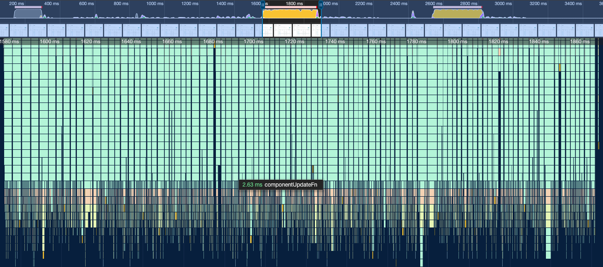
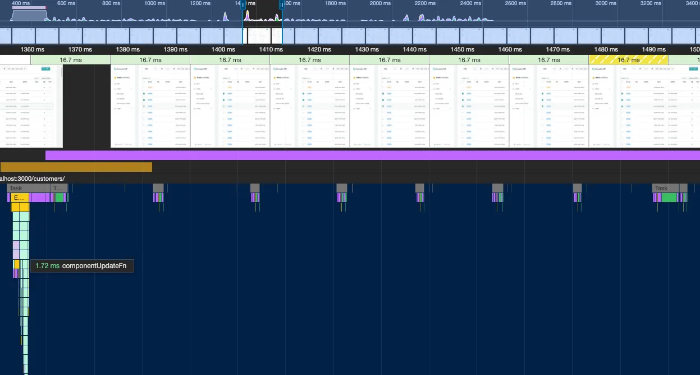
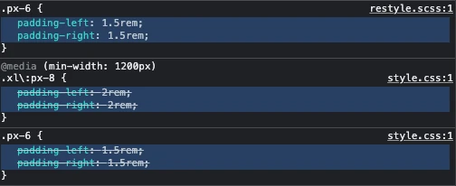
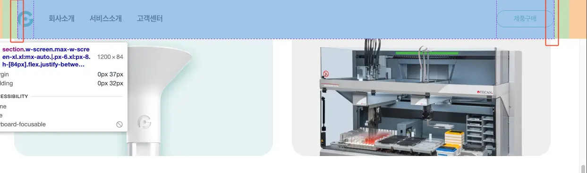
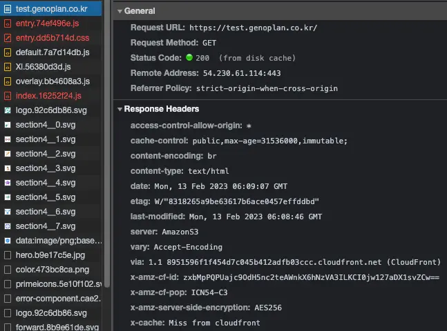
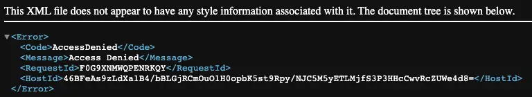
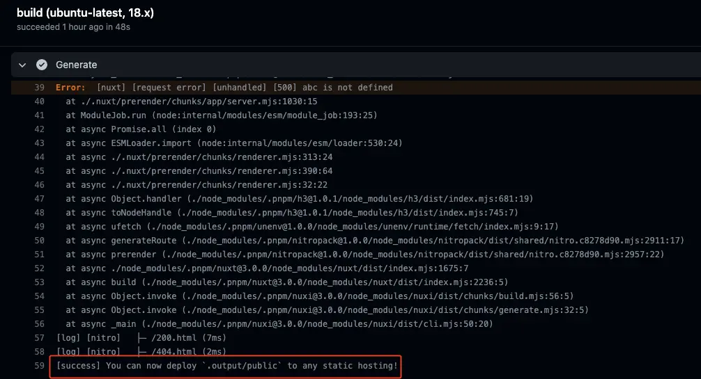
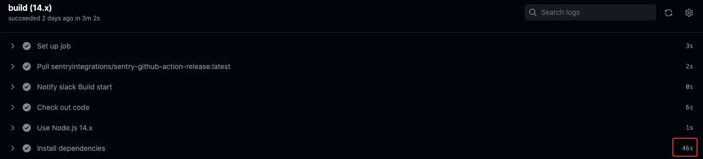
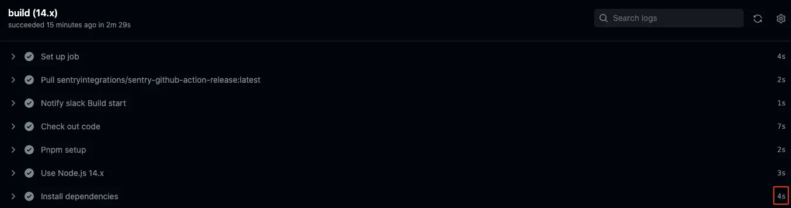
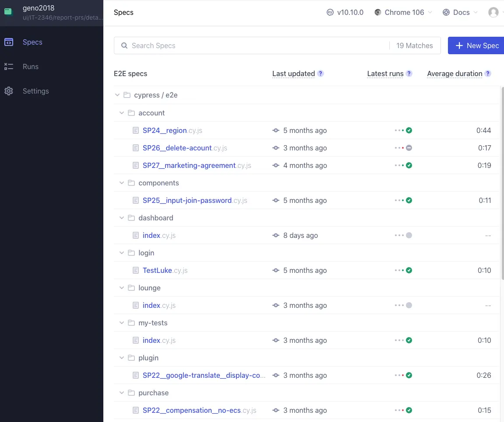

## Week 4, 2026 - Prisma upgrade 5 -> 6 - CORS 에러

### 현상

브라우저에서 GraphQL 요청 시 CORS 에러 발생:

```
Access to fetch at 'https://*/app/graphql' from origin 'https://*' has been blocked by CORS policy: Response to preflight request doesn't pass access control check: No 'Access-Control-Allow-Origin' header is present on the requested resource.
```

- Prisma 5.1.0 사용 시: 정상 동작
- Prisma 6.x 업그레이드 후: CORS 에러 발생

### 원인

**CORS 설정 문제가 아니라 서버 시작 실패 문제였음.**

1. Prisma 6.x 업그레이드 후 `prisma generate` 미실행
2. Node.js 앱 시작 시 `Cannot find module '.prisma/client/default'` 에러 발생
3. PM2 앱 상태: `errored`
4. Apache 프록시가 백엔드(localhost:4000)에 연결 실패
5. Apache가 503 응답 반환 (CORS 헤더 없음)
6. 브라우저가 CORS 에러로 인식

**추가 문제:**

- 서버의 Node.js 버전(v18.12.1)이 Prisma 6.x 요구사항(v18.18+)보다 낮았음
- 서버에 pnpm이 설치되어 있지 않아 `npx prisma generate` 사용 시 최신 버전(7.x) 설치 시도

### 해결 방법

#### 1. Node.js 업그레이드 (v22)

```bash
## nvm 설치
curl -o- https://raw.githubusercontent.com/nvm-sh/nvm/v0.39.7/install.sh | bash
source ~/.bashrc

## Node.js v22 설치 및 사용
nvm install 22
nvm use 22
```

#### 2. pnpm 설치 후 Prisma 클라이언트 생성

```bash
npm install --global corepack@latest
corepack enable pnpm

cd /opt/bitnami/apache/htdocs
pnpm exec prisma generate
```

#### 3. PM2 앱 재시작

```bash
pm2 restart index
pm2 status  ## 상태 확인
```

## Week 3, 2026 - Preview 페이지 SSG 리다이렉트 버그 수정

AI 작성.

- **증상**: `/preview#eyJxxxx...` URL로 접근 시, 로컬에서는 정상 동작하지만 SSG 배포 환경에서는 `/#eyJxxxx...`로 잘못 리다이렉트됨
- **환경**: Nuxt 3/4 SSG + AWS S3 + CloudFront (S3 정적 웹호스팅 미사용, 이전 정적 웹호스팅 사용할 땐 잘 됐음)

### 원인 - S3 + CloudFront 라우팅 문제

S3 정적 웹호스팅을 사용하지 않는 환경에서:

1. `/preview#token`으로 접근
2. S3에서 `/preview` 파일(키)을 찾지 못함 (디렉토리이므로)
3. 404 발생
4. CloudFront 에러 페이지 설정에 의해 `/index.html`로 fallback
5. 결과: `/#token`으로 리다이렉트

### 해결 - S3에 확장자 없는 파일 업로드

**파일**: `.github/workflows/test__build--deploy.yml`, `main__build--deploy.yml`

```yaml
- name: Sync with S3
  run: aws s3 sync .output/public s3://$PROJECT_NAME --delete
- name: Upload preview file for S3 direct access
  run: aws s3 cp .output/public/preview/index.html s3://$PROJECT_NAME/preview --content-type "text/html"
```

S3 sync 후 `/preview/index.html`을 `/preview` 키로 추가 업로드하여:

- `/preview#token` 접근 시 → S3의 `/preview` 파일 서빙
- `/preview/` 접근 시 → S3의 `/preview/index.html` 서빙
- `/preview/report/` 접근 시 → S3의 `/preview/report/index.html` 서빙

#### 시도

sync 과정에서

> upload: .output/public/preview/index.html to s3://\*\*/preview/index.html

가 있으니 그냥 --content-type "text/html" 추가하면 될 듯 싶었지만 안되네...

### 참고

- S3 정적 웹호스팅을 활성화하면 index document 설정으로 자동 처리 가능

## Week 3, 2026 - Samsung Browser Download Issue

Samsung Internet browser 다운로드 실패. Presigned URL을 Blob으로 변환하는 과정에서 문제 발생. **해결: Blob 변환 제거하고 presigned URL 직접 사용.**

### Problem

PDF 다운로드가 Samsung browser에서만 실패. Chrome/Safari는 정상.

### Root Cause

`fetch() → blob → createObjectURL()` 패턴이 Samsung browser에서 안 됨.

```javascript
// ❌ 문제 코드
export const downloadPresignedUrl = async (presignedUrl, fileName) => {
  const response = await fetch(presignedUrl)
  const blob = await response.blob()
  return downloadBlob(blob, fileName)
}
```

### Solution

Blob 변환 완전 제거. Presigned URL을 직접 사용.

```javascript
// ✅ 해결 코드
export const downloadPresignedUrl = (presignedUrl, fileName) => {
  const a = document.createElement("a")
  a.href = presignedUrl // Blob 거치지 않고 직접 사용
  a.download = fileName
  a.style.display = "none"
  document.body.appendChild(a)
  a.click()
  setTimeout(() => document.body.removeChild(a), 100)
}
```

## Week 45, 2025 - Nuxt, Pinia SSR Error

nuxt v3 generate 후 S3에 업로드 하고 cloudfront에서 OAC를 통해 서비스하는 사이트 **배포환경에서 모든 URI가 root / 로 redirect**

**개발환경 error**

```
Error: obj.hasOwnProperty is not a function
⁃ at shouldHydrate (node_modules/.pnpm/pinia@2.3.1_typescript@5.8.2_vue@3.5.22_typescript@5.8.2_/node_modules/pinia/dist/pinia.mjs:1212:40)
```

Pinia 버전 충돌: @pinia/nuxt 모듈의 최신 버전(예: 0.6.0 이상)과 Nuxt 3(특히 3.15.x 이상) 간의 호환성 이슈
shouldHydrate 함수에서 hasOwnProperty를 호출할 때 객체가 아닌 값(예: 쿼리 결과나 페이로드)이 전달되어 오류 발생. 이는 Pinia가 SSR 중 상태를 처리할 때 일어나며, 에러가 발생하면 Nuxt의 에러 핸들링이 중단.
SSR 관련 설정: ssr: true로 설정된 프로젝트에서 404나 기타 에러(예: 와일드카드 라우트)를 throw할 때 이 문제가 더 두드러짐.
브라우저나 서버 로그에서 500 에러로 기록되며, error.vue가 무시됨.

## Week 43, 2025 - Android AAB

Target SDK를 ver.35로 올리라는 메일 옴. Mac 머신 고장으로 새 Mac에서 처음하는 앱 빌드.

OpenJDK를 쓸 수 있다는 걸 처음 앎.

```bash
# Homebrew를 통한 OpenJDK 17 설치
brew install openjdk@17
```

### platform 추가 시 무한 pending

cordova로 android platform 추가 했을 때 아무 반응 없어서 좀 헤맸다.

```bash
cordova platform add android@14.0.0 --verbose
```

Claude가 해결방법 중 하나로 기존 Android 플랫폼 제거를 제시해서 보니 플랫폼 설치가 되어 있음. 거기에 패키지 수동 설치 후 --nofetch 옵션으로 플랫폼 추가. `--nofetch` 옵션은 cordova-fetch를 우회하고 이미 node_modules에 설치된 패키지를 사용

```bash
cordova platform add android@14.0.0 --nofetch --verbose
```

진행이 됨.
머신 바꿨을 때 설치했었나? 그래도 에러 메시지는 보여줘야지!

### 빌드 오류

```
com.android.builder.errors.EvalIssueException: compileSdkVersion is not specified. Please add it to build.gradle
```

Claude가 제시한 방법대로 하니 빌드 됨. 왜 기본 도구 설치, build flow로 진행이 되지 않는가...

### AAB 파일, 앱 서명

Claude 제시를 따라 build하니 AAB 파일이 생성됨. 이전엔 APK로 했었음.
Google Play Console에 AAB 파일을 업로드하려면 서명이 필요. (Google Play Console에 앱 무결성 > Play 앱 서명 작업됨)
손으로 좀 작업함. build.json 파일 생성.

### 파일 백업 압축

백업을 하기 위해 암호 암축을 Claude와 작업했는데 처음 접하는 방식이라 기록

#### 백업 파일 암호화

```bash
# 1. 백업 디렉토리 생성
mkdir -p ~/genoplan-backup-android-gpclient2-$(date +%Y%m%d)

# 2. 필요한 파일 복사
cp platforms/keystore.jks ~/genoplan-backup-android-gpclient2-$(date +%Y%m%d)/
cp build.json ~/genoplan-backup-android-gpclient2-$(date +%Y%m%d)/

# 3. 메타정보 작성
cat > ~/genoplan-backup-android-gpclient2-$(date +%Y%m%d)/INFO.txt <<EOF
Backup Date: $(date)
Keystore: keystore.jks
Alias: gpclient2
App ID: com.genoplan.mobile.client2
EOF

# 4. 암호화 압축 (AES-256-CBC)
cd ~
tar czf - genoplan-backup-android-gpclient2-$(date +%Y%m%d) | \
  openssl enc -aes-256-cbc -pbkdf2 -out genoplan-backup-android-gpclient2-$(date +%Y%m%d).tar.gz.enc

# 5. 원본 디렉토리 삭제 (암호화된 파일만 보관)
rm -rf genoplan-backup-android-gpclient2-$(date +%Y%m%d)
```

**옵션 설명:**

- `-aes-256-cbc`: AES 256bit 암호화
- `-pbkdf2`: 키 유도 함수 사용 (보안 강화)
- 실행 시 비밀번호 입력 프롬프트가 나타남

#### 백업 파일 복호화

```bash
# 방법 1: 복호화 + 압축 해제 (한 번에)
openssl enc -aes-256-cbc -pbkdf2 -d -in genoplan-backup-android-gpclient2-20241024.tar.gz.enc | tar xzf -

# 방법 2: 2단계로 나눠서 실행
# 1단계: 복호화
openssl enc -aes-256-cbc -pbkdf2 -d -in genoplan-backup-android-gpclient2-20241024.tar.gz.enc \
  -out genoplan-backup-android-gpclient2-20241024.tar.gz

# 2단계: 압축 해제
tar xzf genoplan-backup-android-gpclient2-20241024.tar.gz

# 압축 해제 없이 목록만 확인
openssl enc -aes-256-cbc -pbkdf2 -d -in genoplan-backup-android-gpclient2-20241024.tar.gz.enc | tar tzf -
```

## Week 39, 2025 - AWS S3 public access block, CloudFront OAC

그 동안 client side rendering 프로젝트를 배포할 때 AWS S3의 Static website hosting, public access 설정하고 CloudFront에서 제공했는데
이번에 배운 [[CloudFront OAC|dev.devops.aws.setting-front-cdn]] 방식으로 전환함.
이 방식이면 S3의 Static website hosting, public access 설정을 끌 수 있기 때문에 S3 endpoint 유출 됐을 시, 악의적인 과금 유도를 차단할 수 있음. 가능성은 적지만 뭐... 보안이니까

## Week 38, 2025 - Claude Code

기대한 영역은 기대에 못 미치고 기대 안한 부분은 기대 이상.
context로 제공 안한 부분은 추측으로 넣어주는데, 수정이 필요해서 번거로움.
API에서 특정 데이터 이름이 이 API에선 camelCase로 쓰이고 저 API에선 snake_case로 쓰이니 손으로 다 수정해줘야 했음.
figma는 mcp연결이 한 번에 된 반면에 postman mcp는 그게 안되어 밀린 일정에 건너뛰었는데 JSON export라도 해서 context로 넣었다면...

나중에 ~/.claud.json에 설정 추가해서 해결 ([[~/.claud.json - mcp 설정|journal.what-i-struggled-brag-in#claudjson---mcp-설정]] 참고. 공식문서에 없고 repo 뒤져서 찾음)

figma도 wireframe 수준의 영역을 긁어왔더니 UI가 다 깨짐. 기능명세만 긁어오자.

위에 말한 기대 외 디테일, 부가기능 만들어주는 건 좋지만 핵심기능 수정을 해야하는데 인지부하와 code 찾기가 부담된다. phase 나눠서 작성이 좋을 듯.

TODO 모아보기 편하게 component 상단에 작성.

다른 query 할 때도 postman mcp로 인해 16.2k tokens이 할당된다. 아예 mcp project를 따로 둬서 그 쪽에서만 관련 작업을 하는게 나음.

그 외 prompt 관련은 [[Prompt|dev.with-ai.prompt]]에서 관리

### ~/.claud.json - mcp 설정

```
// https://github.com/postmanlabs/postman-mcp-server/blob/main/README.md#vs-code-integration-1

"mcpServers": {
  "postman-api-http-server-minimal": {
    "type": "http",
    "url": "https://mcp.postman.com/minimal",
    "headers": {
      "Authorization": "Bearer xxx"
    }
  }
}
```

## Week 35, 2025 - 환자번호 검색 시, 리스트에는 환자번호가 나오지 않음 GIT-5593

테이블 리스트에 기본 데이터 출력 후 환자번호 검색하면 환자번호가 없는 걸로 표시됨.

자식 component에서 환자번호에 `ref(props.data.patient.number)`를 쓰면 페이지 넘어갈 때나 검색 시 component가 파괴되지 않는 경우, 데이터 갱신이 되지 않는다. computed로 수정하여 해결

-> Column에 key를 생성하면 ref로 해결됨. 이쪽이 더 정석같군.

## Week 35, 2025 - 자식 간의 데이터 조건 참조 GIT-5592

환자번호가 있어야 접수확인 버튼 활성화.
환자번호 입력을 자식 component에서 defineModel이 아니라 update:patientNumber로 처리

defineModel은 환자번호 타이핑할 때마다 데이터가 갱신되기 때문에 실제 DB에 입력 완료된 상태가 아니더라도 활성화 조건이 만족되지만
API를 통해 DB에 환자번호 입력 성공 시에 update 이벤트를 통한 데이터 갱신으로 처리하면 의도대로 활성화 조건이 처리 됨

https://vuejs.org/guide/components/v-model#under-the-hood

```html
<!-- Child.vue -->
<script setup>
  const props = defineProps(["modelValue"])
  const emit = defineEmits(["update:modelValue"])
</script>

<template>
  <input
    :value="props.modelValue"
    @input="emit('update:modelValue', $event.target.value)"
  />
</template>
```

```html
<!-- Parent.vue -->
<Child :modelValue="foo" @update:modelValue="$event => (foo = $event)" />
```

## Week 20, 2025 - Astro + Vue 중대결함

헤더 작성 중, 스크롤에 따라 배경색이 바뀌는 기능이 있어 scroll event 처리 함수 추가
`client:only="vue"` attribute 필요함

```html
<header client:only="vue" />
```

버튼 클릭에 따라 메뉴가 toggle되어야 함. toggle에 필요한 state를 vue로 처리하는 와중에

```js
import { ref } from "vue" // auto import in nuxt
```

가 없으면 헤더가 **render 되지 않지만 아무런 error message를 출력하지 않음.**

```json
{
  "dependencies": {
    "@astrojs/vue": "^5.0.13",
    "astro": "^5.7.12",
    "vue": "^3.5.13"
  }
}
```

## Week 50, 2024 - AWS S3 Presigned URL for PDF

- [[dev.web.pdf]]
- [[dev.devops.aws.s3.presigned-url]]

## Week 45, 2024 - Nuxt generate fail in Node v22

[x]에서 Node v20에는 build 되는데 v22에서 build 안되는 버그
증상 - generate command does not return/close on success
같은 nuxt 기반 project인 [.co.kr]은 v22에서 build 됨

Nuxt 3.13.2 with Nitro 2.9.7으로 같고, vite는 5.4.7, 5.4.10로 차이난다. (전자가 [x])

의심가는 부분

> 5.4.8 (2024-09-25)
>
> - fix(css): backport #18113, fix missing source file warning with sass modern api custom importer (#18 ([7d47fc1](https://github.com/vitejs/vite/commit/7d47fc1c749053095a3345ca1d47406a5f31792a)
>   ), closes [#18183](https://github.com/vitejs/vite/issues/18183)

## Week 36, 2024 - Nuxt hook for page blink during nav

페이지 이동 시 다음 페이지가 캐시되지 않을 경우 지연시간이 있는데,
그 동안 `현재 페이지 top:0으로 이동` 후에 다음 페이지로 이동해서 UX 상 거슬림


## Week 35, 2024 - Safari infinite translateX animation flickers on loop

Adding `-webkit-transform: translateZ(0);` to img or picture element will do the trick [#](https://stackoverflow.com/a/71832879/5163033)

scroll element 내의 `<picture>` + lazy loading이 제대로 안되는 버그도 있어 eager로 바꿈

## Week 25, 2024 - PDF Generator

이전 [[Pdf Generator|dev.journal.genoplan.pdf-generator]] project를 다시 써야 될 상황이 와서 project를 가져와 package upgrade해서 세팅해보니 Chromium launch error 몇 가지 발생 (Security.setIgnoreCertificateErrors, 등) 2~30분 했는데 다른 error 발생해서 예전 version으로 돌리니 제대로 된다.

## Week 24, 2024 - iOS border height style

```html
<section class="!h-4 | flex gap-1 | text-10">
  <div
    class="w-fit font-bold px-[6px] rounded-full | flex items-center"
    :class="
              isNutritionCard
                ? 'text-grey-500 border border-grey-500'
                : 'text-grey-50 bg-[#00000099]'
            "
  >
    <!--! chip에서 직접 height를 지정하면, border 유무에 따라 iOS safari와 다른 browser에서 height 계산을 다르게 해서 parent에서 height를 고정 -->
    {{ topic.category }}
  </div>
</section>
```

비슷하게 chip class style 작성할 때, padding-top 잡는 위치가 1px 차이나서 이걸 고치면 하나씩 엇나가보여, height 25px → 26px 로 수정한 case도 있다.

## Week 21, 2024 - Swiper

오른쪽 끝까지 swipe 했을 때 빈 공간이 남는다.

|◼️◼️◼️| → |◼️◻️◻️|

이번에 major version v11로 update한 Swiper core API를 사용하면 `slidesOffsetAfter` 값을 수동으로 계산해서 넣으면 되긴 하지만,
이전에 Swiper element 쓴 code들은 저 계산 없이 정상 동작한다.

```html
<swiper-container slides-per-view="auto">
  <swiper-slide class="w-16" />
</swiper-container>
```

core API에도 slidesPerView와 width 설정해봤지만 중간에 [layer 하나가 추가](https://swiperjs.com/migration-guide-v10#swiper-element-layout)된 것 때문인지 안됨.

## Week 16, 2024 - Blurry text on canvas

모니터 3개 사용 중인데, 맥북 모니터에서 canvas에서 이미지 저장한 파일의 text가 흐리게 보임

```js
const canvas = document.createElement("canvas")
const scale = window.devicePixelRatio || 1 // 텍스트가 흐리게 보여 device pixel ratio에 따라 배율 조정하여 저장
canvas.width = 360 * scale
canvas.height = 576 * scale
canvas.style.width = "360px"
canvas.style.height = "576px"
const ctx = canvas.getContext("2d")
ctx.scale(scale, scale)
```

- [Canvas drawings, like lines, are blurry](https://stackoverflow.com/a/46920541/5163033)

## Week 14, 2024 - Dynamic route path on Nuxt generate

비회원 리포트 상세 페이지를 모바일에서 열람하다 의도치 않게 화면을 끌어내려 refresh를 일으킴 → dynamic route path는 nuxt generate 시에 처음 access point로 쓰면 / 로 redirection 됨

/login error 화면이 나옴 → Navigate Back으로 비회원 리포트 요약페이지에 이동하면, access URI가 회원용(/login)이기 때문에 $auth.requestAuth가 setup되지 않아 해당 error가 발생 (s.requestAuth is not a function)

1.  mobile에서 의도치 않게 refresh 되지 않게 overscroll-behavior: contain 으로 mitigate
2.  $auth.requestAuth 가 setup안되면 page refresh 시켜서 해결

## Week 12, 2024 - primevue new theme layer

사용 중인 primevue theme이

- 3.46.0에선 정상작동
- 3.47.0에선 checkbox style 망가짐
- 3.48에서 deprecated

https://github.com/primefaces/primevue/issues/5220
https://github.com/primefaces/primevue/blob/master/CHANGELOG.md#3480-2024-02-05
[#5201](https://github.com/primefaces/primevue/issues/5201) theme에 쓰이는 class는 왠만해서 안바뀔줄 알았는데 minor에서 break되다니...

/nonmember/report에서 autocomplete 검색 결과 띄운 후, 페이지 이동, 돌아오면 layer 순서가 바뀌어서 style이 죄다 깨짐.

- https://primevue.org/csslayer/

이전에 FOUC 때문에 primevue에서 dynamic하게 import 하는 style resource들을 우선 순위 낮추기 위해 앞쪽에 import 시키는 code 때문에 발생. -> 제거

## Week 12, 2024 - Wix shopify referral

### Terminology

1. 회원 발송 메일에서 접근 ref code 이하 rc -> sendgrid 대상자의 구매는 고려치 않음으로 인해 rc link가 필요 없게 됨
2. 회원이 공유한 URL로 접근 forward code 이하 fc ->
3. 회원이 아닌 사람이 공유하거나 직접 접근 no code 이하 nc

### Access URL

1. ~~rc - https://promo.genoplan.com/cancer-prevention-support-campaign/?rc={{ref-code}}~~
2. fc - https://promo.genoplan.com/cancer-prevention-support-campaign/?fc={{ref-code}}
3. nc - https://promo.genoplan.com/cancer-prevention-support-campaign/

### 공유 URL

공유하기 버튼에서 clipboard로 copy, SNS 공유

1. ~~rc - https://promo.genoplan.com/cancer-prevention-support-campaign/?fc={{ref-code}}~~
2. fc - https://promo.genoplan.com/cancer-prevention-support-campaign/ (의 단축 버전) - ref code 가지고 1단계 이상 추적 가능하긴 한데... 일단 추적은 안하는 걸로 기획
3. nc - https://promo.genoplan.com/cancer-prevention-support-campaign/ (의 단축 버전)

ref-code가 잘못뫴을 때 어찌 처리되는가? → shopify에서 code 없는 걸로 처리됨

### shopify URL

#### 11,000엔 구입

1. ~~rc - ref-code 써서 추적 용도로 - https://jp.store.genoplan.com/discount/{{ref-code}}?redirect=%2Fproducts%2F%E3%82%AA%E3%83%A0%E3%82%AD%E3%83%AA%E6%A7%98%E3%81%AE%E3%81%9F%E3%82%81%E3%81%AE%E3%82%B5%E3%83%9D%E3%83%BC%E3%83%88~~
2. fc - ref-code 써서 추적 용도로 - https://jp.store.genoplan.com/discount/{{ref-code}}?redirect=%2Fproducts%2F%E3%82%AA%E3%83%A0%E3%82%AD%E3%83%AA%E6%A7%98%E3%81%AE%E3%81%9F%E3%82%81%E3%81%AE%E3%82%B5%E3%83%9D%E3%83%BC%E3%83%88
3. nc - https://jp.store.genoplan.com/products/%E3%82%AA%E3%83%A0%E3%82%AD%E3%83%AA%E6%A7%98%E3%81%AE%E3%81%9F%E3%82%81%E3%81%AE%E3%82%B5%E3%83%9D%E3%83%BC%E3%83%88

wix에서 code 포함된 shopify url 버튼으로 연결 - https://www.wix.com/wix-lp/new-wixcode/forum/coding-with-velo/solved-how-to-open-in-new-tab-with-wix-location

- https://forum.wixstudio.com/t/dynamic-links-in-a-triggerd-email/3270

#### 9,900엔 구입

1. ~~rc - ref-code를 가지고 미리 생성한 discount code를 가져옴 - https://jp.store.genoplan.com/discount/{{discount-code}}?redirect=%2Fproducts%2F%E3%82%AA%E3%83%A0%E3%82%AD%E3%83%AA%E6%A7%98%E3%81%AE%E3%81%9F%E3%82%81%E3%81%AE%E3%82%B5%E3%83%9D%E3%83%BC%E3%83%88~~
2. fc - ref-code를 가지고 미리 생성한 discount code를 가져옴 - https://jp.store.genoplan.com/discount/{{discount-code}}?redirect=%2Fproducts%2F%E3%82%AA%E3%83%A0%E3%82%AD%E3%83%AA%E6%A7%98%E3%81%AE%E3%81%9F%E3%82%81%E3%81%AE%E3%82%B5%E3%83%9D%E3%83%BC%E3%83%88
3. nc - https://jp.store.genoplan.com/discount/OMUKIRI?redirect=%2Fproducts%2F%E3%82%AA%E3%83%A0%E3%82%AD%E3%83%AA%E6%A7%98%E3%81%AE%E3%81%9F%E3%82%81%E3%81%AE%E3%82%B5%E3%83%9D%E3%83%BC%E3%83%88

- 할인코드 포함된 링크를 wix email에 넣을 수 있는가? form text input으로 처리함 + hidden

### etc

- discount용, no-discount용 둘 다 concat한 URL을 메일로 쏘면 code 찾으려고 request할 필요는 없음
- 할인이 0으로 표시될텐데... 사소한가
- 나중에 shopify에서 전체 리스트 다운 받아서 code 사용 수 추출

## Week 12, 2024 - dynamic page with Lazy component

bo에서 service 페이지를 열고, 리포트에서 상세 항목을 클릭하면

> Uncaught (in promise) TypeError: Failed to fetch dynamically imported module: `/_nuxt/_code_.EESJVKCf.js`

error를 뱉으면서 / 페이지 refresh 된다.
뒤로 가기한 뒤에 다시 상세 항목 클릭하면 `/_nuxt/_code_._MbpWpiu.js` 접근하면서 정상 동작.

[code] 같은 dynamic page를 `<Lazy>` component에서 접근하면 lazy의 import와 같이 작용하면서 버그 발생하는 듯
lazy 제거하니 정상 동작

## Week 10, 2024 - get Shopify order data on wix

**requirements**

- token of shopify Custom app with read order auth
- [Wix backend code](https://dev.wix.com/docs/develop-websites/articles/coding-with-wix-studio/wix-studio-about-web-methods) calling Shopify API to bypass CORS

---

shopify order의 status open 이 판매 중인 상품인줄 알았는데 발송 안한 상태(미처리)
any, closed에 취소 건 수도 들어감

한 페이지에 250개 제한에 product_id로 filter는 데이터 받은 후에 가능. cursor based pagination이라... open+손으로 closed 해야 겠는데?

## Week 09, 2024 - Nuxt3 template single wrapper

Nuxt3 project에서 페이지 새로 고침 후에 API data 받아서 v-if로 DOM 변경하는 경우 다음 error가 발생

> Uncaught (in promise) TypeError: Cannot read properties of null (reading 'insertBefore') at insert (chunk-5V36DLOA.js?v=0e87bacb:9614:12)

새로 고침 시 console에서 다음과 같은 warning이 나옴

> [Vue warn]: Hydration node mismatch

code는 다음과 같다

```html
<template>
  <RegistrationVerifySN v-if="step === 'VERIFY_SN'" @nextStep="nextStep" />
  <RegistrationGuide v-else-if="step === 'GUIDE'" @nextStep="nextStep" />
</template>
```

갖은 검색하다가 지나친 [comment](https://github.com/nuxt/nuxt/issues/12266#issuecomment-1397213624)를 적용하여 다음과 같이 고치니 warning은 그대로지만 error는 해결 됨. vue2처럼 하나의 wrapper로 해야겠네

```html
<template>
  <div>
    <RegistrationVerifySN v-if="step === 'VERIFY_SN'" @nextStep="nextStep" />
    <RegistrationGuide v-else-if="step === 'GUIDE'" @nextStep="nextStep" />
  </div>
</template>
```

## Week 09, 2024 - Google maps API syntax error

최신 버전 쓰는데 왜 문법 error가 발생했나 보니 옛날에 넣어뒀던 polyfill과 충돌나는 듯.

실행에는 문제없지만 sentry에서 계속 error 보고 됐던 google translator나 tag manager error 원인도 이거?

### debug 과정

> host-report-errors.js:5 Unhandled promise rejection TypeError: r is not iterable at Loader.eval (index.mjs:324:44)

error 메시지가 떠서 [[Week 25, 2023 - @babel/preset-env core-js Polyfill|journal.what-i-struggled-brag-in#week-25-2023---babelpreset-env-core-js-polyfill]]와 같이 babel build script 수정하여 core-js polyfill 적용하니

> Uncaught TypeError: this.Tm is not iterable

```
p @ https://cdn.polyfill.io/v3/polyfill.min.js:6
_callee$ @ webpack-internal:///./node_modules/.pnpm/@googlemaps+js-api-loader@1.16.6/node_modules/@googlemaps/js-api-loader/dist/index.mjs:547
```

옛날에 넣어뒀던 polyfill이 initiator로 잡힘. 설마 싶어서 제거해보니 문제 해결

## Week 08, 2024 - Nuxt definePageMeta code runs unconditionally

page meta 지정이 안먹히는 버그

- 현상: 초기 mount 시점에서 실행되지 않는 switch 문의 case 안에 있는 meta reset용 definePageMeta code를 comment out시키니 제대로 돌아감. 혹시 실행되나 바로 위에 log찍어보니 실행 안됨. 뭐지?
- 원인: [문서](https://nuxt.com/docs/api/utils/define-page-meta) 찾아보니 **compiler macro**라는데 conditional branch에 있건 없건 무조건 실행되나봄. 이름부터 define으로 시작되긴 하네.
  > definePageMeta is a compiler macro

```js
const nextStep = () => {
  switch (step.value) {
    case "VERIFY_SN":
      step.value = "FORM"
      break
    case "FORM":
      step.value = "COMPLETE"
      console.log("🚀 ~ step.value:", step.value, "reset") // not run
      definePageMeta({}) // run
      break
  }
}
```

## Week 01, 2024 - imprv delay of switching checkbox in PrimeVue DataTable

- Motivation: checkbox 가진 100개 row의 table에서 일괄 다운로드를 위해 checkbox를 조작하면 반응이 느림
- Cause: DataTable의 header영역에서 단순히 count만 증가시켜도 전체 Table re-rendering 발생
  
- Solution: header 분리
  

## Week 01, 2024 - Nuxt3 nextTick, setTimeout 0

상세 페이지에서 table list 페이지로 돌아올 때, 초단위로 멈췄다가 페이지가 이동 됨.  
fetch cache가 안되어 fetch delay가 있긴 한데, 그것보다는 table rendering에 엄청 시간 잡아먹음.  
문제는 nextTick을 써도 rendering 마치고 리스트 페이지가 보임.  
setTimeout 0로 하니 리스트 페이지 먼저 보이고, skeleton 띄우고 rendering 시작.  
vue2에선 nextTick과 setTimeout 0가 동일하게 작동했는데 Nuxt3에선 왜 동작차이가 날까?

## Week 51, 2023 - Tanstack query, Sentry replay error

오늘 다른 배포 2번 후에 갑자기 sentry에서 error notification이 마구 들어옴.

> - TypeError: this[\#y].values is not a function or its return value is not iterable
> - r.values is not a function or its return value is not iterable
> - Spread syntax requires ...iterable\[Symbol.iterator\] to be a function

상기 3개의 error message가 몇 십 개씩.

첫 번째 배포 후 테스트에는 정상 동작, 두 번째 배포 후 테스트에도 정상이었음. 첫 번째 내용은 텍스트와 단순 UI style 수정이었고, [두 번째가 cache bust 관련 bug fix](journal.what-i-struggled-brag-in.md#week-51-2023---webpack-tailwindcss-조합에서-appcss-cache-bust가-안됨)였는데...

서비스 페이지에서 hard refresh 몇 번 해보니 그제야 나도 error가 뜨기 시작.

과정 모두 적기엔 너무 지치고, 결국 첫 번째 error message의 원인은 40일 전에 v4 -> v5로 upgrade한 tanstack query와 sentry replay의 polyfill문제였음. 일단 babel-loader에 package 경로 포함시켜 해결.
그 동안 배포를 몇 번 했고, 서비스 페이지 테스트를 다른 사람도 다했는데 오늘 갑자기 이 error가 뜬 이유는 도대체 뭐냐.

몇 시간 뒤에 갑자기 다른 project에 sentry replay 원인으로 동일 error notification 들어옴. 이쪽도 배포한지 40일 넘었는데...

## Week 51, 2023 - Webpack, tailwindcss 조합에서 app.css cache bust가 안됨

tailwind의 utility class들이 app.css로 출력되는데, 이 파일만 file name에 hash가 붙지 않아 cache bust가 안됨.

```diff
new MiniCssExtractPlugin({
+  filename: '[name].[contenthash].css',
  chunkFilename: '[id].[contenthash].css',
  ignoreOrder: true,
}),
```

다음은 app 초기 loading에 쓰이는 manifest 설정

```diff
new WebpackAssetsManifest({ // https://webpack.js.org/plugins/mini-css-extract-plugin/#filename
  output: 'manifest.json',
  customize(entry) {
+    if (['app.js', 'app.css'].includes(entry.key)) return entry
    return false
  },
}),
```

## Week 50, 2023 - Ver.17 Safari에서 Avif가 안보임

avif, webp, tiny-jpg로 이미지 용량 줄여서 picture 태그로 쓰고 있는데, Safari ver.17에서 이미지가 안 보임. (Version 16.6 (17615.3.12.11.3, 17615) - Monterey Ver.12.6.8에서 정상동작)

> [developers cannot rely on the browser to do format selection by using `<picture>` + `<source>`](https://github.com/Fyrd/caniuse/pull/6448#issuecomment-1245020390).

> safari Version 16.6 (17615.3.12.11.3, 17615) 에선 정상 동작합니다.  
> 제 사파리 버전 17.0(19616.1.27.211.1) 에서는 안보여요  
> 제가 쓰는 인코딩 툴로 생성한 avif 파일이 문제 있는건지 vanessa safari에서 이미지 내용이 안나오네요.

- 다운로드 용량 확인 함.
- safari inspector에서 미리보기에서도 투명한 사각형만 보임.
- 다른 사이트의 avif 파일은 보이는 걸 확인 (개인정보보호 탭에서, https://libre-software.net/image/avif-test/)

다른 feature 배포 시에도 동일 증상

- 17.1.2에서 안보임
- iPhone XR 17.2에서 안보임
  - https://tests.caniuse.com/avif - animated avif 동작 안함 (동작하는 Ver.16.6에선 animated 동작함)

> [developers cannot rely on the browser to do format selection by using `<picture>` + `<source>`](https://github.com/Fyrd/caniuse/pull/6448#issuecomment-1245020390).

단순 img 태그만 썼을 땐 avif 잘 보임
→ browser가 safari인지 check하여 picture+srcset의 avif는 off 시킴

## Week 50, 2023 - Fix Github -> EC2 Deploy

기존에 구축해둔 biz admin project의 CI에서 error 발생.

테섭에선 git pull시에 file conflict가 발생, 운영서버에선 github로의 ssh fingerprint, 인증 정보가 invalid.

- [Always use the "git" user](https://docs.github.com/en/authentication/troubleshooting-ssh/error-permission-denied-publickey#always-use-the-git-user)
- [GitHub's SSH key fingerprints](https://docs.github.com/en/authentication/keeping-your-account-and-data-secure/githubs-ssh-key-fingerprints)
- [Github permission denied: ssh add agent has no identities](https://stackoverflow.com/a/28444641/5163033)

## Week 43, 2023 - NuxtLink tailingSlash

Bug - **[🔗 NuxtLink defaults](https://github.com/nuxt/nuxt/releases/tag/v3.8.0)의** `trailingSlash`를 넣도록 설정하니 pdf download link에 /가 붙어 dashboard로 redirection 됨.

- trailingSlash가 필요한 이유는 lightsail로 성능 측정했을 때 끝 / 가 없는 url에 접근하면 끝 / 가 있는 url로 redirection이 일어난다고 점수 까여서...

Fix - resource link는 a tag로 처리

## Week 36, 2023 - Google Forms 응답 결과 API로 입력

응답 제출 시 trigger를 설정하여 Google Apps script function을 호출

### Prefilled link

- https://stackoverflow.com/a/27904632/5163033

### Submit Event trigger

- https://developers.google.com/apps-script/guides/triggers/installable?hl=ko
- https://developers.google.com/apps-script/guides/triggers/events?hl=ko#Google%20Forms-events

### [Pass URL parameters into survey](https://stackoverflow.com/a/27904632/5163033)

1. Open a form in Google Forms
2. In the top right, click More [...]
3. Choose Get pre-filled link
4. Fill in any answer fields you want to pre-populate
5. Click Submit
6. To send the pre-populated form to respondents, copy and send the link at the top

### Post API

- https://developers.google.com/apps-script/guides/services/external?hl=ko

## Week 34, 2023 - Arc42 template에 따라 문서화

[Arc42](https://arc42.org/overview/)를 참고하여 Report PDF generator 프로젝트 [문서](https://github.com/genoplan/report-pdf-generator/blob/main/README.md)를 작성

개념이 설명되어 있는데 잘 이해가 안가서 예제를 찾아보니 예제마다 다른 부분도 많고, 문서를 위한 문서화처럼 늘여쓰기 설명이 느껴져서 template의 일부분만 차용해서 씀.

양식이 제공되다보니 Quality Goals 같은 생각지 못한 관점의 기술을 하게 되어 좋음.

작성 내용은 [[Pdf Generator|dev.journal.genoplan.pdf-generator]] 참고

## Week 32, 2023 - Report PDF generator

[CSS to set A4 paper size](https://stackoverflow.com/questions/16649943/css-to-set-a4-paper-size)

### Deploy to AWS Lambda

- https://towardsserverless.com/articles/nuxt3-ssr-on-aws-lambda
  - https://nitro.unjs.io/deploy/providers/aws
  - https://nuxt.com/docs/getting-started/deployment#presets
- https://docs.aws.amazon.com/lambda/latest/dg/gettingstarted-package.html#gettingstarted-package-zip-cli

#### Github action

```yml
# nuxt build
- name: Make server zip file
   run: cd .output/server;zip -qq -r ./server.zip ./*;mv ./server.zip ../../server.zip;cd ../..
   shell: bash
- name: Deploy to Lambda
   run: aws lambda update-function-code --function-name $functionName --zip-file fileb://./server.zip
```

### Public image base URL

/public에 있는 image 들은 그대로 쓰면 lambda base URL을 기준으로 잡기 때문에 제대로 쓸 수 없다. cloudfront의 base URL을 기준으로 잡아야 함

[<base>](https://developer.mozilla.org/en-US/docs/Web/HTML/Element/base)로 해결

```js
const cdnURL = "https://example.cloudfront.net"
export default defineNuxtConfig({
  app: {
    cdnURL,
    head: {
      base: { href: process.env.CI ? cdnURL : "/" },
    },
  },
})
```

[<nuxt-img>](https://image.nuxtjs.org/components/nuxt-img#provider)로도 가능하긴 할 듯

### [[Pdf Generator|dev.journal.genoplan.pdf-generator]]

### Rendering

#### Forcing Page Breaks

```css
.page-break {
  page-break-before: always;
}
```

#### Color

```css
* {
  print-color-adjust: exact;
}
```

## Week 30, 2023 - Webpack & Tailwind CSS Setup

Nuxt project에 사용하는 tailwind가 너무 편해서 webpack project에도 적용

> [Webpack & Tailwind CSS Setup](https://gist.github.com/bradtraversy/1c93938c1fe4f10d1e5b0532ae22e16a)  
> [Webpack CSS Extraction](https://vue-loader.vuejs.org/guide/extract-css.html#webpack-4)

## Week 29, 2023 - Nuxt v3.6.0 generate dynamic route path

Nuxt v3.6.0부터 Generate 시에 외부에서 dynamic route path로 접속하면 인식을 못하고 상위 path로 이동시킨다.

- ex. /n/[code]

이전에 /n?[code]가 안되서 저걸로 타협봤었는데 별별 테스트를 하다가 /n#[code]로 타협

## Week 28, 2023 - 국생원 KDTC 항목 등록

등록 사이트가 불안정하고, 버그 때문에 고생함

- 때때로 서비스 죽음
- 이전 데이터 결손 때문에 새 항목 등록이 안됨
- 항목 개수가 늘어남에 따라 사이트 리소스 할당이 높아져서 사이트가 죽음
- 삭제요청한 분류 때문에 새 분류의 index numbering이 안되서 두 번째 분류 등록이 안됨

지난 번에 등록시키려는 항목을 절반도 못시켜 등록마감 working day 3일 전부터 데이터를 받고 시작했는데 사이트 버그 때문에 일요일 출근까지...

## Week 28, 2023 - nuxt config for primevue v3.30.0

nuxt, primevue, tailwind가 공존하는 환경에서 primevue의 변경사항으로 인해 tailwind 설정이 먹히는 상황

**Bug1**

기존 [primevue.min.css가 v3.30.0부터 deprecated](https://github.com/primefaces/primevue/issues/4110)

nuxt config css에 등록한 css들을 import 후에 primevue가 css 내용을 import하기 때문에
custom components나 utilities 내용을 덮어 쓴다.

**Fix1**

덮어써지는 css들은 따로 위치시켜야 함. layouts/default.vue에 이동  
layouts/default.vue 그냥 import하면 local dev시에는 의도한 순서로 import하는데 build 결과물은 또 primevue 생성 style이 가장 나중에 import 됨.  
layouts/default.vue에 [dynamic import](https://nuxt.com/docs/getting-started/styling#importing-within-components)로 처리

> ! plugins/primevue.js에 dynamic import 해봤는데 local에선 되지만 build 환경에선 안됨

```js
// layouts/default.vue
if (process.client) {
  import("~/vue-components/styles/components.scss")
  import("~/vue-components/styles/utilities.scss")
}
```

**Bug2 from Fix1**

dynamic으로 import하다보니 mount 이후에 import 되어 FOUC(flash of unstyled content)가 발생

**Fix2**

primevue가 생성하는 style들을 앞으로 보내 우선순위 낮추는 방식으로 해결

```js
// plugins/primevue
export default defineNuxtPlugin({
  hooks: {
    "app:mounted"() {
      const target = document.querySelector('link[rel="icon"]')
      document.querySelectorAll("[data-primevue-style-id]").forEach((el) => {
        target.after(el)
      }) // 여기서 app:mounted로 옮기면 common, base, toast service까지 옮기고 layouts/default에서 옮기면 sidebar, menu 등의 component 기본 style까지 옮김
    },
  },
})
```

tailwind 쓰려면 기존 primevue에서 제공하는 걸 모두 날리는게 [공식 방법](https://primevue.org/tailwind/) 같음
[이런 거](https://github.com/primefaces/primevue/issues/4139) 보면 tailwind utility와 충돌나는거 점점 없어질거 같긴하다만…

## Week 25, 2023 - @babel/preset-env core-js Polyfill

고객이 리포트 확인이 안된다고 함. logrocket과 sentry에서 확인한 error message는 `Unexpected token '='. Expected an opening '(' before a method's parameter list.`
관련 검색 해보니 polyfill 문제 같음[^instance-fields]. 고객의 browser를 확인해보니 iOS 14이고[^safari-14_1-release-notes] log와 관련 issue[^chart.js-issue-11151]를 확인하고 나중에 chrome에서 정상 확인한 걸 보니 이게 맞는 걸로 보여 원인과 polyfill 작업 이전의 가이드를 안내 후 작업 시작

> 버그가 수정되기 전에는 safari의 경우 version 14.1 이상으로 upgrade를 하거나
> chrome 72, firefox 69, edge 79 이상의 browser에서 확인하셔야 합니다.

[^instance-fields]: `instance fields`: https://stackoverflow.com/a/60026710/5163033

[^safari-14_1-release-notes]: `safari-14_1-release-notes`: https://developer.apple.com/documentation/safari-release-notes/safari-14_1-release-notes#JavaScript-and-WebAssembly

[^chart.js-issue-11151]: `chart.js-issue-11151`: https://github.com/chartjs/Chart.js/issues/11151

### Babel config

- useBuiltIns: 'usage', 'entry'

entry 쓰는 target browser에 필요한 polyfill을 entry point에 전부 때려박아서 문제가 해결될 줄 알았으니 안 됨. 알고보니 추가되는 polyfill은 function 같은거고 error는 package code 내에 syntax 문제라 code transform이 필요해서 다음 babel-loader config로 해결

### Webpack babel-loader config

- `include: [/.+chart\.js.+/]`: error 발생하는 package의 path를 regex로 include (pnpm을 쓰기 때문에 버전마다 path가 달라짐)
- `sourceType: "unambiguous"`

### Polyfill target browser

```
# .browserslistrc
> 0.25%
not dead
last 4 years
ie 11
```

### Refactoring

예전에 쓰던 하기의 plugin들 core-js@3에서 기본 지원에 포함되어서 삭제

- transform-vue-jsx
- @babel/plugin-transform-runtime
- @babel/plugin-syntax-dynamic-import
- @babel/plugin-transform-destructuring

손으로 추가시켰던 polyfill function들도 삭제

## Week 24, 2023 - Media Query overwritten with non Media Query

### Bug



tailwind 기반의 component package에서 쓰는 media query style(style.css)이 project에서 쓰는 utility class(restyle.scss)에 덮어써짐. [stack overflow reply](https://stackoverflow.com/a/16806052/5163033)

media query가 style에만 있을 수도 있고 restyle에만 있을 수 있어서 어느 순서로 해도 문제

### Fix

결국 package 풀고 sub module로

## Week 24, 2023 - iOS Safari scroll momentum

Tony에게 문의 받은 bug

### Feature

dialog 유지한채 안에서 동의서를 보여주고 한 항목을 동의 받으면 Scroll Top을 0으로 이동시킨 후 다음 동의서를 보여줘야 함.

### Bug

때때로 iOS safari에서 다음 동의서가 보이지 않음. 스크롤하면 rendering 됨.

### Cause

iOS safari의 scroll momentum이 걸린 상태로 다음 동의서로 전환되면 scrollTop이 이상한 곳을 가르킴.

### Fix

`scroll-behavior`을 건드렸지만 해결 안됨. 웹에서 scroll momentum 기능 끄는 방법을 찾아봤지만 딱히 유효한 방법은 못 찾고, 결국 `overflow` hidden → auto로 해결

## Week 23, 2023 - Package → Submodule

### Motivation

vue component + nuxt base module package를 peer dependency로 가지고 있으며 이 project 자체도 package라서 수정사항이 있을 때 마다

1. playground에서 테스트
2. package publish
3. project에서 install
4. project에서 테스트
5. project build

과정이 너무 번거롭다. sub module로 전환하여 1~3 과정을 없애고자 작업

vue component는 package로 둬도 될거 같고, nuxt base module은 추후 sub module로 바꾸자

### [[Setup|dev.git.submodule-nuxt]]

## Week 22, 2023 - Slack notification from Github actions

|      |                                                                                                                                        |
| ---- | -------------------------------------------------------------------------------------------------------------------------------------- |
| from |  |
| to   |                            |

### Print context of github action

github 문서를 계속 찾아봐도 action이 실행되는 동안 제공되는 context에 대한 정보가 불명확해서 직접 출력하는 script를 찾아서 결과를 확인해봄

> [[dev.devops.github-actions.print-context]]

### Slack에서 직접 만든 [app](https://github.com/slackapi/slack-github-action)으로 교체

multiline commit message 출력되도록

> [[dev.devops.github-actions.slack-notification-about-build]]

### Release info

> [[dev.devops.github-actions.release-info]]

## Week 19, 2023 - nuxt module error: lodash import

nuxt module의 component에서

```js
import _ from "lodash"
```

code가 module을 쓰는 project의 local dev 환경에서

> The requested module
> '/\_nuxt/node_modules/.pnpm/lodash@4.17.21/node_modules/lodash/lodash.js?v=4a75b04f'
> does not provide an export named 'default'

error를 뱉으면서 멈춤  
build 시에도 error 메시지 발생하지만 마무리는 됨.

```js
import { ceil } from "lodash"
```

도 같은 메시지 나오길래 이것저것 시도하다가 사용하는 project에서 똑같은 문구 써서 출력되는 걸 한 번 보니 정상동작. 추가한 code지우고 시험하니까 다음부턴 잘 됨. ??? 뭐지?

바로 destructure code로 사용하는 project를 build하니

> 🚀 ~ file: error.vue:10 ~ error undefined Named export 'max' not found. The requested module 'file:///home/runner/work/patients.genoplan.co.kr-2023/patients.genoplan.co.kr-2023/node_modules/.pnpm/lodash@4.17.21/node_modules/lodash/lodash.js' is a CommonJS module, which may not support all module.exports as named exports.  
> CommonJS modules can always be imported via the default export, for example using:
>
> import pkg from 'file:///home/runner/work/patients.genoplan.co.kr-2023/patients.genoplan.co.kr-2023/node_modules/.pnpm/lodash@4.17.21/node_modules/lodash/lodash.js';  
> const { round, max } = pkg;

error 메시지가 나와서 이전으로 돌리고...

결국엔

```js
import * as _ from "lodash" // https://askjavascript.com/how-to-solve-does-not-provide-an-export-named-default/
```

로 해결...

되지 않음. build는 정상인데 local dev에서 다음과 같은 error가 뜸

> [Vue warn]: Error in render function: "TypeError: \_.max is not a function"

[**vite build 관련된 error**](https://github.com/nuxt/nuxt/issues/13247#issuecomment-1397291481)였다.

import를 다음과 같이 하고,

```js
import _round from "lodash/round"
```

다음 설정 추가하여 해결

```js
// nuxt.config.js
export default defineNuxtConfig({
  vite: {
    optimizeDeps: {
      include: ["lodash/ceil", "lodash/round", "lodash/max"], // https://github.com/genoplan/report-module-2023/issues/1#issuecomment-1550532676
    },
  },
})
```

## Week 19, 2023 - nuxt module: include tailwind utility classes

tailwind의 처리가 nuxt 실행되는 playground 쪽에만 되어서 prepack(module export처리) 이전의 build 시에는 utility classes가 결과로 나오는데, prepack 할 때는 포함 안됨.  
[unjs/unbuild](https://github.com/unjs/unbuild) source code도 뒤져보고 했지만 결국 미봉책으로 module 가져다 쓰는 project의 tailwind.config에서 처리하도록 함.

```js
// tailwind.config.js
module.exports = {
  content: ["./node_modules/module/dist/runtime/components/**/*.{js,vue,ts}"],
}
```

## Week 19, 2023 - Nuxt error: Hydration completed but contains mismatches.

> Hydration completed but contains mismatches. chunk-TBEUP4O5.js:5346

tbody를 넣어주니 해결

- https://www.reddit.com/r/Nuxt/comments/wh4zul/comment/ij4cl3i/?utm_source=share&utm_medium=web3x&utm_name=web3xcss&utm_term=1&utm_content=share_button

## Week 19, 2023 - 국생원 DTC 항목 변경 신고 Retrospective

예상치 못한 1950개의 항목, 첨부파일 12GB over.

google drive에서 local disk로 다운 받는게 bottleneck이었다.

download 시도하면 먼저 google drive에서 긴 압축시간을 보내고 다운받는데, 시간이 길어서 network error로 취소되고... 2GB로 잘린 파일도 압축 풀기 위해 local disk 용량 확보했어야 했고...

결국은 외장하드로 직접 업로드. mac 이라 windows machine에서 파일 기록을 했음.

처음부터 외장하드 이용했으면 시간 엄청 절약 가능했음. 애당초 항목 수와 첨부파일 용량 확인부터 했었어야...

## Week 19, 2023 - github actions yarn cache

예전에 했던 pnpm의 node cache 쓰는 방식으로는 cache 생성은 되는데 yarn에서 그걸 쓰지 못함

```yml
- name: Use Node.js ${{ matrix.node-version }}
   uses: actions/setup-node@v3
   with:
      node-version: ${{ matrix.node-version  }}
      cache: "yarn"
```

검색 반복해가며 try & error로 결국 찾긴 했지만 이건 뭐... [^19-yarn]

```yml
# https://dev.to/mattpocockuk/how-to-cache-nodemodules-in-github-actions-with-yarn-24eh
- uses: actions/cache@v3
   with:
      path: '**/node_modules'
      key: ${{ runner.os }}-modules-${{ hashFiles('**/yarn.lock') }}
- name: Install packages
   run: yarn install
```

[^19-yarn]: `19-yarn`: `--prefer-offline` 이나 `--cache-dir` 설정이나, `if: ${{ steps.cache-npm.outputs.cache-hit != 'true' }}`나 다 작동 안됐음.

## Week 18, 2023 - github private package - nuxt module

vue3 기반 package는 지난 주에 성공했는데 본 목적인 report 관련 module을 만드려니 nuxt 기반으로는 같은 방법으로는 안 됨. (cache bust를 위한 file name에 hash 붙는 것부터...)

report 관련 code들을 vue3로 변환하느냐, 좀 더 공부해서 nuxt module로 만드느냐... 고민했지만 나중에 회원가입도 동일하게 만들어야 하므로 nuxt module로 결정

찾아보니 nuxt에 [module 만드는 방식](https://nuxt.com/docs/guide/going-further/modules)이 따로 있어서 진행.

### [Explicit Imports](https://nuxt.com/docs/guide/concepts/auto-imports#explicit-imports)

Published modules cannot leverage auto-imports for assets within their runtime directory. Instead, they have to import them explicitly from `#imports` or alike.

## Week 17, 2023 - github private package

Q1부터 새로 생성되는 프로젝트들이 기존 report 재사용이 많아서 새로운 report 사이트를 만들어 연동시킨다든지 하는 것 보다는 그냥 private package 만드는게 좋아보여서[^private-package] 시도. 결국 안쓸 지도 모르겠지만...

기대효과는

- commit log 응집화
- build time 줄임 - package cache 사용
- project별 파편화 줄임

[^private-package]: `private-package`: project마다 다른 곳이 있다면 composition이나 injection으로 처리할 수 있다. + 관련 code를 해당 project에서 관리할 수 있다. report 전용 사이트로 만들면 다른 project 관련 code를 사이트에서 관리해야 함.

### Release test package

> [Quickstart for GitHub Packages](https://docs.github.com/en/packages/quickstart)

### Use test package on local

> [Authenticating with a personal access token](https://docs.github.com/en/packages/working-with-a-github-packages-registry/working-with-the-npm-registry#authenticating-with-a-personal-access-token)

[.npmrc에 token 저장하지 않기](https://stackoverflow.com/questions/55514076/npmrc-config-file-not-reading-environment-variable-to-download-private-node-mod/55578270#55578270)

```shell
<org-name>:registry=https://npm.pkg.github.com
//npm.pkg.github.com/:_authToken=${GITHUB_PACKAGE_READ_TOKEN}
```

````shell
shell rc에 token export.
  ex) z shell의 경우 ~/.zshrc에 다음을 추가
  ```shell
  export GITHUB_PACKAGE_READ_TOKEN=~~
````

- [What is Source Command in Linux and How Does it Work?](https://linuxhandbook.com/source-command/)

### Make package of vue 3 component

> [Building a Vue 3 component library](https://blog.logrocket.com/building-vue-3-component-library/)  
> https://vitejs.dev/guide/build.html#library-mode

### Setup tailwind

component에 쓰인 tailwind class가 export 되지 않는다면, export target js 파일에 tailwind css를 import [출처](https://www.freecodecamp.org/news/build-a-css-library-with-vitejs/)

### Caveats

#### tailwind

[Preflight](https://tailwindcss.com/docs/preflight#overview)를 포함한 기본 정의되는 style이 전부 export된다. 중복 내용이므로 제거. component에 정의된 class style만 export 되도록 import 되는 css는 다음 내용만 넣도록

```css
@tailwind utilities;
```

#### package.json > dependencies

dependencies에 넣어 배포하니까 node_modules도 같이 배포된다. (package.json에 files로 dist directory만 제한 넣어도 같이 배포됨)  
devDependencies로 옮기니 포함 안됨.

#### dependencies resources 제외

0.3.0 은 primeicons.css나 font도 다 포함하도록 만들었는데 github package 용량 제한도 있고, prime의 경우는 peerDependencies로 설치되니 결국 중복이라 제거해서 0.4.0로...

## Week 16, 2023 - Cloudfront uri query

[[SPA framework - S3 - CloudFront 배포 시 404 error 처리 | What I struggled 🧗‍♂️/📣 brag In|journal.what-i-struggled-brag-in#week-51-2022---spa-framework---s3---cloudfront-배포-시-404-error-처리]]로 세팅된 배포 환경에서 첫 진입 url에 query를 넣을 경우 제대로 전달이 안된다.

redirect되면서 query 값이 날아가나?

## Week 16, 2023 - Xstate init children machine

```js
auth.factor === "requiredAccount" &&
  auth.accountStatus === "retainingAccountInfo"
```

위 code에서

- factor는 유입되는 url로 계정 로그인이 필요한지, 필요없는지에 대한 값을 할당하고 각각의 child machine을 invoke.
- accountStatus는 계정 로그인을 다루는 account machine에 쓰이며 retainingAccountInfo가 초기 값.

local에선 계정 로그인이 필요 없는 경우 accountStatus 값이 할당 안되는데, 배포하면 초기 값인 retainingAccountInfo로 할당됨

의심가는 건 server 활성화되는 local과 비활성화 (SSG, CSR)되는 배포 환경

## Week 11, 2023 - Nuxt dev/prod env 차이

개발은 server 띄워서 하고, prod은 jam stack으로 올리니 차이점이 발생.

```js
if (process.server) return
```

plugin에서 써야 할 곳이 많다.

## Week 10, 2023 - Vue3 flatMap reactive

이전 vue2 code를 vue3 기반의 nuxt로 옮기다가 발생한 버그

```js
// data 생성 code
report?.disease.categories.flatMap((d) => d.items).map(
   (d) => {d.invalid = !d.code || d.codeSkip == 'Y' return d})
```

저기에 마지막 map 안쪽 code가 데이터에 반영되지 않고, sorting도 되지 않음.

나중에 알아낸건 flatMap 단계까지만 reactive되고 그 이후는 안됨. map을 두 번 써서 그런지, flatMap까지만 되는 건지, vue3(hook), vue2 code(option) 섞어서 써서 그런지 이유는 모름.

map 대신에 forEach로 먼저 데이터 처리하고 component에 넘길 때 flatMap으로 넘겨주니 정상 동작.

## Week 10, 2023 - Vue3 defineProps reactive

skeleton 때문에 undefined 데이터도 props로 전달하는데
vue3에서 defineProps가 reactive 되지 않아
실제 데이터가 들어왔을 때 갱신을 안 함.

props 변수에 toRef로 한 번 더 wrapping 하여 해결.

> [[dev.javascript.vue.what-is-the-difference-between-ref-toref-and-torefs]]

```js
const props = defineProps({ data: Object })
const data = toRef(props, "data")
```

> Updated: Vue(Nuxt?)의 version이 update 됨에 따라 toRef 없이 잘 되는 듯 (vue v3.3.4)

## Week 10, 2023 - CloudFront에서 /subdir/index.html 서비스 세팅

[[dev.devops.aws.setting-front-cdn#how-do-i-serve-indexhtml-in-subfolders-with-s3cloudfront]]

## Week 9, 2023 - XState

새로운 프로젝트에 인증관련 상태를 XState로 적용해보고 있는데 Nuxt, global state, XState 콜라보로 난항.  
article보면 다들 잘 쓰고 있던데, 그 동안 본 문서 중에서 제일 읽기 힘듬.  
error라도 뱉어야 하는데 왜 죄다 침묵하지?

1. 내가 예상하기론 어떤 기능이 있어야 하는데, 문서에는 없고
2. 함수 내의 navigateTo 처리가 안되서 XState 쪽을 계속 봤는데 Nuxt에서 error도 안내고 처리 안하고 있었고 (lifecycle 단계 문제로 보임)
3. global instance인지 새로 instance 생성되는지 명확히 안나와서 죄다 뒤져보고
4. instance 생성이라는 글을 github issue에서 찾고 state management를 해보니 또 invoke 처리가 안되는거 같아서 계속 파보니 state에서부터 compute하지 말고 machine부터 compute범위에 넣어야 하고...

   ```js
   const authMachine = useAuthMachine()
   const { state, send } = authMachine.value
   const loginStatus = computed(() => state.value) // ! state.value 번화가 없음

   const loginStatus = computed(() => authMachine.value.state.value) // 이렇게 해야 state.value 변화가 감지된다.
   ```

5. store쪽에 useMachine을 넣으면 hook이라서 그런가 invoke가 또 안되고... (app.vue에서 useMachine을 넣으면 해결됨). error라도 뱉든지
6. 문서는 왜 또 v4랑 v5 alpha 내용이 섞여있냐.

## Week 9, 2023 - Layout about scroll bar

현재 데스크탑 스크롤 바가 body에만 적용되어 있고 header에는 없습니다.


chome 계열에선 스크롤 바가 width 차지 않게 하는 [overlay 속성](https://caniuse.com/?search=overflow-y%3A%20overlay) 넣겠습니다.

- header가 스크롤 무관하게 고정 위치라 그런지 스크롤 바 width 무시합니다.

apple site도 layout 위치 벗어나게 두네요.

## Week 8, 2023 - Cloudfront: nuxt missing resource by html cache after new deployment

### 문제

nuxt generate하여 s3를 통해 cloudfront로 서비스하면,
[[cache 정책|dev.devops.aws.setting-front-cdn#cache]]
에 따라 browser에서 새로 배포 되기 전의 index.html cache를 읽어 배포로 삭제된 .js, .css를 못 찾아 404 error가 뜬다.


### 해결: Cache control - [[CloudFront functions|dev.devops.aws.setting-front-cdn#cloudfront-functions]]

\*.html pattern에

```
cache-control: no-store,must-revalidate;
```

> https://developer.mozilla.org/en-US/docs/Web/HTTP/Headers/Cache-Control

---

### 참고

이것도 같지만... cache control로 변경한 이전 작업

> [How to make CloudFront never cache index.html on S3 bucket](https://stackoverflow.com/a/54462509/5163033)

A solution based on CloudFront configuration:

Go to your CloudFront distribution, under the "Behavior" tab and create a new behavior. Specify the following values:

- Path Pattern: index.html
- Object Caching: customize
- Maximum TTL: 0 (or another very small value)
- Default TTL: 0 (or another very small value)
- Save this configuration.

CloudFront will not cache index.html anymore.

---

I think this answer applies to the `Use legacy cache settings` option in `Cache and origin request settings`. If you want to use an existing managed policy by selecting the `Use a cache policy and origin request policy` option, I think the correct value is `Managed-CachingDisabled`

## Week 7, 2023 - Windows Subsystem for Linux

밑의 국성원 유전자 검사 신고 작업. 데이터 만드시는 분들이 야근하고 토요일에도 작업하셔서 일요일에 유효성 검사랑 실제 데이터 등록 테스트를 함.

WSL 설치 후 pnpm i error. 하단 답글보니 이게 뭔가 싶다. 결국 windows 영향을 받는다는 거잖아. 날리고 windows용으로 세팅

### [Solution for WSL](https://stackoverflow.com/a/58414196)

I solved this by mounting C:/ with default permissions bound to my user instead of root. I followed the guide here: [https://devblogs.microsoft.com/commandline/chmod-chown-wsl-improvements/](https://devblogs.microsoft.com/commandline/chmod-chown-wsl-improvements/)

```shell
sudo umount /mnt/c
sudo mount -t drvfs C: /mnt/c -o metadata,uid=1000,gid=1000,umask=22,fmask=111
```

This mounts all files on the C drive as my user instead of root. Therefore sudo is not needed to run `npm i`

### Volta

windows 설치 후 실행이 안됨

> https://github.com/volta-cli/volta/issues/1392#issuecomment-1336254236

좀 찾아보니 환경변수 확인하라고 함. 됨. [공식 문서](https://docs.volta.sh/guide/getting-started) linux 설치에는 환경변수 등록하라고 해놓고 windows에는 그런거 안써있는데?

## Week 6, 2023 - 국생원 유전자 검사 신고 - Playwright script

실행이 빠르고 test code recording이 편한 playwright로…

### 국생원 항목 입력 Error

국생원 사이트에서 item 입력할 때 필수 항목이 빠지면 alert을 주지만, max length가 over되면 경고 없이 저장됐다가 나중에 확인되면 저장 안된걸 볼 수 있다. 해서 `항목저장확인` function으로 저장됐는지 확인 절차를 넣음

## Week 5, 2023 - Cypress → Playwright → Cypress

Playwright의 Test code structuring 문제

### Playwright

playwright는 test 마다 독립적인걸 가정하여 parallel하게 실행하도록 [권장](https://playwright.dev/docs/test-parallel#serial-mode).

- **[[Question] Running projects in sequential order, files in parallel #19889](https://github.com/microsoft/playwright/issues/19889)**

문제는 하나의 story를 테스트 하는데 **step별로 나눌 수 없음**. (feature request는 있는데 낮은 우선순위로 1년 반 동안 진전없음)

- **[[Feature] It would be nice if test.step showed up in trace view actions #8682](https://github.com/microsoft/playwright/issues/8682)**
- **[[Feature] Show test steps `test.step` in the `list` report (and on assertion fails) #20532](https://github.com/microsoft/playwright/issues/20532)**

[어떤 글](https://timdeschryver.dev/blog/keep-your-playwright-tests-structured-with-steps)에는 test.step을 쓰라고 했는데, 써보니 step3에서 error가 나도 전체 story에서 error났다는 보고만 나온다. debug mode로 돌려도 같음. (interface가 달라보이긴 한데...)

test.describe.config serial로 test 나눠서 쓰면 가능하긴 한데, test하나 끝날 때마다 browser context가 reset 됨. (=page reset)

완전 deal breaker인데, playwright를 써야 하나?
global config로 serial하게 하면 될까? test.describe.config랑 차이 없을 거 같은데
test마다 my-test setting을 하도록 함? step의 시작단계 마다 context를 setting하라고?

문서도 너무 빈약 https://playwright.dev/docs/api/class-test#test-step

> test.step  
> Declares a test step.

### Cypress

찾아보니 cypress에서도 test code recording 기능이 있다. 시험 기능이지만. ([experimentalStudio](https://www.cypress.io/blog/2022/08/30/how-to-use-studio-in-cypress-10-7))

ver.10.0에서 삭제했다가 [feedback](https://github.com/cypress-io/cypress/discussions/21561)에서 부활시켜달라는 요청이 많아서 ver.10.7에서 부활. 현재 ver.12.5.1. 반년 정도 지났는데 아직도 experimental 단계라는게 좀 그렇지만, 내렸다가 feedback 받고 부활한거라 없어질거 같지는 않음. 해서 cypress로 계속 쓸 듯.

오랜만에 cypress 돌려보니 env 실행 자체가 너무 느리다. playwright 쓰다가 쓰니 역체감이 심함.

## Week 4, 2023 - AWS EC2 테스트 서버 볼륨 삭제됨

### 경과

아침 출근하니 테스트 서버 CPU 점유 경고가 뜸. 확인해보니 100%에서 계속 유지되어서 EC2 Instance를 reboot.  
몇 분 뒤에 변화가 없어서 suspend. 몇 분 뒤에 웹 사이트 접속 안되어 확인해보니 종료 됨. ??? log를 확인해보니 AutoScailing이 죽여버림.


더 확인해보니 자동 생성된 instance의 volumn이 계승되지 않고 새로 생성 됨. 이거까진 이해가 가는데 기존 volumn을 자동 삭제? 이런 방식이면 믿고 쓸 수가 있나?

### 원인

나중에 알아보니 EC2 생성 시 기본으로 [root volume이 종료 시 삭제 설정](https://aws.amazon.com/ko/premiumsupport/knowledge-center/deleteontermination-ebs/)된다. 🤨

> The instance is stopped - The data does not persist - [Data persistence for Amazon EC2 instance store volumes](https://docs.aws.amazon.com/AWSEC2/latest/UserGuide/instance-store-lifetime.html)

> When you stop an instance, the data on any instance store volumes is erased. Before you stop an instance, verify that you've copied any data that you need from the instance store volumes to persistent storage, such as Amazon EBS or Amazon S3. — [Stop and start Amazon EC2 instances](https://docs.aws.amazon.com/AWSEC2/latest/UserGuide/Stop_Start.html)

### 해결

[[dev.devops.github-actions--s3--code-deploy]] [^week4-2023__test-server], [[dev.devops.github-actions--code-deploy--git-pull]]를 통해 복구.

[^week4-2023__test-server]: `week4-2023__test-server`: 작성해놓은 문서의 command text에 spacebar 대신 다른 보이지 않는 문자가 들어가서 copy&paste 했을 때 error 계속 발생했었음 🤨

## Week 3, 2023 - Nuxt generate 시, dynamic route에서 payload error

### 현상

next generate로 생성된 사이트에서 payload 생성 안하는 dynamic route path에서도 payload를 요구[^ssr-prerendering?]

[^ssr-prerendering?]: `ssr-prerendering?` - SSR을 통해 prerendering 할 수도 있지만, report의 경우는 개체 별 페이지를 모두 생성시키진 않을 예정이므로

### 해결

crawlLinks: true와 함께 nuxt build로 생성

> When using this option with nuxi build, static payloads won't be generated by default at build time. For now, selective payload generation is under an experimental flag.
> — https://nuxt.com/docs/getting-started/deployment#selective-pre-rendering

```js
//nuxt.config.js
{
  nitro: {
    // 이 config 없이 nuxt generate하면 dynamic route까지 payload를 try. error 발생.
    prerender: {
      crawlLinks: true,
      routes: ['/', '/ko'],   // /ko는 @nuxtjs/i18n module의 한국어 지원을 위해
    },
  }
}
```

### 참고한 문서들

- https://nuxtjs.org/docs/concepts/nuxt-lifecycle/
- https://stackoverflow.com/questions/61485508/how-nuxt-generate-dynamic-routes
- https://nuxt.com/docs/api/configuration/nuxt-config/#generate
- https://github.com/nuxt/rfcs/issues/22
- https://nuxtjs.org/docs/features/data-fetching/#:~:text=this%20hook%20blocks%20route%20navigation%20until%20it%20is%20resolved%2C%20displaying%20a%20page%20error%20if%20it%20fails.

## Week 2, 2023 - Playwright CORS setting

### Allow Extension

결론은 실패. load는 됐지만 기본 off로 되어 있어 browser 처음 실행할 때 손으로 on 시켜야 함.

```shell
# Run find . -type d -iname "<EXTENSION ID HERE>"
```

```js
// playwright.config.js
use: {
   launchOptions: {  // https://playwright.dev/docs/api/class-testoptions#test-options-launch-options
      args: [  // https://playwright.dev/docs/chrome-extensions
         `--disable-extensions-except=~/Library/Application Support/Google/Chrome/Default/Extensions/lfhmikememgdcahcdlaciloancbhjino/0.3.5_0`,
      ],
   },
}
```

### Off web security

이쪽으로 해결[^chromium-only]

[^chromium-only]: `chromium-only` - chromium만 해결. 다른 browser도 해당 option을 찾아 넣든가, CORS 세팅을 부탁하든가 해야 함.

```js
// playwright.config.js
use: {
   launchOptions: {  // https://playwright.dev/docs/api/class-testoptions#test-options-launch-options
      args: ['--disable-web-security'],
   },
}
```

## Week 2, 2023 - Playwright 도입

cypress에 비해 다음 이점이 확연하다. (그리고 [[단점 | journal.what-i-struggled-brag-in#week-5-2023---playwright-test-code-structuring-draft]]이 드러나는데...)

1. 속도가 빠르고 (browser를 직접 띄우지 않고 테스트만 실행시킬 수 있음)
2. VS code와의 연결이 더욱 긴밀하다.
   1. browser에서의 입력을 test code로 생성해줌.
   2. vs code에서 selector에 cursor를 두면, browser에서 해당 element가 표시됨

## Week 2, 2023 - temp branch 운영

### 문제

배포 환경에서만 테스트 할 수 있는 내용이라면 지속적으로 수정·배포·테스트를 진행  
이 과정 중에 다른 개발자가 테스트 서버에 배포하면 내용이 서로 상실되거나 브랜치 conflict가 빈번하게 발생할 수 있으므로, 개발자끼리 테스트 브랜치, 서버를 쓰겠다고 알린 뒤에 독점적으로 사용 중
(fixup으로 쌓아가며 테스트할 수 있으나, 결국엔 commit을 정리한 후, 정리한 걸 다시 테스트해야 하는데, 이 때 conflict가 대량 발생할 수 있다.)

### 해결

temp branch 운영. husky를 이용하여 temp branch를 push하기 전에 origin/test branch를 merge

> https://stackoverflow.com/questions/6372334/git-commit-hooks-per-branch/6376054#6376054

### Trouble shooting

push할 때 다음 error가 발생하면 `chmod`로 해당 파일에 실행 권한을 줄 것

> hint: The '.husky/pre-push' hook was ignored because it's not set as executable.

test branch merge 후 remote에는 push됐는데, local에서는 push 안된 걸로 표시  
→ post push hook이 없어서 merge가 일어나면 손으로 fetch 입력해야 함. 아니면 fetch 선행 입력

```shell
git push;git fetch
```

## Week 52, 2022 - [Tailwind - Dynamic class names](https://tailwindcss.com/docs/content-configuration#dynamic-class-names)

```js
class = `bg-${ zero ? pageColor : baseColor}` // not work
class = zero ? `bg-${pageColor}` : `bg-${baseColor}` // not work
```

## Week 51, 2022 - SPA framework - S3 - CloudFront 배포 시 404 error 처리

없는 URI로 접근 시 403 error가 뜬다. [아마도 해당 url path를 cloudFront에서 인식하지 못해서 S3로 요청이 가고 public이 아니니 permission denied 에러](https://dexlee.tistory.com/189#:~:text=%ED%95%B4%EB%8B%B9%20url%20path%EB%A5%BC%20cloudFront%EC%97%90%EC%84%9C%20%EC%9D%B8%EC%8B%9D%ED%95%98%EC%A7%80%20%EB%AA%BB%ED%95%B4%EC%84%9C%20S3%EB%A1%9C%20%EC%9A%94%EC%B2%AD%EC%9D%B4%20%EA%B0%84%EB%8B%A4.%20public%EC%9D%B4%20%EC%95%84%EB%8B%88%EB%8B%88%20%EB%8B%B9%EC%97%B0%ED%9E%88%20permission%20denied%20%EC%97%90%EB%9F%AC%20%EB%B0%9C%EC%83%9D.)


cloudfront에서 403 error를 SPA framework index.html로 처리하도록 해주면 framework에서 404 처리해 줌


## Week 50, 2022 - tailwind css

새 nuxt3 project에 tailwind 도입.
그 동안 제작자 소개글에서 motivation과 결과가 모순되는 걸 봐서 꺼렸는데, code colocation으로 인한 DX, 속도 향상 때문에 써보기로 함.

## Week 49, 2022 - Nuxt3 UI Framework

.com에 쓰인 buefy UI framework는 .co.kr에 쓰이는 프로젝트 지원X (major version)

**Candidates**

1. [naiveui](https://www.naiveui.com/en-US/light/components/avatar) - 이슈 등록 글이 중국어가 더 많음
   - sketch kit free
   - Naive UI Snippets - vs code
2. [antdv](https://antdv.com/components/overview) - figma kit 구매함 - 버그 답변이 죄다 중국어
3. [primevue](https://www.primefaces.org/primevue/autocomplete) ✅
   - figma$250? - deprecated - [https://www.figma.com/community/file/890589747170608208](https://www.figma.com/community/file/890589747170608208)
   - vuelidate
   - radar chart
4. [vuetifyjs](https://next.vuetifyjs.com/en/components/all/)
   - [https://store.vuetifyjs.com/products/vuetify-ui-kit-figma](https://store.vuetifyjs.com/products/vuetify-ui-kit-figma) free
5. [https://element-plus.org/en-US/component/button.html](https://element-plus.org/en-US/component/button.html)
   - [figma template](https://www.figma.com/community/file/1021254029764378306) - free, non en
6. [ui-elements](https://vuestic.dev/ko/ui-elements/alert)
   - no figma or sketch
7. [inkline](https://www.inkline.io/docs/forms/checkbox)
   - storybook, no figma or sketch

## Week 48, 2022 - Refine package.json product section

```
pnpm install --prod --frozen-lockfile
```

product에 쓰지 않는 package 설치를 피하여 새 package 설치 시의 시간을 37 → 19초로 줄임.  
js resource size도 9mb 정도 줄음 (github cache 확인)

## Week 47, 2022 - nuxt3 generate false negative error

sentry setting test 때문에 일부러 error를 내고 배포했는데 계속 정상 동작함.  
github actions log 확인하니...
  
generate시에

> WARN Using experimental payload extraction for full-static output. You can opt-out by setting experimental.payloadExtraction to false.

라고 뜨더니... 관련있나?

## Week 45, 2022 - TanStack Query 적용

Powerful asynchronous state management, server-state utilities and data fetching.  
cache on API request.  
report detail modal → page로 변환함에 따라 summary 화면과 전환이 잦고 그 때마다 API request를 함.  
stale time을 설정하여 정해진 시간 내에는 request 없이 cache data 활용하도록 수정

| <video width="320" height="240" controls><source src="/assets/movs/what-i-struggled-brag-in/tanstack-query__before.webm" type="video/webm"></video> | <video width="320" height="240" controls><source src="/assets/movs/what-i-struggled-brag-in/tanstack-query__after.webm" type="video/webm"></video> |
| --------------------------------------------------------------------------------------------------------------------------------------------------- | -------------------------------------------------------------------------------------------------------------------------------------------------- |
| TanStack Query 적용 이전. 리포트 요약↔상세 페이지 이동 시 마다 API request 발생                                                                     | TanStack Query 적용 이후. Cache를 활용하기 때문에 리포트 요약 페이지에서 추가 API request가 없어짐                                                 |

## Week 44, 2022 - [[Google app script about i18n|dev.tools.google.apps-script#script-of-sheet---i18n-json]]

## Week 39, 2022 - Package manager yarn → pnpm

배포 시간 -40s (package 설치 시간 감소) - 캐시활용 차이? 같은 script인데…





local disk space 절약

---

한 달 188k transaction

## Week 29, 2022 - Webpack v3 → v5

vue3이 나온 시점에서 무조건 최신 plugin을 쓰면 호환이 안되므로 vue2에 맞는 버전 일일히 찾아 설치함.

## Week 15, 2022 - Cypress



e
