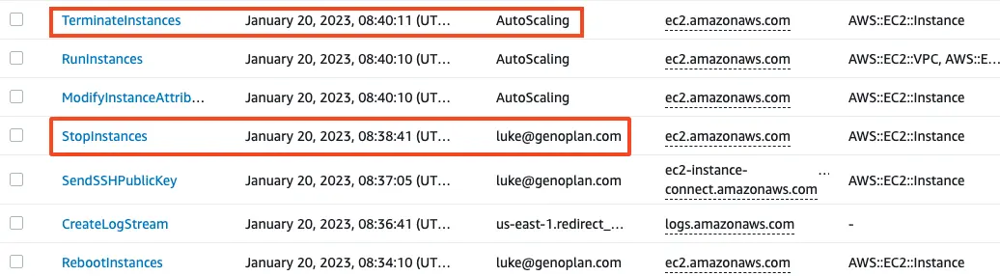
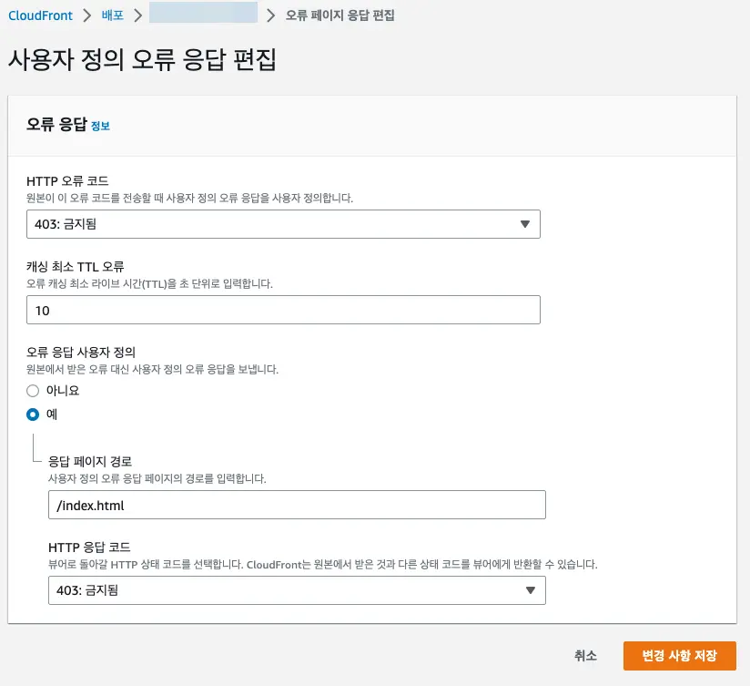
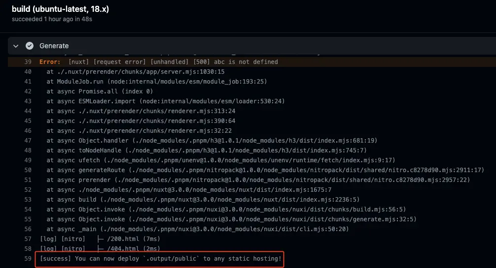

## Week 4, 2023

### AWS EC2 테스트 서버 볼륨 삭제됨

아침 출근하니 테스트 서버 CPU 점유 경고가 뜸. 확인해보니 100%에서 계속 유지되어서 EC2 Instance를 reboot.  
몇 분 뒤에 변화가 없어서 suspend. 몇 분 뒤에 웹 사이트 접속 안되어 확인해보니 종료 됨. ??? log를 확인해보니 AutoScailing이 죽여버림.



더 확인해보니 자동 생성된 instance의 volumn이 계승되지 않고 새로 생성 됨. 이거까진 이해가 가는데 기존 volumn을 자동 삭제? 이런 방식이면 믿고 쓸 수가 있나? 나중에 알아보니 EC2 생성 시 기본으로 [root volumn이 종료 시 삭제 설정](https://aws.amazon.com/ko/premiumsupport/knowledge-center/deleteontermination-ebs/)된다. 🤨

[[dev.devops.github-actions--s3--code-deploy]] [^week4-2023__test-server], [[dev.devops.github-actions--code-deploy--git-pull]]를 통해 복구.

[^week4-2023__test-server]: `week4-2023__test-server`: 작성해놓은 문서의 command text에 spacebar 대신 다른 보이지 않는 문자가 들어가서 copy&paste 했을 때 error 계속 발생했었음 🤨

## Week 3, 2023

### Nuxt generate 시, dynamic route에서 payload error

#### 현상

next generate로 생성된 사이트에서 payload 생성 안하는 dynamic route path에서도 payload를 요구[^ssr-prerendering?]

[^ssr-prerendering?]: `ssr-prerendering?` - SSR을 통해 prerendering 할 수도 있지만, report의 경우는 개체 별 페이지를 모두 생성시키진 않을 예정이므로

#### 해결

crawlLinks: true와 함께 nuxt build로 생성

```js
//nuxt.config.js
{
  nitro: {
    // 이 config 없이 nuxt generate하면 dynamic route까지 payload를 try. error 발생.
    prerender: {
      crawlLinks: true,
      routes: ['/', '/ko'],   // /ko는 @nuxtjs/i18n module의 한국어 지원을 위해
    },
  }
}
```

#### 참고한 문서들

- https://nuxtjs.org/docs/concepts/nuxt-lifecycle/
- https://stackoverflow.com/questions/61485508/how-nuxt-generate-dynamic-routes
- https://nuxt.com/docs/api/configuration/nuxt-config/#generate
- https://github.com/nuxt/rfcs/issues/22
- https://nuxtjs.org/docs/features/data-fetching/#:~:text=this%20hook%20blocks%20route%20navigation%20until%20it%20is%20resolved%2C%20displaying%20a%20page%20error%20if%20it%20fails.

## Week 2, 2023

### Playwright CORS setting

#### Allow Extension

결론은 실패. load는 됐지만 기본 off로 되어 있어 browser 처음 실행할 때 손으로 on 시켜야 함.

```shell
# Run find . -type d -iname "<EXTENSION ID HERE>"
```

```js
// playwright.config.js
use: {
   launchOptions: {  // https://playwright.dev/docs/api/class-testoptions#test-options-launch-options
      args: [  // https://playwright.dev/docs/chrome-extensions
         `--disable-extensions-except=~/Library/Application Support/Google/Chrome/Default/Extensions/lfhmikememgdcahcdlaciloancbhjino/0.3.5_0`,
      ],
   },
}
```

#### Off web security

이쪽으로 해결[^chromium-only]

[^chromium-only]: `chromium-only` - chromium만 해결. 다른 browser도 해당 option을 찾아 넣든가, CORS 세팅을 부탁하든가 해야 함.

```js
// playwright.config.js
use: {
   launchOptions: {  // https://playwright.dev/docs/api/class-testoptions#test-options-launch-options
      args: ['--disable-web-security'],
   },
}
```

### temp branch 운영

#### 문제

배포 환경에서만 테스트 할 수 있는 내용이라면 지속적으로 수정·배포·테스트를 진행  
이 과정 중에 다른 개발자가 테스트 서버에 배포하면 내용이 서로 상실되거나 브랜치 conflict가 빈번하게 발생할 수 있으므로, 개발자끼리 테스트 브랜치, 서버를 쓰겠다고 알린 뒤에 독점적으로 사용 중
(fixup으로 쌓아가며 테스트할 수 있으나, 결국엔 commit을 정리한 후, 정리한 걸 다시 테스트해야 하는데, 이 때 conflict가 대량 발생할 수 있다.)

#### 해결

temp branch 운영. husky를 이용하여 temp branch를 push하기 전에 origin/test branch를 merge

> https://stackoverflow.com/questions/6372334/git-commit-hooks-per-branch/6376054#6376054

#### Trouble shooting

push할 때 다음 error가 발생하면 `chmod`로 해당 파일에 실행 권한을 줄 것

> hint: The '.husky/pre-push' hook was ignored because it's not set as executable.

test branch merge 후 remote에는 push됐는데, local에서는 push 안된 걸로 표시  
→ post push hook이 없어서 merge가 일어나면 손으로 fetch 입력해야 함. 아니면 fetch 선행 입력

```shell
git push;git fetch
```

## Week 52, 2022

### [Tailwind - Dynamic class names](https://tailwindcss.com/docs/content-configuration#dynamic-class-names)

```js
class = `bg-${ zero ? pageColor : baseColor}` // not work
class = zero ? `bg-${pageColor}` : `bg-${baseColor}` // not work
```

## Week 51, 2022

### SPA framework - S3 - CloudFront 배포 시 404 error 처리

없는 URI로 접근 시 403 error가 뜬다. [아마도 해당 url path를 cloudFront에서 인식하지 못해서 S3로 요청이 가고 public이 아니니 permission denied 에러](https://dexlee.tistory.com/189#:~:text=%ED%95%B4%EB%8B%B9%20url%20path%EB%A5%BC%20cloudFront%EC%97%90%EC%84%9C%20%EC%9D%B8%EC%8B%9D%ED%95%98%EC%A7%80%20%EB%AA%BB%ED%95%B4%EC%84%9C%20S3%EB%A1%9C%20%EC%9A%94%EC%B2%AD%EC%9D%B4%20%EA%B0%84%EB%8B%A4.%20public%EC%9D%B4%20%EC%95%84%EB%8B%88%EB%8B%88%20%EB%8B%B9%EC%97%B0%ED%9E%88%20permission%20denied%20%EC%97%90%EB%9F%AC%20%EB%B0%9C%EC%83%9D.)


cloudfront에서 403 error를 SPA framework index.html로 처리하도록 해주면 framework에서 404 처리해 줌


## Week 50, 2022

### tailwind css

새 nuxt3 project에 tailwind 도입.
그 동안 제작자 소개글에서 motivation과 결과가 모순되는 걸 봐서 꺼렸는데, code colocation으로 인한 DX, 속도 향상 때문에 써보기로 함.

## Week 49, 2022

### Nuxt3 UI Framework

.com에 쓰인 buefy UI framework는 .co.kr에 쓰이는 프로젝트 지원X (major version)

**Candidates**

1. [naiveui](https://www.naiveui.com/en-US/light/components/avatar) - 이슈 등록 글이 중국어가 더 많음
   - sketch kit free
   - Naive UI Snippets - vs code
2. [antdv](https://antdv.com/components/overview) - figma kit 구매함 - 버그 답변이 죄다 중국어
3. [primevue](https://www.primefaces.org/primevue/autocomplete) ✅
   - figma$250? - deprecated - [https://www.figma.com/community/file/890589747170608208](https://www.figma.com/community/file/890589747170608208)
   - vuelidate
   - radar chart
4. [vuetifyjs](https://next.vuetifyjs.com/en/components/all/)
   - [https://store.vuetifyjs.com/products/vuetify-ui-kit-figma](https://store.vuetifyjs.com/products/vuetify-ui-kit-figma) free
5. [https://element-plus.org/en-US/component/button.html](https://element-plus.org/en-US/component/button.html)
   - [figma template](https://www.figma.com/community/file/1021254029764378306) - free, non en
6. [ui-elements](https://vuestic.dev/ko/ui-elements/alert)
   - no figma or sketch
7. [inkline](https://www.inkline.io/docs/forms/checkbox)
   - storybook, no figma or sketch

## Week 48, 2022

### Refine package.json product section

```
pnpm install --prod --frozen-lockfile
```

product에 쓰지 않는 package 설치를 피하여 새 package 설치 시의 시간을 37 → 19초로 줄임.  
js resource size도 9mb 정도 줄음 (github cache 확인)

## Week 47, 2022

### nuxt3 generate false negative error

sentry setting test 때문에 일부러 error를 내고 배포했는데 계속 정상 동작함.  
github actions log 확인하니...
  
generate시에

> WARN Using experimental payload extraction for full-static output. You can opt-out by setting experimental.payloadExtraction to false.

라고 뜨더니... 관련있나?

## Week 45, 2022 - TanStack Query 적용

Powerful asynchronous state management, server-state utilities and data fetching.  
cache on API request.  
report detail modal → page로 변환함에 따라 summary 화면과 전환이 잦고 그 때마다 API request를 함.  
stale time을 설정하여 정해진 시간 내에는 request 없이 cache data 활용하도록 수정

| <video width="320" height="240" controls><source src="/assets/movs/what-i-struggled-brag-in/tanstack-query__before.webm" type="video/webm"></video> | <video width="320" height="240" controls><source src="/assets/movs/what-i-struggled-brag-in/tanstack-query__after.webm" type="video/webm"></video> |
| --------------------------------------------------------------------------------------------------------------------------------------------------- | -------------------------------------------------------------------------------------------------------------------------------------------------- |
| TanStack Query 적용 이전. 리포트 요약↔상세 페이지 이동 시 마다 API request 발생                                                                     | TanStack Query 적용 이후. Cache를 활용하기 때문에 리포트 요약 페이지에서 추가 API request가 없어짐                                                 |

## Week 44, 2022

### [[Google app script about i18n|dev.tools.google.apps-script#script-of-sheet---i18n-json]]
