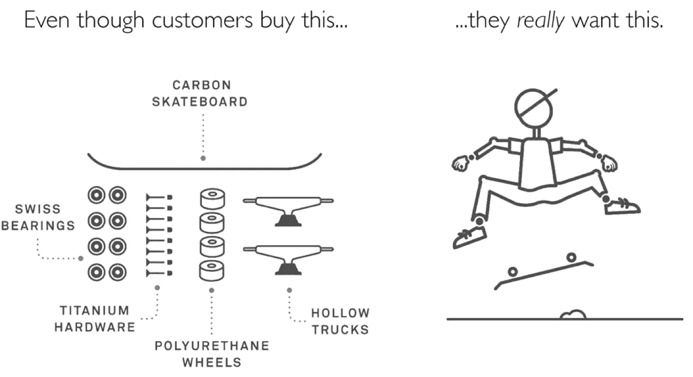

## Collections

- [50 Ideas That Changed My Life](https://perell.com/essay/50-ideas-that-changed-my-life/)
- [Ian's Shoelace Site](https://www.fieggen.com/shoelace/)
- [Live Near Your Friends](https://headlineshq.substack.com/p/issue-no-029-live-near-your-friends) - in distance of 5-minute walk
  - [The Tail End](https://waitbutwhy.com/2015/12/the-tail-end.html)
- [Write more "useless" software](https://ntietz.com/blog/write-more-useless-software/) for the joy of computing.
- [A Single Small Map Is Enough For A Lifetime](https://www.noemamag.com/a-single-small-map-is-enough-for-a-lifetime/)
- [How to Study](https://cse.buffalo.edu/~rapaport/howtostudy.html)
- [The Case Against Caffeine](https://zantafakari.substack.com/p/the-case-against-caffeine)
  - But it gets worse, especially if you drink lots of caffeine throughout the day. In that case, you never give your body the chance to clear it out. So the base concentration in your blood slowly creeps up. - https://zantafakari.substack.com/i/141012714/the-science-of-sleep
- [Aristotle — How to live a good life](https://ralphammer.com/aristotle-how-to-live-a-good-life/) - Ralph Ammer
  > Happiness is not a feeling of pleasure. **Happiness is the pursuit of excellence**.
- [NEVER sacrifice your life for an artificial deadline.](https://news.ycombinator.com/user?id=nine_zeros)
  - How to determine if something is an artificial deadline? Because if it were a real deadline with significance to the business, they'd pull more hands on deck, remove roadblocks relentlessly day after day, and even offer to take portions of your work on themselves so that the deadlines can be met.
- [Why you need a "WTF Notebook"](https://www.simplermachines.com/why-you-need-a-wtf-notebook/)
- [Avoid blundering: 80% of a winning strategy](https://longform.asmartbear.com/avoid-blundering/)
  - https://news.ycombinator.com/item?id=39902854
  - https://news.hada.io/topic?id=14789
- [(Life) Advice From The Creator of C++](https://www.youtube.com/watch?v=-QxI-RP6-HM)
  - https://news.hada.io/topic?id=10726
- [Just for Fun (2022)](https://justforfunnoreally.dev/)
  > I've often described my motivation for building software to others using imagery: I like to go find a secluded beach, build a large, magnificent sand castle, and then walk away. Will anyone notice? Probably not. Will the waves eventually destroy it? Yep. Did I still get immense satisfaction? Absolutely. — [aliasxneo](https://news.ycombinator.com/item?id=41497113)
- [You Must Read At Least One Book To Ride](https://ludic.mataroa.blog/blog/you-must-read-at-least-one-book-to-ride/)
- [An Unreasonable Amount of Time](https://allenpike.com/2024/an-unreasonable-amount-of-time) - A method for magic.
  > Sometimes magic is just someone spending more time on something than anyone else might reasonably expect. — [Teller](https://www.goodreads.com/quotes/6641527-sometimes-magic-is-just-someone-spending-more-time-on-something)

> 정리를 무조건 버려야 한다고 생각하는 분들이 많은데 사실 그렇지 않아요. 공간에 어울리는 물건들을 쓰기 편하게 두는 게 정리거든요. — 1일 1정리. 심지은 지음

- [On The Death of Daydreaming](https://www.afterbabel.com/p/on-the-death-of-daydreaming)
  - 🥱 -> 🤔💡🌱 (Boredom -> Reflection, Creativity, Growth)
  - Smartphones eliminate boredom and dullness, but as a result, creativity and empathy are being impaired.
  - Interstitial time, which used to be moments for meditation, daydreaming, and observation—human activities—has now mostly been replaced by digital consumption.
  - The habit of avoiding waiting and boredom leads to the weakening of our attention, patience, and imagination.
  - With access to an iPad or a smartphone, children in the twenty-first century never had to be bored;
- [불만족의 해독제](https://www.youtube.com/watch?v=kMEO5pDwkH0) - 감사함

## Focus

- [Take the pedals off the bike](https://www.fortressofdoors.com/take-the-pedals-off-the-bike/) - the most important and fundamental skill first – balance

### Targeting

- [A Three-Step Framework For Solving Problems 👌](https://www.lennysnewsletter.com/p/a-three-step-framework-for-solving)
- [What is Jobs to be Done (JTBD)?](https://jtbd.info/2-what-is-jobs-to-be-done-jtbd-796b82081cca)
  > Upgrade your user, not your product. Don’t build better cameras — build better photographers.  
  > — Kathy Sierra
  >
  > 
  > The designers at intercom (intercom.com) use this illustration to show what is, and isn’t, important to customers.
  - https://www.revealed.market/when-coffee-and-kale-compete
- [GOOD ENOUGH BEATS GREAT](https://www.meaningfulmoney.life/post/maximizer-vs-satisficer)
- [Pivot Points](https://longform.asmartbear.com/pivot-points/)
  - **Contextual Evaluation**: Unlike traditional assessments that categorize traits as strengths or weaknesses, Pivot Points recognize that their value is context-dependent.
  - **Embracing Constraints**: Pivot Points are viewed as enabling constraints that, when embraced, can lead to more fulfilling personal and professional lives, allowing individuals and organizations to thrive by aligning actions with inherent strengths.
- [Smart People Don't Chase Goals; They Create Limits](https://www.joanwestenberg.com/smart-people-dont-chase-goals-they-create-limits/)
  > The painter who begins with a blank canvas faces more paralysis than the one who starts with a frame and a palette.
  > One person sets a goal: become a best-selling author. Another imposes a constraint: write every day, but never write what bores me.
  >
  > > Wut? The constraints are what made it a hard problem, but the only reason they were able to hit this goal in an impossibly short timeline is the huge amount of resources that they put toward a very clear goal (which was, honestly, less "let man explore the heavens" than "beat the Soviets"). — [#](https://news.ycombinator.com/vote?id=44237540&how=un&auth=51df6f06022c423f1c5abe96dab72810e7a7f3c5&goto=item%3Fid%3D44232714#44237540)
  >
  > - 결점을 알고도 일부러 썼다면 사기에 가까운 장시논리. 일부에게만 팔려도 이득이라는 betting
  >
  > I agree with the author, but I would also say there is something above goals and constraints. Values. A set of things that, when comparing multiple options, make the choice clear. An example of some values I frequently use is "What will give me the most enjoyment the furthest into the future? "What will result in the world being a better place?" "What will make me become someone who resembles Jesus more?" They are different from constraints as they don't knock out any options by default. Instead, they make triaging when there are many different things I could be doing much easier, and circumvent my messy intuition which is based on hormones, hunger, weather, etc.  
  > I think values, goals, and constraints are all valuable, but it's a hierarchy. We should create constraints that help us become more aligned with our values. We should create shorter-term goals that make it easy to stay within our constraints. — [#](https://news.ycombinator.com/item?id=44236709)

### [wodenokoto](https://news.ycombinator.com/item?id=33258142)

In moment to moment work, I am starting to think focus is more about _not_ keeping busy when you need to wait for something.  
1 minute compile time? Not an opportunity to check your email or hacker news.

- Absolutely. Focusing on lots of different tasks is the antithesis of focus. Focus is identifying and executing against one singular goal.
- Tis true. Eat the boredom for a minute.
- Yeah, I have a rack of dumbbells next to my desk (WFH for the win). I'll get up and run through a 1-2 minute complex. Not enough to sweat, but great for a refocus.

### [lo_zamoyski](https://news.ycombinator.com/item?id=33261175)

In this vein, classical ethicists talk about the vice of curiosity as opposed to the virtue of studiousness. Studiousness is the virtue of attention, of self-mastery in relation to intellectual pursuits, of prudent allocation of attention to what you should; curiosity is the vice of inattention, of spreading yourself too thin, to pursue things other than what one should or what is not worth pursuing, pursuing that which is beyond your reach, of flitting about between things, of inordinate desire in the domain of intellectual pursuits. The studious man attains wisdom, the curious man remains, at best, a coasting, superficial dilettante. The difference between the studious man and the curious man is something like the difference between the committed and faithful husband and the waffling philanderer. The former shows restraint in relation to his appetites and is able to build a relationship and raise a family, while the latter is a mess who never achieves anything of value, slavishly indulging his appetites that lead nowhere but his own misery and mediocrity. In all these cases, desirable things may present themselves that would derail you from your aim and sabotage your achievement and your own good. In all these cases, commitment involves refusing to indulge those desires because doing so is counterproductive and harmful in relation to the good pursued.

In life, we must make decisions. The word "decision" comes from the Latin "to cut off", as in to cut off options or paths. The grapevine must be pruned to strengthen it and produce more fruit. Of course, we must decide wisely, there is no question about that, but FOMO is the opposite of that. It is an intemperate and immoderate desire for everything, never committing to anything and therefore never attaining anything and never becoming anything.

### [How do you deal with information and internet addiction?](https://news.ycombinator.com/item?id=34711741)

> The purpose of knowledge is action, not knowledge.
> ― Aristotle

> Knowledge isn't free. You have to pay attention
> ― Richard Feynman

> "Information is not truth"
> ― Yuval Noah Harari

> If I were the plaything of every thought, I would be a fool, not a wise man.
> ― Rumi

> Dhamma is in your mind, not in the forest. You don't have to go and look anywhere else.
> ― Ajahn Chah

> Man has set for himself the goal of conquering the world,
> but in the process he loses his soul.
> ― Alexander Solzhenitsyn

> The wise man knows the Self,
> And he plays the game of life.
> But the fool lives in the world
> Like a beast of burden.
> ― Ashtavakra Gita (4―1)

> We must be true inside, true to ourselves,
> before we can know a truth that is outside us.
> ― Thomas Merton

> Saying yes frequently is an additive strategy. Saying no is a subtractive strategy. Keep saying no to a lot of things - the negative and unimportant ones - and once in awhile, you will be left with an idea which is so compelling that it would be a screaming no-brainer 'yes'.
> ― unknown

### [You don’t need to work on hard problems](https://www.benkuhn.net/hard/)

In the real world the most important problems are vague and have many evaluation dimensions.  
Author found it rewarding to optimize for speed, cost and other pragmatic factors rather than just difficulty.

## [Nine Micro Life Hacks I Found on Reddit](https://medium.com/mind-cafe/nine-micro-life-hacks-i-found-on-reddit-that-are-surprisingly-useful-6c74638798e6)

## [Why happiness is not a destination…it’s a way of life!](https://www.roystonguest.com/blog/why-happiness-is-not-a-destinationits-a-way-of-life/)

## [The 10–3–2–1–0 Bedtime Routine That Makes Your Mornings 2X Productive](https://betterhumans.pub/the-10-3-2-1-0-bedtime-routine-that-makes-your-mornings-2x-productive-b0da1bce7234)

- 10 Hours Before Bed — No Caffeine
- 3 Hours Before Bed — No Alcohol
- 2 Hours Before Sleep — No Work
- 1 Hour Before Bed — Cut Off From Digital Media
- 0 — Times You Hit The Snooze Button: How It Makes Your Morning 2X Productive
  - “The reason most people hit the snooze button is they didn’t sleep well at night.”

## [Bob Ross and imposter syndrome](https://gomakethings.com/bob-ross-and-imposter-syndrome/)

Bob was the ultimate anti-imposter syndrome advocate. His trademark line was…

> We don’t make mistakes. We make happy little accidents.

**It’s ok to feel like you’re not 100 percent sure what you’re doing. After 10 years of doing this, I still look stuff up every day.**

That doesn’t make you an imposter.

It makes you a beginner. It makes you a learner. It makes you someone who gets to experience that joy of looking at this amazing work we do with fresh eyes and new perspectives.

## [5 Uncommon Habits That Will Make You Happier](https://nickwignall.medium.com/5-uncommon-habits-that-will-make-you-happier-a3499cc31479)

- Happiness is hard because it’s often at odds with what feels good in the moment. And left to our instincts, we tend to choose what feels good now over what will make us genuinely happy in the long-run.

## [5 Simple Ways to Improve Your Self-Worth](https://nickwignall.medium.com/5-simple-ways-to-improve-your-self-worth-ae2dbb7b2303)

> “Motivation often comes after starting, not before. Action produces momentum.”
>
> — James Clear

## [How To Finally Make Something](https://medium.com/@scott.stevenson/how-to-finally-make-something-a16c8db7ba2a)

Creativity ultimately means stepping forward without knowing where we’re going. Unfortunately, unstructured and ambiguous tasks make us anxious.

To avoid this anxiety we constantly substitute playing the real game of creation with other activities that feel more structured — what I’ll call “fantasy games”.

I’ll nickname four ways this ailment shows up as:

1. Learning Syndrome
2. Tool Syndrome
3. Process Syndrome
4. Maintenance Syndrome

## [3 Habits The Wealthiest People Practice Daily That Most Others Don't](https://medium.com/wealthwise/3-habits-the-wealthiest-people-practice-daily-that-most-others-dont-423b62e60f0a)

They Ask $30,000 Questions Instead of $3 Questions

Examples of $3 questions are:

- Should I make my coffee at home or get it at Starbucks?
- Should I buy organic tomatoes or non-organic?
- Should I cancel Netflix now that it’s a few dollars more expensive?
- I have $10,000 in savings, should I switch banks with a 0.10% higher interest rate? (only makes a $10 difference per year)

Examples of $30,000 questions are:

- Can I earn more by negotiating a raise or switching jobs?
- Should I start a side-hustle so I can make an extra $1000 per month?
- Do I invest consistently and automatically?
- How much am I paying in investment fees?
- What’s the interest rate on this 30-year mortgage?
- Can I increase my monthly savings rate to 15%?

## [Learn Exponentially](https://saveall.ai/blog/learn-exponentially)

> **Spaced repetition is a rapid exponential process**

To visualize what this means we can [estimate (as fairly we can)](https://colab.research.google.com/drive/1InSARQ8FGJzmcc-Cn86RmsihQ77EsHi1?usp=sharing) how much you learn from 60 minutes reading per day vs. 30 minutes reading + 30 minutes spaced repetition per day:

The difference is extraordinary even when looking only 5 years ahead. **Use spaced repetition over a lifetime and you’ll be hundreds of times more knowledgeable.**

> https://news.ycombinator.com/item?id=33140527

So sure, learn spaced repetition, but really, find something and practice it for more joy and better results instead.

## Travel

- [How to Travel With Your Bullet Journal](https://bulletjournal.com/blogs/bulletjournalist/how-to-travel-with-your-bullet-journal)

## Caution

- [The Gruen Transfer is consuming the internet](https://sebs.website/blog/the%20gruen-transfer-is-consuming-the-internet)
  > looking to buy a specific item, only to find the layout confusing? Perhaps you ended up aimlessly strolling around, purchasing other items?
